# Wiki Documentation for /Users/kw/project/rpc-framework

Generated on: 2025-05-16 18:06:39

## Table of Contents

- [项目简介](#page-intro)
- [快速入门](#page-getting-started)
- [整体架构](#page-overall-arch)
- [核心模块详解](#page-core-modules)
- [服务注册与发现](#page-registry-discovery)
- [负载均衡](#page-loadbalancing)
- [性能监控](#page-monitoring)
- [RPC 数据流与序列化](#page-rpc-dataflow-serialization)
- [服务提供者与消费者实现](#page-provider-consumer)
- [服务部署与运行](#page-deployment-running)
- [拦截器机制与自定义](#page-interceptors)

<a id='page-intro'></a>

## 项目简介

### Related Pages

Related topics: [快速入门](#page-getting-started), [整体架构](#page-overall-arch)

<details>
<summary>Relevant source files</summary>

The following files were used as context for generating this wiki page:

- [README.md](README.md)
- [rpc-common/src/main/java/org/example/rpc/common/annotations/Api.java](rpc-common/src/main/java/org/example/rpc/common/annotations/Api.java)
- [rpc-router/src/main/java/org/example/rpc/router/impl/DefaultRouter.java](rpc-router/src/main/java/org/example/rpc/router/impl/DefaultRouter.java)
- [rpc-protocol/src/main/java/org/example/rpc/protocol/serialize/impl/SimpleJsonSerializerImpl.java](rpc-protocol/src/main/java/org/example/rpc/protocol/serialize/impl/SimpleJsonSerializerImpl.java)
- [rpc-common/src/main/java/org/example/rpc/common/circuit/CircuitBreaker.java](rpc-common/src/main/java/org/example/rpc/common/circuit/CircuitBreaker.java)
- [rpc-monitor/src/main/java/org/example/rpc/monitor/impl/DefaultMonitoringServiceImpl.java](rpc-monitor/src/main/java/org/example/rpc/monitor/impl/DefaultMonitoringServiceImpl.java)
- [rpc-example/rpc-blog-service/src/main/java/org/example/rpc/blog/BlogServiceApplication.java](rpc-example/rpc-blog-service/src/main/java/org/example/rpc/blog/BlogServiceApplication.java)
- [rpc-common/src/main/java/org/example/rpc/common/annotations/GET.java](rpc-common/src/main/java/org/example/rpc/common/annotations/GET.java)
- [rpc-monitor/src/main/java/org/example/rpc/monitor/model/StatisticalMetrics.java](rpc-monitor/src/main/java/org/example/rpc/monitor/model/StatisticalMetrics.java)
</details>

# 项目简介

这是一个基于 Spring Boot 的轻量级 RPC (Remote Procedure Call) 框架实现，具有高性能和可扩展性。该项目构建于 Spring Boot 2.7.3 之上，提供包括服务注册与发现、负载均衡和网络传输在内的一整套功能。框架利用 Protocol Buffers 进行高效序列化，以实现高性能的远程服务调用。
Sources: [README.md:13-19]()

## 主要特性

该 RPC 框架提供以下主要特性：

*   服务注册与发现
*   动态服务路由
*   负载均衡
*   请求拦截
*   性能监控
*   Spring 框架集成
*   Protocol Buffer 序列化
*   可扩展架构

Sources: [README.md:21-30]()

## 系统架构

框架采用模块化设计，包含以下核心组件和支持模块。

Sources: [README.md:32-34]()

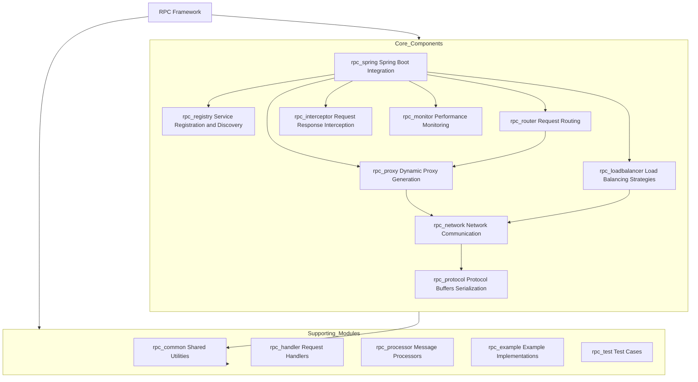
**图解**: RPC 框架核心组件与支持模块概览。
Sources: [README.md:32-71]()

### 核心组件

| 组件名称 (模块)         | 描述                                                                 |
| :---------------------- | :------------------------------------------------------------------- |
| Registry (rpc-registry) | 服务注册与发现、健康检查、服务元数据管理                             |
| Network Transport (rpc-network) | 网络通信层、连接池、协议处理                                         |
| Protocol (rpc-protocol) | Protocol Buffer 消息定义、协议编码/解码、消息格式规范                |
| Proxy (rpc-proxy)       | 动态代理生成、远程服务调用、本地服务暴露                             |
| Load Balancer (rpc-loadbalancer) | 多种负载均衡策略、服务实例选择、流量分发                             |
| Router (rpc-router)     | 请求路由、服务版本控制、流量管理                                     |
| Interceptor (rpc-interceptor) | 请求/响应拦截、横切关注点、自定义业务逻辑注入                        |
| Monitor (rpc-monitor)   | 性能指标收集、服务健康监控、统计分析                                 |
| Spring Integration (rpc-spring) | Spring Boot 自动配置、注解支持、Bean 生命周期管理                  |

Sources: [README.md:37-62]()

### 支持模块

| 模块名称 (模块)      | 描述                             |
| :------------------- | :------------------------------- |
| rpc-common           | 共享工具类和通用组件             |
| rpc-handler          | 请求处理程序                     |
| rpc-processor        | 消息处理管道                     |
| rpc-example          | 示例实现和演示                   |
| rpc-test             | 测试用例和集成测试               |

Sources: [README.md:64-71]()

## 技术栈

| 技术类别     | 技术/版本                    |
| :----------- | :--------------------------- |
| Java 版本    | 8+                           |
| 框架         | Spring Boot 2.7.3            |
| 序列化       | Protocol Buffers 3.24.0      |
| 构建工具     | Maven 3.0+                   |
| 测试         | JUnit 5, Mockito             |
| JSON 处理    | FastJSON, Gson               |

Sources: [README.md:73-81]()

## 项目结构

项目的顶层目录结构如下：

```
rpc-framework/
├── rpc-common/        # Common utilities
├── rpc-protocol/      # Protocol definitions
├── rpc-network/       # Network layer
├── rpc-registry/      # Service registry
├── rpc-proxy/         # Service proxy
├── rpc-loadbalancer/  # Load balancing
├── rpc-router/        # Request routing
├── rpc-interceptor/   # Interceptors
├── rpc-monitor/       # Monitoring
├── rpc-spring/        # Spring integration
├── rpc-handler/       # Request handlers
├── rpc-processor/     # Message processors
├── rpc-example/       # Examples
└── rpc-test/          # Tests
```
Sources: [README.md:106-122]()

## 注解驱动

框架广泛使用注解来简化开发和配置。

### 服务API注解 (`@Api`)
`@Api` 注解用于标记一个类为API接口，RPC框架会扫描这些类以作后续处理。

```java
// rpc-common/src/main/java/org/example/rpc/common/annotations/Api.java
package org.example.rpc.common.annotations;

import java.lang.annotation.Documented;
import java.lang.annotation.ElementType;
import java.lang.annotation.Retention;
import java.lang.annotation.RetentionPolicy;
import java.lang.annotation.Target;

@Documented
@Target(ElementType.TYPE)
@Retention(RetentionPolicy.RUNTIME)
public @interface Api {
  String value() default "";
}
```
Sources: [rpc-common/src/main/java/org/example/rpc/common/annotations/Api.java:1-20]()

### HTTP方法注解
框架提供类似于Spring MVC的HTTP方法注解，如 `@GET`, `@POST`, `@PUT`, `@DELETE`，用于标记处理特定HTTP请求的方法。

```java
// rpc-common/src/main/java/org/example/rpc/common/annotations/GET.java
package org.example.rpc.common.annotations;

// ... imports ...

@Documented
@Target(ElementType.METHOD)
@Retention(RetentionPolicy.RUNTIME)
public @interface GET {
    String value() default "";
}
```
Sources: [rpc-common/src/main/java/org/example/rpc/common/annotations/GET.java:1-18]()

这些注解在 `DefaultRouter` 中被用于解析请求路径和参数。

```java
// rpc-router/src/main/java/org/example/rpc/router/impl/DefaultRouter.java
// ...
    // Get the method path from the method-level annotation
    methodPath = "";
    if (method.isAnnotationPresent(GET.class)) {
      methodPath = method.getAnnotation(GET.class).value();
    } else if (method.isAnnotationPresent(POST.class)) {
      methodPath = method.getAnnotation(POST.class).value();
    } else if (method.isAnnotationPresent(PUT.class)) {
      methodPath = method.getAnnotation(PUT.class).value();
    } else if (method.isAnnotationPresent(DELETE.class)) {
      methodPath = method.getAnnotation(DELETE.class).value();
    }
// ...
```
Sources: [rpc-router/src/main/java/org/example/rpc/router/impl/DefaultRouter.java:20-29]()

其他相关注解包括：
*   `@Body`: 标记方法参数作为请求体。 (Sources: [rpc-common/src/main/java/org/example/rpc/common/annotations/Body.java]())
*   `@Reference`: 用于服务引用，替代 `@Autowired`。 (Sources: [rpc-common/src/main/java/org/example/rpc/common/annotations/Reference.java]())

### 服务扫描注解 (`@RpcServiceScan`)
`@RpcServiceScan` 用于指定需要扫描的包路径，以便框架发现和注册RPC服务。

```java
// rpc-example/rpc-blog-service/src/main/java/org/example/rpc/blog/BlogServiceApplication.java
// ...
@RpcServiceScan(basePackages = "org.example.rpc.blog")
@SpringBootApplication(scanBasePackages = {
    "org.example.rpc.blog",
    // ... other packages
})
public class BlogServiceApplication implements CommandLineRunner {
  // ...
}
```
Sources: [rpc-example/rpc-blog-service/src/main/java/org/example/rpc/blog/BlogServiceApplication.java:18-29]()

## 序列化机制

框架默认使用 Protocol Buffers 进行高效序列化。此外，也提供了基于 FastJSON 的简单JSON序列化实现。

Sources: [README.md:18-19](), [README.md:77]()

### SimpleJsonSerializerImpl
`SimpleJsonSerializerImpl` 实现了 `Serializer` 接口，使用 FastJSON 库进行对象的序列化和反序列化。它支持将Java对象序列化为JSON字节数组，并将字节数组反序列化回Java对象。特别地，它处理了 `Throwable` 类型的序列化和反序列化，以便在RPC调用中传递异常信息。

```java
// rpc-protocol/src/main/java/org/example/rpc/protocol/serialize/impl/SimpleJsonSerializerImpl.java
package org.example.rpc.protocol.serialize.impl;

// ... imports ...

@Slf4j
@Service
public class SimpleJsonSerializerImpl implements Serializer {

  // ... static block for ParserConfig ...

  @Override
  public SerializerType getSerializerType() {
    return SerializerType.JSON;
  }

  @Override
  public <T> byte[] serialize(T obj) throws Exception {
    return JSON.toJSONBytes(obj, SerializerFeature.WriteClassName);
  }

  @Override
  public <T> T deSerialize(byte[] bytes, Class<T> clazz) {
    String jsonString = new String(bytes);
    return JSON.parseObject(jsonString, clazz);
  }

  // ... ThrowableSerializer and ThrowableDeserializer inner classes ...
}
```
Sources: [rpc-protocol/src/main/java/org/example/rpc/protocol/serialize/impl/SimpleJsonSerializerImpl.java:15-42]()

## 熔断机制 (`CircuitBreaker`)

框架包含了一个熔断器 (`CircuitBreaker`) 组件，用于在远程服务调用失败次数过多时，暂时阻止进一步的调用，以防止级联故障并允许下游服务恢复。

Sources: [rpc-common/src/main/java/org/example/rpc/common/circuit/CircuitBreaker.java]()

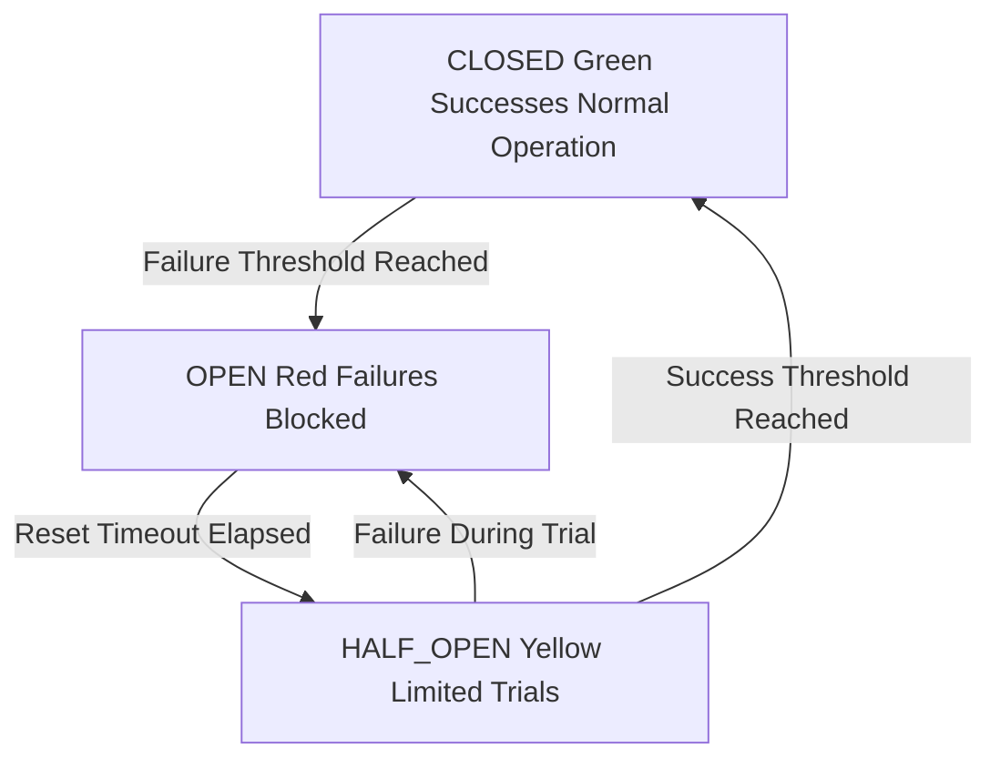
**图解**: 熔断器状态转换图。
Sources: [rpc-common/src/main/java/org/example/rpc/common/circuit/CircuitBreaker.java:70-110]()

熔断器具有三种状态：
*   **CLOSED (关闭)**: 正常状态，允许所有请求通过。如果失败次数达到阈值，则转换到 `OPEN` 状态。
*   **OPEN (打开)**: 请求被阻止。经过一段重置超时后，转换到 `HALF_OPEN` 状态。
*   **HALF_OPEN (半开)**: 允许少量测试请求通过。如果这些请求成功，则转换回 `CLOSED` 状态；如果失败，则再次转换到 `OPEN` 状态。

关键逻辑片段：
```java
// rpc-common/src/main/java/org/example/rpc/common/circuit/CircuitBreaker.java
// In recordFailure method
    if (currentState == CircuitBreakerState.HALF_OPEN) {
      if (state.compareAndSet(CircuitBreakerState.HALF_OPEN, CircuitBreakerState.OPEN)) {
        log.info("Circuit breaker state changed to OPEN");
        // ... reset counters ...
      }
    } else if (currentState == CircuitBreakerState.CLOSED) {
      if (failureCount.incrementAndGet() >= failureThreshold) {
        if (state.compareAndSet(CircuitBreakerState.CLOSED, CircuitBreakerState.OPEN)) {
          log.info("Circuit breaker state changed to OPEN");
          // ... reset counters ...
        }
      }
    }
```
Sources: [rpc-common/src/main/java/org/example/rpc/common/circuit/CircuitBreaker.java:99-110]()

## 性能监控 (`rpc-monitor`)

`rpc-monitor` 模块负责收集服务调用的性能指标、监控服务健康状况并进行统计分析。

Sources: [README.md:56-59]()

### `DefaultMonitoringServiceImpl`
该服务实现了监控数据的收集和统计。它维护一个 `methodMetricsMap`，用于存储每个方法的调用指标 (`MethodMetrics`)。

```java
// rpc-monitor/src/main/java/org/example/rpc/monitor/impl/DefaultMonitoringServiceImpl.java
// ...
  @Override
  public Map<String, StatisticalMetrics> getStatistics() {
    Map<String, StatisticalMetrics> stats = new ConcurrentHashMap<>();
    methodMetricsMap.forEach((method, metrics) -> {
      // ... calculate avgTime, maxTime, successCount, successRate ...
      List<String> errorMessages = metrics.stream()
         .filter(m -> !m.isSuccess())
          .map(MethodMetrics::getErrorMessage)
          .collect(Collectors.toList()); // 收集错误信息

      Map<String, Integer> metricType = metrics.stream()
          .collect(Collectors.groupingBy(MethodMetrics::getMetricType, Collectors.summingInt(e -> 1))); // 收集请求类型

      stats.put(method, new StatisticalMetrics(avgTime, maxTime,
          successCount, metrics.size(), successRate, errorMessages, metricType));
    });
    return stats;
  }
// ...
```
Sources: [rpc-monitor/src/main/java/org/example/rpc/monitor/impl/DefaultMonitoringServiceImpl.java:37-51]()

### `StatisticalMetrics`
这是一个数据类，用于封装方法的统计指标。

```java
// rpc-monitor/src/main/java/org/example/rpc/monitor/model/StatisticalMetrics.java
package org.example.rpc.monitor.model;

import lombok.AllArgsConstructor;
import lombok.Data;

import java.util.List;
import java.util.Map;

@Data
@AllArgsConstructor
public class StatisticalMetrics {
  private double averageTime;
  private long maxTime;
  private long successCount;
  private long totalCount;
  private double successRate;
  private List<String> errorMessages;
  private Map<String, Integer> metricTypes;
}
```
Sources: [rpc-monitor/src/main/java/org/example/rpc/monitor/model/StatisticalMetrics.java:1-20]()

## 示例应用启动

项目提供了示例应用来演示框架的使用，例如 `BlogServiceApplication` 和 `UserServiceApplication`。这些应用通常通过 `NettyServer` 启动RPC服务。

```java
// rpc-example/rpc-blog-service/src/main/java/org/example/rpc/blog/BlogServiceApplication.java
// ...
public class BlogServiceApplication implements CommandLineRunner {
  // ... fields and constructor ...

  @Override
  public void run(String... args) throws Exception {
    CountDownLatch latch = new CountDownLatch(1);
    NettyServer nettyServer = new NettyServer(
        requestProcessor,
        nettyServerProperties,
        serializerFactory);
    new Thread(() -> {
      nettyServer.start();
      latch.countDown();
    }).start();
    latch.await();
  }
}
```
Sources: [rpc-example/rpc-blog-service/src/main/java/org/example/rpc/blog/BlogServiceApplication.java:38-54]()

## 总结

该 RPC 框架是一个功能全面的分布式服务解决方案，它通过模块化的设计、Spring Boot 的集成以及对 Protocol Buffers 等技术的运用，旨在提供高性能、高可扩展性的远程过程调用能力。其核心特性包括服务治理、负载均衡、熔断保护和性能监控，为构建微服务架构提供了坚实的基础。
Sources: [README.md:13-19](), [README.md:21-30]()

---

<a id='page-getting-started'></a>

## 快速入门

### Related Pages

Related topics: [项目简介](#page-intro), [服务部署与运行](#page-deployment-running)

<details>
<summary>Relevant source files</summary>

The following files were used as context for generating this wiki page:

- [README.md](README.md)
- [rpc-example/rpc-blog-service/src/main/java/org/example/rpc/blog/BlogServiceApplication.java](rpc-example/rpc-blog-service/src/main/java/org/example/rpc/blog/BlogServiceApplication.java)
- [rpc-example/rpc-user-service/src/main/java/org/example/rpc/user/UserServiceApplication.java](rpc-example/rpc-user-service/src/main/java/org/example/rpc/user/UserServiceApplication.java)
- [rpc-registry/src/main/java/org/example/rpc/registry/zookeeper/ZookeeperHelper.java](rpc-registry/src/main/java/org/example/rpc/registry/zookeeper/ZookeeperHelper.java)
- [rpc-test/src/main/java/org/example/rpc/core/test/TestConfig.java](rpc-test/src/main/java/org/example/rpc/core/test/TestConfig.java)
</details>

# 快速入门

## 引言

本项目是一个基于 Spring Boot 2.7.3 构建的分布式 RPC (Remote Procedure Call) 框架，旨在提供高性能和高可扩展性的远程服务调用能力。其核心特性包括服务注册与发现、动态服务路由、负载均衡、请求拦截、性能监控以及对 Protocol Buffers 序列化的支持。本指南将引导您完成项目的基本设置、构建和运行流程。
Sources: [README.md:80-94]()

## 先决条件

在开始之前，请确保您的开发环境满足以下条件：

*   JDK 1.8 或更高版本
*   Maven 3.0 或更高版本
*   Git
Sources: [README.md:41-44]()

## 构建项目

请按照以下步骤克隆并构建项目：

1.  **克隆代码仓库**:
    ```bash
    git clone [repository-url]
    cd rpc-framework
    ```
    *将 `[repository-url]` 替换为实际的仓库地址。*

2.  **构建项目**:
    使用 Maven 执行以下命令来编译和打包项目：
    ```bash
    mvn clean install
    ```
    Sources: [README.md:46-53]()

## 运行服务

框架包含注册中心、服务提供者和服务消费者等核心组件。`README.md` 文件中提及了用于启动和停止这些服务的脚本。
Sources: [README.md:55-57]()

### 启动服务

1.  **启动注册中心 (Registry Server)**:
    注册中心负责服务的注册与发现。
    ```bash
    ./start-test-instances.sh
    ```
    注册中心通常使用 ZooKeeper 实现。`ZookeeperHelper` 类封装了与 ZooKeeper 交互的逻辑，例如服务实例的加载。
    Sources: [README.md:59-62](), [rpc-registry/src/main/java/org/example/rpc/registry/zookeeper/ZookeeperHelper.java:62-69]()

    `TestConfig.java` 文件中展示了如何配置 `ZookeeperHelper` 和 `RpcServiceRegistry` 等与注册中心相关的 Bean：
    ```java
    // rpc-test/src/main/java/org/example/rpc/core/test/TestConfig.java
    @Bean
    public ZookeeperHelper zookeeperHelper(ZookeeperProperties zookeeperProperties, ServiceHealthManager serviceHealthManager) {
      return new ZookeeperHelper(zookeeperProperties, serviceHealthManager);
    }
    
    @Bean
    public RpcServiceRegistry rpcServiceRegistry(ZookeeperHelper zookeeperHelper) {
      return new ZookeeperRpcServiceRegistryImpl(heartbeatManager(serviceHealthManager(), zookeeperHelper), zookeeperHelper, serviceHealthManager());
    }
    ```
    Sources: [rpc-test/src/main/java/org/example/rpc/core/test/TestConfig.java:46-52]()

2.  **启动服务提供者 (Service Providers)**:
    服务提供者是实际业务逻辑的承载者。例如，`rpc-blog-service` 是一个服务提供者。
    ```bash
    ./start-blog-instances.sh
    ```
    `BlogServiceApplication.java` 是博客服务提供者的启动类，它通过 `CommandLineRunner` 启动 Netty 服务器来暴露 RPC 服务。
    ```java
    // rpc-example/rpc-blog-service/src/main/java/org/example/rpc/blog/BlogServiceApplication.java
    @Override
    public void run(String... args) throws Exception {
      CountDownLatch latch = new CountDownLatch(1);
      NettyServer nettyServer = new NettyServer(
          requestProcessor,
          nettyServerProperties,
          serializerFactory);
      new Thread(() -> {
        nettyServer.start();
        latch.countDown();
      }).start();
      latch.await();
    }
    ```
    Sources: [README.md:64-66](), [rpc-example/rpc-blog-service/src/main/java/org/example/rpc/blog/BlogServiceApplication.java:53-64]()

3.  **启动服务消费者 (Service Consumers)**:
    服务消费者调用远程服务。例如，`rpc-user-service` 既可以是服务提供者，也可以是其他服务的消费者。
    ```bash
    ./start-user-instances.sh
    ```
    `UserServiceApplication.java` 的启动方式与 `BlogServiceApplication` 类似，同样在 Spring Boot 启动后初始化并启动 Netty 服务器。
    ```java
    // rpc-example/rpc-user-service/src/main/java/org/example/rpc/user/UserServiceApplication.java
    @Override
    public void run(String... args) throws Exception {
      CompletableFuture.runAsync(() -> {
        try {
          NettyServer nettyServer = new NettyServer(
              requestProcessor,
              nettyServerProperties,
              serializerFactory
          );
          nettyServer.start();
          log.info("Netty server started successfully on port: {}", nettyServerProperties.getServerPort());
        } catch (Exception e) {
          log.error("Failed to start netty server", e);
          System.exit(1);
        }
      }).exceptionally(throwable -> {
        log.error("Unexpected error during server startup", throwable);
        System.exit(1);
        return null;
      });
    }
    ```
    Sources: [README.md:68-70](), [rpc-example/rpc-user-service/src/main/java/org/example/rpc/user/UserServiceApplication.java:41-60]()

### 服务启动与交互流程

下图展示了典型的服务启动顺序和组件间的交互：

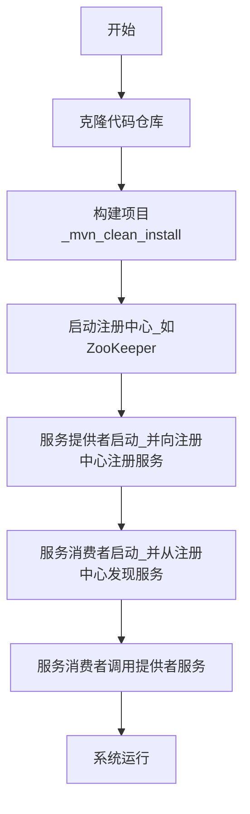
此图概述了从代码获取到服务运行的基本步骤。
Sources: [README.md:46-70]() (conceptual flow derived from build and run steps)

下图展示了服务注册与发现的基本时序：
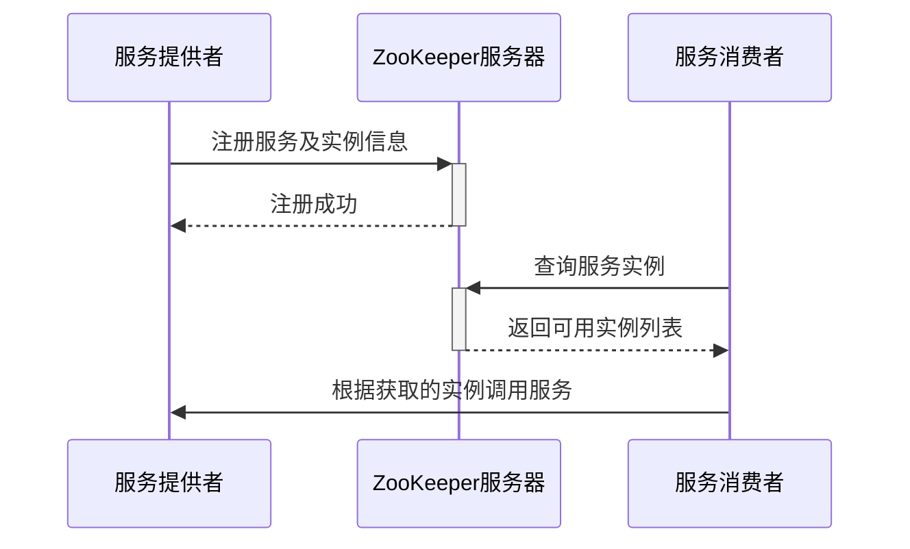
此图说明了服务提供者如何注册其服务，以及服务消费者如何发现并调用这些服务。
Sources: [rpc-registry/src/main/java/org/example/rpc/registry/zookeeper/ZookeeperHelper.java]() (describes ZK interactions), [rpc-test/src/main/java/org/example/rpc/core/test/TestConfig.java:42-55]() (shows ZK beans setup)

### 停止服务

使用对应的停止脚本来关闭正在运行的服务实例：
```bash
./stop-test-instances.sh
./stop-blog-instances.sh
./stop-user-instances.sh
```
Sources: [README.md:72-76]()

## 项目结构

项目采用模块化设计，主要模块及其功能如下：

```
rpc-framework/
├── rpc-common/        # 通用工具类和组件
├── rpc-protocol/      # 协议定义 (如 Protocol Buffers)
├── rpc-network/       # 网络层实现
├── rpc-registry/      # 服务注册与发现模块
├── rpc-proxy/         # 服务代理生成
├── rpc-loadbalancer/  # 负载均衡策略
├── rpc-router/        # 请求路由
├── rpc-interceptor/   # 拦截器实现
├── rpc-monitor/       # 监控模块
├── rpc-spring/        # Spring 集成支持
├── rpc-handler/       # 请求处理器
├── rpc-processor/     # 消息处理器
├── rpc-example/       # 示例代码和演示
└── rpc-test/          # 测试用例
```
Sources: [README.md:80-94](), [README.md:123-138]()

关键模块说明：
| 模块名            | 描述                                     |
|-----------------|------------------------------------------|
| `rpc-common`    |共享的工具类和通用组件。                      |
| `rpc-protocol`  | 包含 Protocol Buffer 消息定义及序列化/反序列化逻辑。 |
| `rpc-network`   | 网络通信层，处理连接和协议。                   |
| `rpc-registry`  | 实现服务注册、发现和健康检查。                 |
| `rpc-spring`    | 提供与 Spring Boot 的自动配置和注解支持。      |
| `rpc-example`   | 包含各种服务提供者和消费者的示例实现。            |
Sources: [README.md:80-94](), [README.md:123-138]()

## 技术栈

该 RPC 框架主要使用的技术栈如下：

| 技术          | 版本/说明             |
|---------------|-----------------------|
| Java          | 8+                    |
| 框架          | Spring Boot 2.7.3     |
| 序列化        | Protocol Buffers 3.24.0 |
| 构建工具      | Maven 3.0+            |
| 测试          | JUnit 5, Mockito      |
| JSON 处理     | FastJSON, Gson        |
Sources: [README.md:31-37]()

## 总结

本快速入门指南介绍了 `rpc-framework` 项目的基本情况、环境要求、构建步骤以及如何运行其核心服务。通过提供的脚本和 Spring Boot 的集成，开发者可以相对轻松地启动和管理注册中心、服务提供者和服务消费者。模块化的设计和清晰的项目结构便于后续的深入学习和二次开发。
Sources: [README.md]()

---

<a id='page-overall-arch'></a>

## 整体架构

### Related Pages

Related topics: [核心模块详解](#page-core-modules), [项目简介](#page-intro)

<details>
<summary>Relevant source files</summary>

The following files were used as context for generating this wiki page:

- [README.md](README.md)
- [rpc-test/src/main/java/org/example/rpc/core/test/TestConfig.java](rpc-test/src/main/java/org/example/rpc/core/test/TestConfig.java)
- [rpc-common/src/main/java/org/example/rpc/common/annotations/Body.java](rpc-common/src/main/java/org/example/rpc/common/annotations/Body.java)
- [rpc-common/src/main/java/org/example/rpc/common/annotations/Api.java](rpc-common/src/main/java/org/example/rpc/common/annotations/Api.java)
- [rpc-common/src/main/java/org/example/rpc/common/annotations/PUT.java](rpc-common/src/main/java/org/example/rpc/common/annotations/PUT.java)
- [rpc-common/src/main/java/org/example/rpc/common/annotations/POST.java](rpc-common/src/main/java/org/example/rpc/common/annotations/POST.java)
- [rpc-example/rpc-bff-service/src/main/java/org/example/rpc/bff/BffController.java](rpc-example/rpc-bff-service/src/main/java/org/example/rpc/bff/BffController.java)
- [rpc-registry/src/main/java/org/example/rpc/registry/zookeeper/ZookeeperHelper.java](rpc-registry/src/main/java/org/example/rpc/registry/zookeeper/ZookeeperHelper.java)
- [rpc-protocol/src/main/java/org/example/rpc/protocol/serialize/impl/SimpleJsonSerializerImpl.java](rpc-protocol/src/main/java/org/example/rpc/protocol/serialize/impl/SimpleJsonSerializerImpl.java)
- [rpc-test/src/main/java/org/example/rpc/core/test/circuit/CircuitBreakerTest.java](rpc-test/src/main/java/org/example/rpc/core/test/circuit/CircuitBreakerTest.java)
- [rpc-common/src/main/java/org/example/rpc/common/annotations/Reference.java](rpc-common/src/main/java/org/example/rpc/common/annotations/Reference.java)
- [rpc-example/rpc-blog-service/src/main/java/org/example/rpc/blog/BlogServiceApplication.java](rpc-example/rpc-blog-service/src/main/java/org/example/rpc/blog/BlogServiceApplication.java)
- [rpc-test/src/main/java/org/example/rpc/core/test/loadbalance/LoadBalanceIntegrationTest.java](rpc-test/src/main/java/org/example/rpc/core/test/loadbalance/LoadBalanceIntegrationTest.java)
- [rpc-example/rpc-bff-service/src/main/java/org/example/rpc/bff/BffService.java](rpc-example/rpc-bff-service/src/main/java/org/example/rpc/bff/BffService.java)
- [rpc-common/src/main/java/org/example/rpc/common/annotations/DELETE.java](rpc-common/src/main/java/org/example/rpc/common/annotations/DELETE.java)
- [rpc-example/rpc-blog-service/src/main/java/org/example/rpc/blog/impl/BlogServiceImpl.java](rpc-example/rpc-blog-service/src/main/java/org/example/rpc/blog/impl/BlogServiceImpl.java)
- [rpc-common/src/main/java/org/example/rpc/common/annotations/GET.java](rpc-common/src/main/java/org/example/rpc/common/annotations/GET.java)
- [rpc-example/rpc-api/src/main/java/org/example/rpc/api/pojo/Blog.java](rpc-example/rpc-api/src/main/java/org/example/rpc/api/pojo/Blog.java)
</details>

# 整体架构

## 引言

本项目是一个基于 Spring Boot 2.7.3 构建的轻量级、高性能、可扩展的分布式 RPC (Remote Procedure Call) 框架。它提供了一整套包括服务注册与发现、动态服务路由、负载均衡、网络传输在内的功能。该框架采用 Protocol Buffers 进行高效序列化，以实现高性能的远程服务调用。整体设计采用模块化方式，旨在提高代码的可维护性和可扩展性。

Sources: [README.md:82-86]()

## 系统架构

RPC 框架采用了模块化设计，包含以下核心组件和支持模块。

Sources: [README.md:88-90]()

### 核心组件

核心组件是框架功能实现的基础，各组件协同工作完成 RPC 通信的完整流程。

| 组件名称         | 模块名             | 描述                                       |
| ---------------- | ------------------ | ------------------------------------------ |
| 注册中心         | `rpc-registry`     | 服务注册、发现、健康检查、元数据管理         |
| 网络传输         | `rpc-network`      | 网络通信层、连接池、协议处理               |
| 协议             | `rpc-protocol`     | Protocol Buffer 消息定义、编解码、消息格式 |
| 代理             | `rpc-proxy`        | 动态代理生成、远程服务调用、本地服务暴露     |
| 负载均衡器       | `rpc-loadbalancer` | 多种负载均衡策略、服务实例选择、流量分发     |
| 路由器           | `rpc-router`       | 请求路由、服务版本控制、流量管理           |
| 拦截器           | `rpc-interceptor`  | 请求/响应拦截、横切关注点、自定义逻辑注入  |
| 监控             | `rpc-monitor`      | 性能指标收集、服务健康监控、统计分析       |
| Spring 集成      | `rpc-spring`       | Spring Boot 自动配置、注解支持、Bean 生命周期 |

Sources: [README.md:93-126]()

下图展示了核心组件之间的高层交互关系：
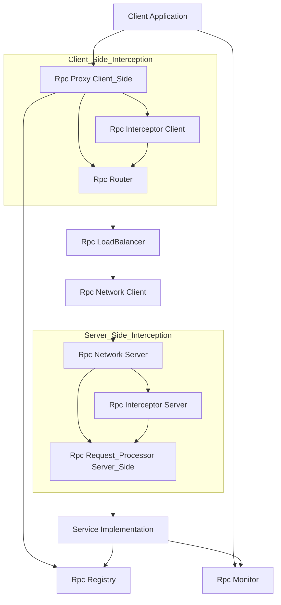
此图描述了一个典型的RPC调用流程：客户端应用通过代理发起调用，经过路由、负载均衡选择合适的服务实例，然后通过网络传输层将请求发送到服务端。服务端接收请求，处理后返回结果。注册中心负责服务的注册与发现，监控模块收集系统运行状态。拦截器允许在调用链的关键点注入自定义逻辑。

Sources: [README.md:93-126]()

### 支持模块

支持模块为核心组件提供通用功能和辅助能力。

-   **`rpc-common`**: 共享工具类和通用组件。
-   **`rpc-handler`**: 请求处理句柄。
-   **`rpc-processor`**: 消息处理管道。
-   **`rpc-example`**: 示例实现和演示。
-   **`rpc-test`**: 测试用例和集成测试。

Sources: [README.md:128-133]()

## 关键特性

该 RPC 框架具备以下关键特性：

-   服务注册与发现
-   动态服务路由
-   负载均衡
-   请求拦截
-   性能监控
-   Spring 框架集成
-   Protocol Buffer 序列化
-   可扩展架构

Sources: [README.md:73-80]()

## 技术栈

项目采用的技术栈如下：

| 技术类别     | 技术/版本                  |
| ------------ | -------------------------- |
| Java 版本    | 8+                         |
| 框架         | Spring Boot 2.7.3          |
| 序列化       | Protocol Buffers 3.24.0    |
| 构建工具     | Maven 3.0+                 |
| 测试         | JUnit 5, Mockito           |
| JSON 处理    | FastJSON, Gson             |

Sources: [README.md:33-39](), [README.md:135-141]()

## 项目结构

项目采用多模块 Maven 项目结构，便于管理和维护。

```
rpc-framework/
├── rpc-common/        # 通用工具
├── rpc-protocol/      # 协议定义
├── rpc-network/       # 网络层
├── rpc-registry/      # 服务注册
├── rpc-proxy/         # 服务代理
├── rpc-loadbalancer/  # 负载均衡
├── rpc-router/        # 请求路由
├── rpc-interceptor/   # 拦截器
├── rpc-monitor/       # 监控
├── rpc-spring/        # Spring 集成
├── rpc-handler/       # 请求处理器
├── rpc-processor/     # 消息处理器
├── rpc-example/       # 示例
└── rpc-test/          # 测试
```
Sources: [README.md:60-71]()

## 核心流程与机制

### 服务注册与发现 (Zookeeper 实现)

服务注册与发现是微服务架构中的核心环节。本框架使用 Zookeeper 作为注册中心实现。

-   **服务注册**：服务提供者启动时，将其服务信息（如服务名、IP 地址、端口等）注册到 Zookeeper 的指定路径下。
-   **服务发现**：服务消费者启动或调用服务时，从 Zookeeper 查询指定服务名的可用服务实例列表。
-   **健康检查与心跳**：`HeartbeatManager` 负责维护服务实例的健康状态，定期向 Zookeeper 发送心跳。`ServiceHealthManager` 管理服务健康状态。

`ZookeeperHelper` 类封装了与 Zookeeper 交互的底层逻辑，包括节点的创建、查询、监听等。它使用 Guava Cache缓存服务实例信息，以减少对 Zookeeper 的直接访问压力。

```java
// rpc-registry/src/main/java/org/example/rpc/registry/zookeeper/ZookeeperHelper.java
public class ZookeeperHelper implements DisposableBean {

  private final ZookeeperProperties zookeeperProperties;
  private volatile CuratorFramework zookeeperClient;
  private final ServiceHealthManager serviceHealthManager;
  private final Cache<String, List<String>> serviceInstanceCache;

  public ZookeeperHelper(ZookeeperProperties zookeeperProperties, ServiceHealthManager serviceHealthManager) {
    this.zookeeperProperties = zookeeperProperties;
    this.serviceHealthManager = serviceHealthManager;
    this.serviceInstanceCache = CacheBuilder.newBuilder()
        .expireAfterWrite(30, TimeUnit.SECONDS) // 缓存30秒过期
        .maximumSize(1000) // 最大缓存1000个条目
        .recordStats()
        .build(new CacheLoader<String, List<String>>() {
          @Override
          public List<String> load(String serviceName) throws Exception {
            // 从Zookeeper加载服务实例
            return loadServiceInstanceFromZookeeper(serviceName);
          }

          @Override
          public ListenableFuture<List<String>> reload(String serviceName, List<String> oldValue) {
            // 异步重新加载
            return ListenableFutureTask.create(() -> loadServiceInstanceFromZookeeper(serviceName));
          }
        });
  }
  // ...
}
```
Sources: [rpc-registry/src/main/java/org/example/rpc/registry/zookeeper/ZookeeperHelper.java:32-60](), [README.md:94-97](), [rpc-test/src/main/java/org/example/rpc/core/test/TestConfig.java:30-32, 43-45]()

以下序列图展示了服务注册与发现的基本流程：
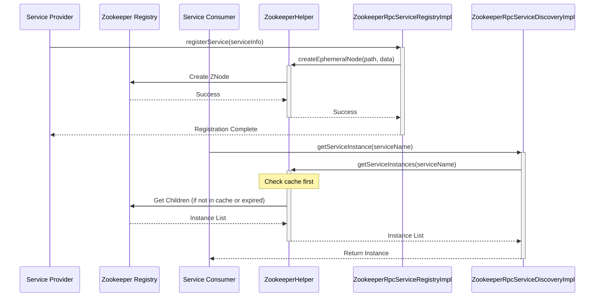
Sources: [rpc-registry/src/main/java/org/example/rpc/registry/zookeeper/ZookeeperHelper.java](), [rpc-test/src/main/java/org/example/rpc/core/test/TestConfig.java:34-42, 46-48]()

### RPC 调用流程

典型的 RPC 调用流程涉及客户端、代理、网络传输和服务端等多个环节。

1.  **客户端调用**：客户端通过注入的接口（使用 `@Reference` 注解标记）调用远程方法。
2.  **动态代理**：`rpc-proxy` 模块为远程服务接口生成动态代理对象。当客户端调用接口方法时，实际执行的是代理对象的逻辑。
3.  **协议处理**：代理对象将方法调用信息（如服务名、方法名、参数等）封装成统一的 RPC 请求对象。`rpc-protocol` 模块定义了消息格式，并使用序列化器（如 `SimpleJsonSerializerImpl`）将请求对象序列化成字节流。
4.  **网络传输**：`rpc-network` 模块负责将序列化后的请求字节流通过网络（如 Netty）发送到服务端。
5.  **服务端处理**：
    *   服务端 `rpc-network` 模块接收到字节流，进行解码和反序列化，得到 RPC 请求对象。
    *   `rpc-handler` 或 `rpc-processor` 将请求分发给对应的服务实现。
    *   服务实现执行业务逻辑。
6.  **结果返回**：服务端将执行结果封装成 RPC 响应对象，序列化后通过网络返回给客户端。
7.  **客户端接收**：客户端接收响应，反序列化后得到结果，返回给调用方。

```mermaid
graph TD
    Client[Client Application] --> Reference_Annotation[@Reference ServiceInterface]
    Reference_Annotation --> Dynamic_Proxy[Dynamic Proxy rpc_proxy]
    Dynamic_Proxy --> Serialization[Serialize Request rpc_protocol]
    Serialization --> Network_Client[Network Client rpc_network]
    Network_Client --> |Request Data| Network_Server[Network Server rpc_network]
    Network_Server --> Deserialization[Deserialize Request rpc_protocol]
    Deserialization --> Request_Handler[Request Handler rpc_handler_processor]
    Request_Handler --> Service_Impl[Service Implementation]
    Service_Impl --> |Response Data| Request_Handler
    Request_Handler --> Serialization_Response[Serialize Response rpc_protocol]
    Serialization_Response --> Network_Server
    Network_Server --> |Response Data| Network_Client
    Network_Client --> Deserialization_Response[Deserialize Response rpc_protocol]
    Deserialization_Response --> Dynamic_Proxy
    Dynamic_Proxy --> Client
```
Sources: [README.md:93-133](), [rpc-common/src/main/java/org/example/rpc/common/annotations/Reference.java]()

### 序列化机制

序列化是将对象状态转换为可存储或传输的格式的过程。本框架支持多种序列化方式，并通过 `SerializerFactory` 进行管理。`SimpleJsonSerializerImpl` 是一个基于 FastJSON 的简单 JSON 序列化实现。

```java
// rpc-protocol/src/main/java/org/example/rpc/protocol/serialize/impl/SimpleJsonSerializerImpl.java
@Service
public class SimpleJsonSerializerImpl implements Serializer {

  // ... (static block for FastJSON config)

  @Override
  public SerializerType getSerializerType() {
    return SerializerType.JSON;
  }

  @Override
  public <T> byte[] serialize(T obj) throws Exception {
    return JSON.toJSONBytes(obj, SerializerFeature.WriteClassName); // 序列化时写入类名
  }

  @Override
  public <T> T deSerialize(byte[] bytes, Class<T> clazz) {
    String jsonString = new String(bytes);
    return JSON.parseObject(jsonString, clazz); // 反序列化
  }

  // ... (ThrowableSerializer and ThrowableDeserializer for custom exception handling)
}
```
该实现通过 `SerializerFeature.WriteClassName` 在序列化时加入类名信息，以便在反序列化时能够正确还原对象类型。同时，它还自定义了 `Throwable` 的序列化和反序列化逻辑，以更好地处理异常信息。

Sources: [rpc-protocol/src/main/java/org/example/rpc/protocol/serialize/impl/SimpleJsonSerializerImpl.java:18-59](), [README.md:102-105, 137]()

### 负载均衡

`rpc-loadbalancer` 模块提供了多种负载均衡策略，用于在多个服务实例间分发请求。`LoadBalancerFactory` 用于获取指定策略的负载均衡器。

`TestConfig.java` 中定义了多种负载均衡器的 Bean：
```java
// rpc-test/src/main/java/org/example/rpc/core/test/TestConfig.java
// ...
  @Bean
  public RandomLoadBalancer randomLoadBalancer() {
    return new RandomLoadBalancer();
  }

  @Bean
  public RoundRobinLoadBalancer roundRobinLoadBalancer() {
    return new RoundRobinLoadBalancer();
  }

  @Bean
  public WeightedLoadBalancer weightedLoadBalancer() {
    return new WeightedLoadBalancer();
  }

  @Bean
  public LeastActiveLoadBalancer leastActiveLoadBalancer() {
    return new LeastActiveLoadBalancer();
  }

  @Bean
  public ConsistentHashLoadBalancer consistentHashLoadBalancer() {
    return new ConsistentHashLoadBalancer();
  }

  @Bean
  public LoadBalancerFactory loadBalancerFactory(
      RandomLoadBalancer randomLoadBalancer,
      RoundRobinLoadBalancer roundRobinLoadBalancer,
      WeightedLoadBalancer weightedLoadBalancer,
      LeastActiveLoadBalancer leastActiveLoadBalancer,
      ConsistentHashLoadBalancer consistentHashLoadBalancer) {
    return new LoadBalancerFactory(
        randomLoadBalancer,
        roundRobinLoadBalancer,
        weightedLoadBalancer,
        leastActiveLoadBalancer,
        consistentHashLoadBalancer
    );
  }
// ...
```
支持的策略包括：
-   随机 (Random)
-   轮询 (Round Robin)
-   加权 (Weighted)
-   最少活跃连接 (Least Active)
-   一致性哈希 (Consistent Hash)

`LoadBalanceIntegrationTest.java` 展示了如何使用 `LoadBalancerFactory` 获取负载均衡器并进行选择：
```java
// rpc-test/src/main/java/org/example/rpc/core/test/loadbalance/LoadBalanceIntegrationTest.java
// ...
  private void testStrategy(LoadBalanceStrategy strategy, List<String> instances, String serviceName) throws InterruptedException {
    LoadBalancer loadBalancer = loadBalancerFactory.getLoadBalancer(strategy);
    // ...
    String selected = loadBalancer.select(instances, serviceName);
    // ...
  }
// ...
```
Sources: [rpc-test/src/main/java/org/example/rpc/core/test/TestConfig.java:54-87](), [rpc-test/src/main/java/org/example/rpc/core/test/loadbalance/LoadBalanceIntegrationTest.java:32-33, 41-42](), [README.md:110-113]()

### Spring 集成与注解

`rpc-spring` 模块负责与 Spring Boot 框架的集成，提供了自动配置和注解支持，简化了 RPC 框架的使用。

#### 服务扫描与发布
`@RpcServiceScan` 注解用于指定扫描 RPC 服务的包路径。被 `@RpcService` (未在提供文件中明确定义，但通常与 `@RpcServiceScan` 配合使用，此处根据 `BlogServiceImpl` 的 `@RpcService` 推断其存在或类似注解机制) 标记的类会被识别为 RPC 服务并自动发布。

```java
// rpc-example/rpc-blog-service/src/main/java/org/example/rpc/blog/BlogServiceApplication.java
@RpcServiceScan(basePackages = "org.example.rpc.blog") // 扫描 org.example.rpc.blog 包下的RPC服务
@SpringBootApplication(scanBasePackages = { /* ... other packages ... */ })
public class BlogServiceApplication implements CommandLineRunner {
    // ...
}
```
Sources: [rpc-example/rpc-blog-service/src/main/java/org/example/rpc/blog/BlogServiceApplication.java:18-29]()

#### 服务引用
`@Reference` 注解用于在客户端注入远程服务的代理对象，类似于 Spring 的 `@Autowired`。

```java
// rpc-common/src/main/java/org/example/rpc/common/annotations/Reference.java
@Documented
@Retention(RetentionPolicy.RUNTIME)
@Target({ElementType.FIELD})
public @interface Reference {
}
```
使用示例 (概念性，具体注入逻辑由框架实现)：
```java
// 在客户端代码中
public class MyServiceClient {
    @Reference
    private BlogService blogService; // 注入远程 BlogService 代理

    public void doSomething() {
        // blogService.someMethod(...);
    }
}
```
Sources: [rpc-common/src/main/java/org/example/rpc/common/annotations/Reference.java:1-15]()

#### API 与 HTTP 方法注解
框架还提供了一系列注解用于定义服务接口和方法，这些注解可能用于构建类似 RESTful 风格的 RPC 服务，或者为服务元数据提供更丰富的信息。

| 注解        | 目标元素          | 描述                                 |
| ----------- | ----------------- | ------------------------------------ |
| `@Api`      | `ElementType.TYPE` | 标记一个类为 API 接口                  |
| `@GET`      | `ElementType.METHOD`| 标记方法处理 GET 请求，可带路径值    |
| `@POST`     | `ElementType.METHOD`| 标记方法处理 POST 请求，可带路径值   |
| `@PUT`      | `ElementType.METHOD`| 标记方法处理 PUT 请求，可带路径值    |
| `@DELETE`   | `ElementType.METHOD`| 标记方法处理 DELETE 请求，可带路径值 |
| `@Path`     | `ElementType.PARAMETER` | (在`BlogServiceImpl`中见到用法) 标记路径参数 |
| `@Body`     | `ElementType.PARAMETER` | 标记参数为请求体                     |

Sources: [rpc-common/src/main/java/org/example/rpc/common/annotations/Api.java:1-17](), [rpc-common/src/main/java/org/example/rpc/common/annotations/GET.java:1-15](), [rpc-common/src/main/java/org/example/rpc/common/annotations/POST.java:1-15](), [rpc-common/src/main/java/org/example/rpc/common/annotations/PUT.java:1-15](), [rpc-common/src/main/java/org/example/rpc/common/annotations/DELETE.java:1-15](), [rpc-common/src/main/java/org/example/rpc/common/annotations/Body.java:1-14](), [rpc-example/rpc-blog-service/src/main/java/org/example/rpc/blog/impl/BlogServiceImpl.java:28-29]()

`BlogServiceImpl` 中使用了这些注解来定义其服务方法：
```java
// rpc-example/rpc-blog-service/src/main/java/org/example/rpc/blog/impl/BlogServiceImpl.java
@Slf4j
@RpcService // 假设的注解，用于服务发布
public class BlogServiceImpl implements BlogService {
  // ...
  @GET("/{id}") // 定义GET请求路径
  @Override
  public CompletableFuture<BlogDTO> selectById(@Path("id") String id) { // @Path 用于路径参数
    // ...
  }

  @POST // 定义POST请求
  @Override
  public CompletableFuture<BlogDTO> createBlog(@Body CreateBlogDTO createBlogDTO) { // @Body 用于请求体
    // ...
  }
  // ...
}
```
Sources: [rpc-example/rpc-blog-service/src/main/java/org/example/rpc/blog/impl/BlogServiceImpl.java:24-40, 71-75]()

## 示例应用

项目包含 `rpc-example` 模块，其中提供了示例实现，如 `rpc-blog-service`（服务提供方）和 `rpc-bff-service`（服务消费方，BFF 模式）。

-   **`rpc-blog-service`**: 演示了如何使用 `@RpcServiceScan`、`@RpcService`（推断）以及 HTTP 方法注解 (`@GET`, `@POST` 等) 来实现和发布一个 RPC 服务。它集成了 MyBatis 进行数据持久化。
    Sources: [rpc-example/rpc-blog-service/src/main/java/org/example/rpc/blog/BlogServiceApplication.java](), [rpc-example/rpc-blog-service/src/main/java/org/example/rpc/blog/impl/BlogServiceImpl.java]()
-   **`rpc-bff-service`**: 演示了客户端如何通过 `@Reference`（推断）注解引用远程服务，并发起调用。`BffController` 作为 Spring MVC 控制器，将 RPC 调用结果封装成 HTTP 响应。
    Sources: [rpc-example/rpc-bff-service/src/main/java/org/example/rpc/bff/BffController.java](), [rpc-example/rpc-bff-service/src/main/java/org/example/rpc/bff/BffService.java]()

## 总结

该 RPC 框架通过模块化的设计，实现了服务注册发现、网络通信、序列化、负载均衡、Spring 集成等核心功能。它旨在提供一个轻量级、高性能且易于扩展的 RPC解决方案。通过丰富的注解和自动配置，简化了 RPC 服务的开发和使用。项目结构清晰，技术选型主流，为构建分布式应用提供了坚实的基础。

Sources: [README.md]()

---

<a id='page-core-modules'></a>

## 核心模块详解

### Related Pages

Related topics: [整体架构](#page-overall-arch), [服务注册与发现](#page-registry-discovery), [负载均衡](#page-loadbalancing), [RPC 数据流与序列化](#page-rpc-dataflow-serialization)

<details>
<summary>Relevant source files</summary>

The following files were used as context for generating this wiki page:

- `README.md`
- `rpc-common/src/main/java/org/example/rpc/common/annotations/Api.java`
- `rpc-common/src/main/java/org/example/rpc/common/annotations/GET.java`
- `rpc-common/src/main/java/org/example/rpc/common/annotations/POST.java`
- `rpc-common/src/main/java/org/example/rpc/common/annotations/PUT.java`
- `rpc-common/src/main/java/org/example/rpc/common/annotations/DELETE.java`
- `rpc-common/src/main/java/org/example/rpc/common/annotations/Body.java`
- `rpc-protocol/src/main/java/org/example/rpc/protocol/serialize/impl/ProtobufSerializerImpl.java`
- `rpc-protocol/src/main/java/org/example/rpc/protocol/serialize/impl/SimpleJsonSerializerImpl.java`
- `rpc-registry/src/main/java/org/example/rpc/registry/zookeeper/ZookeeperHelper.java`
- `rpc-router/src/main/java/org/example/rpc/router/impl/DefaultRouter.java`
- `rpc-test/src/main/java/org/example/rpc/core/test/TestConfig.java`
- `rpc-interceptor/src/main/java/org/example/rpc/interceptor/impl/PerformanceInterceptor.java`
- `rpc-monitor/src/main/java/org/example/rpc/monitor/impl/DefaultMonitoringServiceImpl.java`
- `rpc-spring/src/main/java/org/example/rpc/spring/RpcBeanRegistrar.java`
- `rpc-example/rpc-blog-service/src/main/java/org/example/rpc/blog/BlogServiceApplication.java`
- `rpc-example/rpc-user-service/src/main/java/org/example/rpc/user/UserServiceApplication.java`
</details>

# 核心模块详解

## 引言

本文档详细介绍了 RPC 框架中的核心模块。该 RPC 框架是一个基于 Spring Boot 2.7.3 构建的轻量级、高性能、可扩展的分布式远程过程调用解决方案。它提供了一整套功能，包括服务注册与发现、动态路由、负载均衡、请求拦截、性能监控和高效序列化机制（Protocol Buffers）。理解这些核心模块对于有效使用和扩展此框架至关重要。
Sources: [README.md]()

## 系统架构概览

框架采用模块化设计，核心组件协同工作以实现远程服务调用。下图展示了主要组件及其交互：

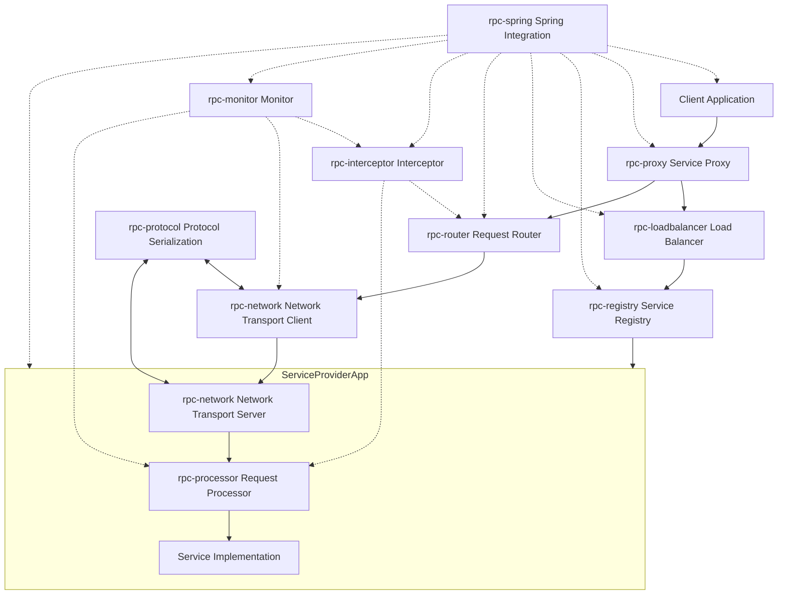
此图概述了客户端如何通过代理、负载均衡器和注册中心发现和调用远程服务，以及请求如何通过网络传输、路由器和拦截器进行处理。监控模块收集性能数据，Spring 集成模块简化了配置和管理。
Sources: [README.md]()

## 核心组件

### 1. 注册中心 (rpc-registry)

注册中心负责服务的注册与发现、健康检查以及服务元数据管理。框架使用 Zookeeper 作为其实现之一。

**主要功能**:
- 服务提供者启动时将其服务信息（服务名、地址、端口等）注册到注册中心。
- 服务消费者从注册中心查询可用服务实例列表。
- 定期进行健康检查，移除不健康的服务实例。

**关键类**: `ZookeeperHelper`
`ZookeeperHelper` 封装了与 Zookeeper 的交互逻辑，包括创建服务节点、获取服务实例、监听节点变化等。它使用 Guava Cache缓存服务实例列表以提高性能。

```java
// ZookeeperHelper 构造函数和缓存初始化
public ZookeeperHelper(ZookeeperProperties zookeeperProperties, ServiceHealthManager serviceHealthManager) {
    this.zookeeperProperties = zookeeperProperties;
    this.serviceHealthManager = serviceHealthManager;
    this.serviceInstanceCache = CacheBuilder.newBuilder()
        .expireAfterWrite(30, TimeUnit.SECONDS) // 缓存30秒过期
        .maximumSize(1000) // 最大缓存1000个条目
        .recordStats()
        .build(new CacheLoader<String, List<String>>() {
            @Override
            public List<String> load(String serviceName) throws Exception {
                // 从Zookeeper加载服务实例
                return loadServiceInstanceFromZookeeper(serviceName);
            }

            @Override
            public ListenableFuture<List<String>> reload(String serviceName, List<String> oldValue) {
                // 异步重新加载
                return ListenableFutureTask.create(() -> loadServiceInstanceFromZookeeper(serviceName));
            }
        });
}
```
Sources: [rpc-registry/src/main/java/org/example/rpc/registry/zookeeper/ZookeeperHelper.java:45-65]()

**服务注册与发现流程**:
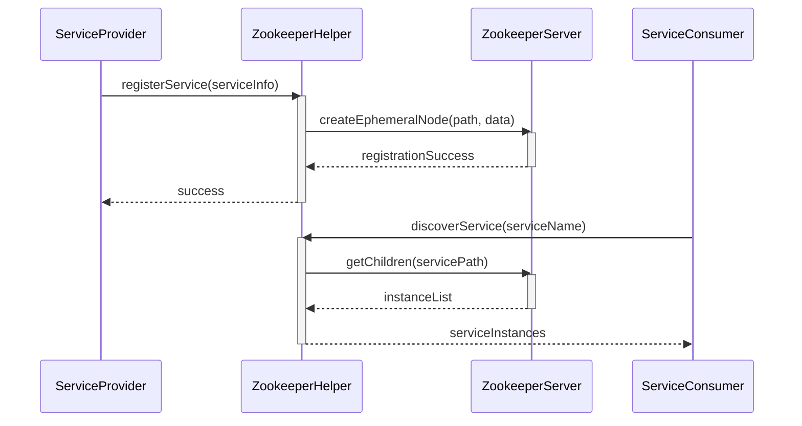
Sources: [rpc-registry/src/main/java/org/example/rpc/registry/zookeeper/ZookeeperHelper.java](), [README.md]()

### 2. 网络传输 (rpc-network)

网络传输模块负责底层网络通信，包括连接管理、协议处理。框架使用 Netty 作为网络通信的基础。

**主要功能**:
- 客户端与服务端之间的高效数据传输。
- 连接池管理，复用连接以减少开销。
- RPC 请求和响应消息的编解码。

**示例**: `NettyServer` 在服务提供方启动。
```java
// 在 BlogServiceApplication 中启动 NettyServer
@Override
public void run(String... args) throws Exception {
    CountDownLatch latch = new CountDownLatch(1);
    NettyServer nettyServer = new NettyServer(
        requestProcessor,
        nettyServerProperties,
        serializerFactory);
    new Thread(() -> {
        nettyServer.start(); // 启动Netty服务器
        latch.countDown();
    }).start();
    latch.await();
}
```
Sources: [rpc-example/rpc-blog-service/src/main/java/org/example/rpc/blog/BlogServiceApplication.java:50-62]()

### 3. 协议 (rpc-protocol)

协议模块定义了消息格式、序列化/反序列化机制。框架支持 Protocol Buffers 和 JSON 等序列化方式。

**主要功能**:
- 定义 `RpcRequest` 和 `RpcResponse` 的数据结构。
- 提供序列化器接口 (`Serializer`) 和多种实现。
- 高效的对象到字节数组的转换，以及反向转换。

**序列化器**:
- `ProtobufSerializerImpl`: 使用 Protocol Buffers 进行序列化，性能较高。
    ```java
    // ProtobufSerializerImpl 的部分实现
    @Override
    public <T> byte[] serialize(T obj) throws Exception {
        if (obj instanceof HeartBeatPacket) {
            return JSON.toJSONBytes(obj); // 心跳包使用JSON序列化
        }
        if (obj instanceof RpcRequest) {
            return serializeRequest((RpcRequest) obj); // RpcRequest 使用 Protobuf
        } else if (obj instanceof RpcResponse) {
            return serializeResponse((RpcResponse) obj); // RpcResponse 使用 Protobuf
        }
        // ...
    }
    ```
    Sources: [rpc-protocol/src/main/java/org/example/rpc/protocol/serialize/impl/ProtobufSerializerImpl.java:49-60]()
- `SimpleJsonSerializerImpl`: 使用 FastJSON 进行序列化，易于调试。
    - 特性：支持 `Throwable` 对象的自定义序列化和反序列化，通过 `ThrowableWrapper` 包装异常信息。
    ```java
    // SimpleJsonSerializerImpl 中 Throwable 的处理
    static {
        ParserConfig.getGlobalInstance().addAccept("org.example.rpc");
        SerializeConfig.getGlobalInstance().put(Throwable.class, new ThrowableSerializer());
        ParserConfig.getGlobalInstance().putDeserializer(Throwable.class, new ThrowableDeserializer());
        ParserConfig.getGlobalInstance().setAutoTypeSupport(true);
    }
    // ...
    public static class ThrowableWrapper {
        private String className;
        private String message;
        // ...
    }
    ```
    Sources: [rpc-protocol/src/main/java/org/example/rpc/protocol/serialize/impl/SimpleJsonSerializerImpl.java:24-30, 61-69]()

**序列化流程**:
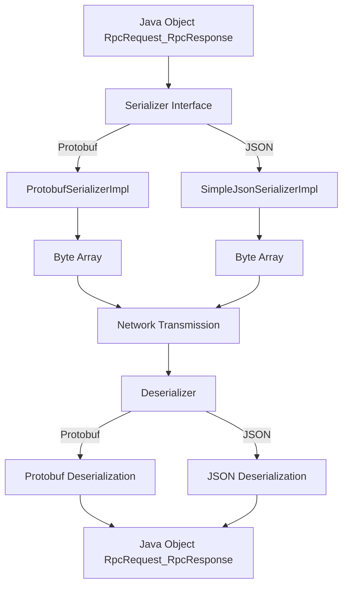
Sources: [README.md](), [rpc-protocol/src/main/java/org/example/rpc/protocol/serialize/impl/ProtobufSerializerImpl.java](), [rpc-protocol/src/main/java/org/example/rpc/protocol/serialize/impl/SimpleJsonSerializerImpl.java]()

### 4. 代理 (rpc-proxy)

代理模块负责为服务消费者生成动态代理对象，使得调用远程服务如同调用本地方法一样简单。

**主要功能**:
- 客户端通过接口定义调用远程服务。
- 动态生成接口的代理实现，封装网络调用、序列化、负载均衡等细节。
- 将本地方法调用转换为 `RpcRequest` 对象。
Sources: [README.md]()

### 5. 负载均衡 (rpc-loadbalancer)

负载均衡模块提供了多种策略来在多个服务实例之间分配请求。

**主要功能**:
- 从注册中心获取的服务实例列表中选择一个合适的实例处理请求。
- 支持多种负载均衡策略。

**支持的策略** (在 `TestConfig` 中配置了多种负载均衡器 Bean):
| 策略 (Strategy)          | 描述 (Description)                                   |
|--------------------------|------------------------------------------------------|
| `RandomLoadBalancer`     | 随机选择一个服务实例。                               |
| `RoundRobinLoadBalancer` | 轮询选择服务实例。                                   |
| `WeightedLoadBalancer`   | 根据权重选择服务实例（权重信息需额外配置）。         |
| `LeastActiveLoadBalancer`| 选择当前活动连接数最少的服务实例。                   |
| `ConsistentHashLoadBalancer` | 一致性哈希，确保相同参数的请求尽可能路由到同一实例。 |
Sources: [rpc-test/src/main/java/org/example/rpc/core/test/TestConfig.java:54-80](), [README.md]()

**`LoadBalancerFactory`**: 用于根据指定的策略获取负载均衡器实例。
```java
// LoadBalancerFactory 在 TestConfig 中装配
@Bean
public LoadBalancerFactory loadBalancerFactory(
    RandomLoadBalancer randomLoadBalancer,
    RoundRobinLoadBalancer roundRobinLoadBalancer,
    WeightedLoadBalancer weightedLoadBalancer,
    LeastActiveLoadBalancer leastActiveLoadBalancer,
    ConsistentHashLoadBalancer consistentHashLoadBalancer) {
  return new LoadBalancerFactory(
      randomLoadBalancer,
      roundRobinLoadBalancer,
      weightedLoadBalancer,
      leastActiveLoadBalancer,
      consistentHashLoadBalancer
  );
}
```
Sources: [rpc-test/src/main/java/org/example/rpc/core/test/TestConfig.java:82-94]()

**负载均衡选择流程**:
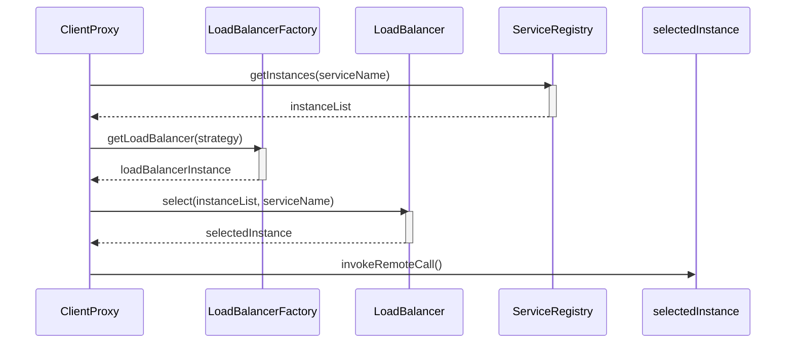
Sources: [README.md](), [rpc-test/src/main/java/org/example/rpc/core/test/TestConfig.java:82-94](), [rpc-test/src/main/java/org/example/rpc/core/test/loadbalance/LoadBalanceIntegrationTest.java:33-34]()

### 6. 路由 (rpc-router)

路由模块负责根据请求内容（如路径、参数）将请求导向正确的服务处理方法。

**主要功能**:
- 解析请求路径和参数。
- 匹配到目标服务的具体方法。
- 支持基于注解的路由定义。

**`DefaultRouter`**:
`DefaultRouter` 类（部分代码片段）展示了如何从 `RpcRequest` 中提取路径和参数，并准备调用目标方法。它依赖于一系列注解来定义API路径和参数绑定。
```java
// DefaultRouter 中的参数提取逻辑 (概念性)
// ...
// Api api = serviceClass.getAnnotation(Api.class);
// if (api != null) {
//   basePath = api.value();
// }
// ...
// if (method.isAnnotationPresent(GET.class)) {
//   methodPath = method.getAnnotation(GET.class).value();
// } 
// ...
// Parameter[] parameters = method.getParameters();
// for (int i = 0; i < parameters.length; i++) {
//   Parameter param = parameters[i];
//   if (param.isAnnotationPresent(Path.class)) {
//     // ... extract path parameter
//   } else if (param.isAnnotationPresent(Query.class)) {
//     // ... extract query parameter
//   } else if (param.isAnnotationPresent(Body.class)) {
//     // ... extract body
//   }
// }
```
Sources: [rpc-router/src/main/java/org/example/rpc/router/impl/DefaultRouter.java]()

**相关注解**:
| 注解         | 目标元素         | 作用                                     |
|--------------|------------------|------------------------------------------|
| `@Api`       | `ElementType.TYPE` | 标记一个类为API，可指定基础路径。        |
| `@GET`       | `ElementType.METHOD` | 标记方法处理GET请求，可指定子路径。      |
| `@POST`      | `ElementType.METHOD` | 标记方法处理POST请求，可指定子路径。     |
| `@PUT`       | `ElementType.METHOD` | 标记方法处理PUT请求，可指定子路径。      |
| `@DELETE`    | `ElementType.METHOD` | 标记方法处理DELETE请求，可指定子路径。   |
| `@Body`      | `ElementType.PARAMETER`| 标记方法参数作为请求体。                 |
| `@Path`      | `ElementType.PARAMETER`| 标记方法参数从URL路径中获取。 (在 `DefaultRouter.java` 中提及) |
| `@Query`     | `ElementType.PARAMETER`| 标记方法参数从URL查询参数中获取。 (在 `DefaultRouter.java` 中提及) |

Sources: [rpc-common/src/main/java/org/example/rpc/common/annotations/Api.java](), [rpc-common/src/main/java/org/example/rpc/common/annotations/GET.java](), [rpc-common/src/main/java/org/example/rpc/common/annotations/POST.java](), [rpc-common/src/main/java/org/example/rpc/common/annotations/PUT.java](), [rpc-common/src/main/java/org/example/rpc/common/annotations/DELETE.java](), [rpc-common/src/main/java/org/example/rpc/common/annotations/Body.java](), [rpc-router/src/main/java/org/example/rpc/router/impl/DefaultRouter.java]()

### 7. 拦截器 (rpc-interceptor)

拦截器模块允许在请求处理流程的关键点执行自定义逻辑，如日志记录、权限校验、性能监控等。

**主要功能**:
- 在请求处理之前 (`preHandle`) 和之后 (`postHandle`) 插入逻辑。
- 实现横切关注点。

**`PerformanceInterceptor`**:
这是一个示例拦截器，用于记录方法调用的性能指标。
```java
// PerformanceInterceptor 核心逻辑
public class PerformanceInterceptor implements RpcInterceptor {
  // ...
  @Override
  public boolean preHandle(RpcRequest request) {
    startTime.set(System.currentTimeMillis()); // 记录开始时间
    return false; // 返回false表示继续处理，true表示中断
  }

  @Override
  public void postHandle(RpcRequest request, RpcResponse response, CircuitBreakerState state) {
    long duration = System.currentTimeMillis() - startTime.get(); // 计算耗时
    boolean success = response.getThrowable() == null;
    String errorMessage = success ? null : response.getThrowable().getMessage();
    MetricType metricType = success ? MetricType.NORMAL_REQUEST : MetricType.EXCEPTION;

    // 调用监控服务记录指标
    monitoringService.recordMetrics(
        request.getClassName() + "#" + request.getMethodName(),
        duration,
        success,
        errorMessage,
        metricType.toString()
    );
    // ...
  }
}
```
Sources: [rpc-interceptor/src/main/java/org/example/rpc/interceptor/impl/PerformanceInterceptor.java:35-63]()

**拦截器调用流程**:
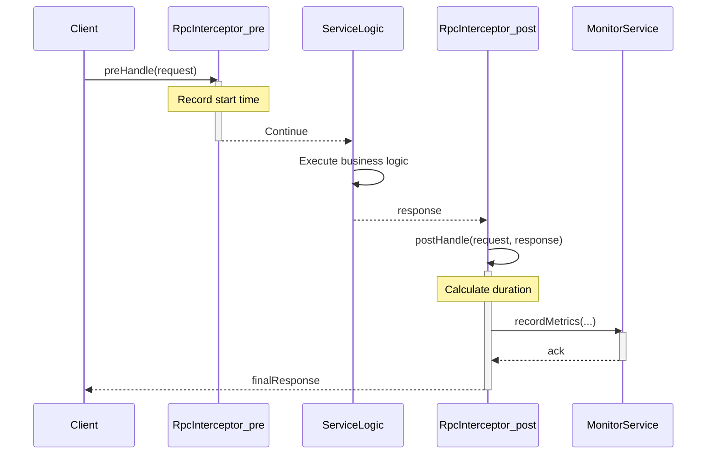
Sources: [rpc-interceptor/src/main/java/org/example/rpc/interceptor/impl/PerformanceInterceptor.java]()

### 8. 监控 (rpc-monitor)

监控模块收集和分析服务的性能指标和健康状况。

**主要功能**:
- 收集方法调用耗时、成功率、错误信息等。
- 提供统计数据查询接口。

**`DefaultMonitoringServiceImpl`**:
该服务实现了 `MonitoringService` 接口，存储和处理方法调用的度量数据。
```java
// DefaultMonitoringServiceImpl 的 recordMetrics 方法 (概念)
// public void recordMetrics(String methodName, long duration, boolean success, String errorMessage, String metricType) {
//   MethodMetrics metrics = new MethodMetrics(LocalDateTime.now(), duration, success, errorMessage, metricType);
//   methodMetricsMap.computeIfAbsent(methodName, k -> new CopyOnWriteArrayList<>()).add(metrics);
// }

// DefaultMonitoringServiceImpl 的 getStats 方法 (部分逻辑)
// public Map<String, StatisticalMetrics> getStats() {
//   methodMetricsMap.forEach((method, metrics) -> {
//     long totalTime = metrics.stream().mapToLong(MethodMetrics::getDuration).sum();
//     // ... calculate avgTime, maxTime, successCount, successRate ...
//     stats.put(method, new StatisticalMetrics(...));
//   });
//   return stats;
// }
```
Sources: [rpc-monitor/src/main/java/org/example/rpc/monitor/impl/DefaultMonitoringServiceImpl.java]() (基于其结构和`PerformanceInterceptor`的调用推断)

### 9. Spring 集成 (rpc-spring)

Spring 集成模块简化了 RPC 框架在 Spring Boot 项目中的使用。

**主要功能**:
- 自动配置 RPC 相关 Bean。
- 支持注解扫描和注册 RPC 服务。
- 管理 RPC 组件的生命周期。

**`RpcBeanRegistrar`**:
此类实现了 Spring 的 `ImportBeanDefinitionRegistrar` 接口，用于在 Spring 容器启动时扫描并注册标记了 `@RpcService` 注解的类。
```java
// RpcBeanRegistrar 的核心方法
@Override
public void registerBeanDefinitions(AnnotationMetadata importingClassMetadata,
                                      BeanDefinitionRegistry registry) {
    // 获取 @RpcServiceScan 注解的属性
    AnnotationAttributes annotationAttributes = AnnotationAttributes.fromMap(importingClassMetadata
        .getAnnotationAttributes(RpcServiceScan.class.getName()));
    String[] rpcPakages = // ... 获取 basePackages ...

    // 创建 RpcBeanDefinitionScanner 实例
    RpcBeanDefinitionScanner serviceScanner = new RpcBeanDefinitionScanner(registry,
        RpcService.class); // 指定扫描 @RpcService 注解

    // 扫描核心包和用户指定的包
    serviceScanner.scan(CORE_MODULE_PACKAGE); // CORE_MODULE_PACKAGE = "org.example.rpc.core"
    int rpcServiceNum = serviceScanner.scan(rpcPakages);
    log.info("Rpc Service registered number: [{}]", rpcServiceNum);
}
```
Sources: [rpc-spring/src/main/java/org/example/rpc/spring/RpcBeanRegistrar.java:25-46]()

**`@RpcServiceScan`**:
此注解用于指定 RPC 服务的扫描基包。通常在 Spring Boot 的主应用类上使用。
```java
// UserServiceApplication 中使用 @RpcServiceScan
@RpcServiceScan(basePackages = "org.example.rpc.**") // 扫描 org.example.rpc 包及其子包下的 @RpcService
@SpringBootApplication(scanBasePackages = {"org.example.rpc"})
public class UserServiceApplication implements CommandLineRunner {
  // ...
}
```
Sources: [rpc-example/rpc-user-service/src/main/java/org/example/rpc/user/UserServiceApplication.java:17-19]()

**RPC 服务扫描与注册流程**:
```mermaid
graph TD
    SpringBootApp[Spring Boot Application Start] --> RpcServiceScanAnno[@RpcServiceScan Annotation]
    RpcServiceScanAnno --> RpcBeanReg[RpcBeanRegistrar]
    RpcBeanReg --> ClassPathScan[ClassPathBeanDefinitionScanner]
    ClassPathScan --> ScanPackages[Scan Specified Packages]
    ScanPackages -- Finds --> RpcServiceAnno[@RpcService Annotated Classes]
    RpcServiceAnno --> RegisterBean[Register as Spring Beans]
    RegisterBean --> AppContext[Beans available in ApplicationContext]
```
Sources: [rpc-spring/src/main/java/org/example/rpc/spring/RpcBeanRegistrar.java](), [rpc-example/rpc-user-service/src/main/java/org/example/rpc/user/UserServiceApplication.java:17]()

## 结论

RPC 框架的核心模块各司其职，共同构成了一个功能完善的分布式服务调用解决方案。从服务的注册与发现、网络通信、数据序列化，到客户端代理、负载均衡、请求路由，再到可插拔的拦截器、性能监控以及与 Spring框架的无缝集成，这些模块的设计共同保证了框架的高性能、可扩展性和易用性。深入理解这些模块的原理和交互方式，有助于开发者更好地利用此框架构建健壮的分布式应用。
Sources: [README.md]()

---

<a id='page-registry-discovery'></a>

## 服务注册与发现

### Related Pages

Related topics: [核心模块详解](#page-core-modules), [负载均衡](#page-loadbalancing)

<details>
<summary>相关源文件</summary>

以下文件被用作生成此维基页面的上下文：

- [rpc-registry/src/main/java/org/example/rpc/registry/registry/impl/ZookeeperRpcServiceRegistryImpl.java](rpc-registry/src/main/java/org/example/rpc/registry/registry/impl/ZookeeperRpcServiceRegistryImpl.java)
- [rpc-registry/src/main/java/org/example/rpc/registry/zookeeper/ZookeeperHelper.java](rpc-registry/src/main/java/org/example/rpc/registry/zookeeper/ZookeeperHelper.java)
- [rpc-common/src/main/java/org/example/rpc/common/annotations/RpcService.java](rpc-common/src/main/java/org/example/rpc/common/annotations/RpcService.java)
- [rpc-spring/src/main/java/org/example/rpc/spring/RpcBeanRegistrar.java](rpc-spring/src/main/java/org/example/rpc/spring/RpcBeanRegistrar.java)
- [rpc-spring/src/main/java/org/example/rpc/spring/annotation/RpcServiceScan.java](rpc-spring/src/main/java/org/example/rpc/spring/annotation/RpcServiceScan.java)
- [rpc-registry/src/main/java/org/example/rpc/registry/registry/api/model/ServiceInstance.java](rpc-registry/src/main/java/org/example/rpc/registry/registry/api/model/ServiceInstance.java)
- [rpc-test/src/main/java/org/example/rpc/core/test/TestConfig.java](rpc-test/src/main/java/org/example/rpc/core/test/TestConfig.java)
- [README.md](README.md)
</details>

# 服务注册与发现

## 引言

服务注册与发现是现代分布式系统中的关键组件，尤其在微服务架构中。此 RPC 框架利用服务注册与发现机制，允许服务提供者将其服务实例（IP地址、端口等信息）注册到一个中心化的注册表（本项目中为 Zookeeper），并使服务消费者能够动态地发现这些服务实例。这种机制支持服务的弹性伸缩、故障转移和负载均衡。

该框架的核心组件包括服务注册表接口、基于 Zookeeper 的实现、服务扫描与自动注册机制，以及服务发现逻辑。服务提供者通过注解标记其服务，框架在启动时自动扫描并注册这些服务。服务消费者则查询注册表以获取可用的服务实例列表。

Sources: [README.md:43-46](), [README.md:71-74]()

## 核心组件与注解

服务注册与发现依赖于一组核心注解和组件来识别和管理 RPC 服务。

Sources: [rpc-spring/src/main/java/org/example/rpc/spring/RpcBeanRegistrar.java](), [rpc-common/src/main/java/org/example/rpc/common/annotations/RpcService.java](), [rpc-spring/src/main/java/org/example/rpc/spring/annotation/RpcServiceScan.java]()

### `@RpcService` 注解

`@RpcService` 注解用于标记一个类，表明该类是一个 RPC 服务实现，需要被框架暴露出去。

```java
package org.example.rpc.common.annotations;

import java.lang.annotation.*;

/**
 * RPC service annotation.
 *
 * <p>Mark the service implementation class with this annotation to expose it as an RPC service.
 *
 * <p>For example:
 * <pre>
 *   {@literal @}RpcService
 *   public class UserServiceImpl implements UserService {
 *   // ...
 *   }
 * </pre>
 *
 * @author Kunhua Huang
 */
@Documented
@Retention(RetentionPolicy.RUNTIME)
@Target({ElementType.TYPE})
public @interface RpcService {

}
```
使用示例：
```java
// rpc-test/src/main/java/org/example/rpc/core/test/TestServiceImpl.java:15
@RpcService
public class TestServiceImpl implements TestService {
    // ...
}
```

Sources: [rpc-common/src/main/java/org/example/rpc/common/annotations/RpcService.java:1-24](), [rpc-test/src/main/java/org/example/rpc/core/test/TestServiceImpl.java:15-16]()

### `@RpcServiceScan` 注解

`@RpcServiceScan` 注解用于指定 Spring Boot 应用启动时扫描 `@RpcService` 注解的包路径。它通过导入 `RpcBeanRegistrar` 来实现服务扫描和注册逻辑。

```java
package org.example.rpc.spring.annotation;

import spring.rpc.io.ecstasoy.RpcBeanRegistrar;
import org.springframework.context.annotation.Import;

import java.lang.annotation.*;

// ...
@Target({ElementType.TYPE, ElementType.METHOD})
@Retention(RetentionPolicy.RUNTIME)
@Import(RpcBeanRegistrar.class)
@Documented
public @interface RpcServiceScan {

  /**
   * Base packages.
   *
   * @return base packages
   */
  String[] basePackages() default {};
}
```
使用示例：
```java
// rpc-example/rpc-blog-service/src/main/java/org/example/rpc/blog/BlogServiceApplication.java:19
@RpcServiceScan(basePackages = "org.example.rpc.blog")
@SpringBootApplication(/* ... */)
public class BlogServiceApplication implements CommandLineRunner {
  // ...
}
```

Sources: [rpc-spring/src/main/java/org/example/rpc/spring/annotation/RpcServiceScan.java:1-27](), [rpc-example/rpc-blog-service/src/main/java/org/example/rpc/blog/BlogServiceApplication.java:19-27]()

### `RpcBeanRegistrar`

`RpcBeanRegistrar` 类实现了 Spring 的 `ImportBeanDefinitionRegistrar` 接口。当应用主类使用 `@RpcServiceScan` 注解时，`RpcBeanRegistrar` 会被触发。它负责扫描指定包（或默认包）下所有被 `@RpcService` 注解的类，并将它们注册为 Spring Beans。

```java
// rpc-spring/src/main/java/org/example/rpc/spring/RpcBeanRegistrar.java:28
public class RpcBeanRegistrar implements ImportBeanDefinitionRegistrar, ResourceLoaderAware {

  // ...
  @Override
  public void registerBeanDefinitions(AnnotationMetadata importingClassMetadata,
                                      BeanDefinitionRegistry registry) {
    AnnotationAttributes annotationAttributes = AnnotationAttributes.fromMap(importingClassMetadata
        .getAnnotationAttributes(RpcServiceScan.class.getName()));
    String[] rpcPakages = new String[0];

    if (annotationAttributes != null) {
      rpcPakages = annotationAttributes.getStringArray("basePackages");
    }

    if (rpcPakages.length == 0) {
      rpcPakages = new String[]{((StandardAnnotationMetadata) importingClassMetadata)
          .getIntrospectedClass().getPackage().getName()};
    }

    RpcBeanDefinitionScanner serviceScanner = new RpcBeanDefinitionScanner(registry,
        RpcService.class);

    // Scans a core module package, if defined.
    // serviceScanner.scan(CORE_MODULE_PACKAGE); // CORE_MODULE_PACKAGE is "org.example.rpc.core"

    int rpcServiceNum = serviceScanner.scan(rpcPakages);
    log.info("Rpc Service registered number: [{}]", rpcServiceNum);
  }
  // ...
}
```
`RpcBeanDefinitionScanner` 是一个内部类，继承自 `ClassPathBeanDefinitionScanner`，并配置为只包含带有 `RpcService` 注解的类。

Sources: [rpc-spring/src/main/java/org/example/rpc/spring/RpcBeanRegistrar.java:20-56]()

## 服务注册

服务注册是将服务提供者的网络地址（IP、端口）及其元数据发布到服务注册中心的过程，以便服务消费者可以发现它们。

Sources: [rpc-registry/src/main/java/org/example/rpc/registry/registry/impl/ZookeeperRpcServiceRegistryImpl.java](), [README.md:71-74]()

### 注册流程

服务注册通常在服务提供者应用启动时进行。
1.  Spring Boot 应用启动。
2.  `@RpcServiceScan` 触发 `RpcBeanRegistrar`。
3.  `RpcBeanRegistrar` 扫描带有 `@RpcService` 注解的类，并将它们注册为 Spring Beans。
4.  `ZookeeperRpcServiceRegistryImpl` (作为 `RpcServiceRegistry` 的主要实现) 负责将这些服务实例的详细信息（如服务名、IP、端口）注册到 Zookeeper。
5.  注册信息通常以临时节点（Ephemeral Node）的形式存储在 Zookeeper 中，以便于通过会话状态进行健康检查。

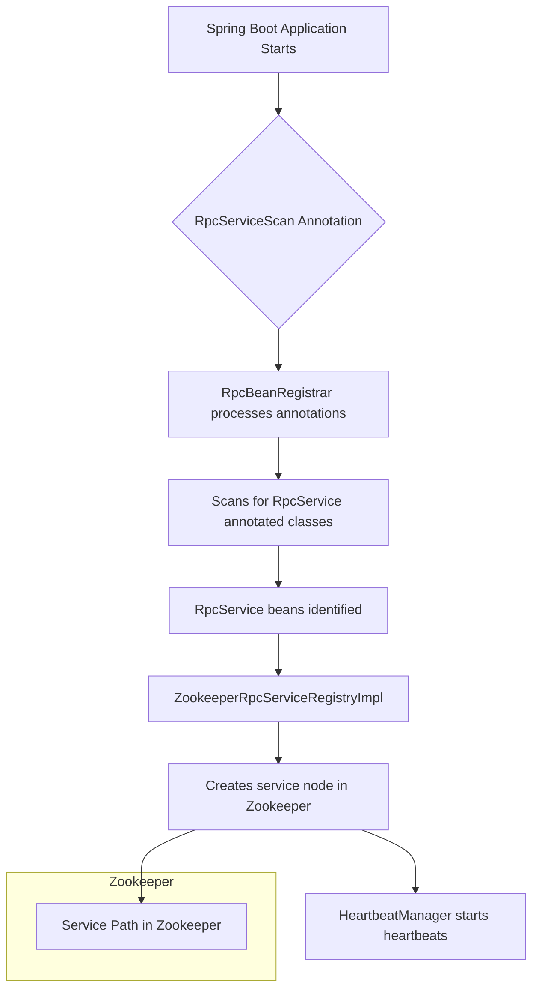
Sources: [rpc-spring/src/main/java/org/example/rpc/spring/RpcBeanRegistrar.java:30-52](), [rpc-registry/src/main/java/org/example/rpc/registry/registry/impl/ZookeeperRpcServiceRegistryImpl.java:49-63]()

### `ZookeeperRpcServiceRegistryImpl`

这是 `AbstractRpcServiceRegistry` 的 Zookeeper 实现，负责将服务注册到 Zookeeper。

关键职责：
-   实现 `doRegister` 方法，将服务信息（IP、端口、服务名）写入 Zookeeper。
-   使用 `ZookeeperHelper` 与 Zookeeper 进行交互。
-   集成 `HeartbeatManager` 来为注册的服务启动心跳。
-   集成 `ServiceShutdownHook` 来在应用关闭时优雅地注销服务。

```java
// rpc-registry/src/main/java/org/example/rpc/registry/registry/impl/ZookeeperRpcServiceRegistryImpl.java:49-63
@Override
void doRegister(RpcServiceRegistryParam registryParam) {
  InetSocketAddress address = new InetSocketAddress(registryParam.getIp(),
      registryParam.getPort());
  // Uses ZookeeperHelper to create the service instance node
  zookeeperHelper.createServiceInstanceNode(registryParam.getServiceName(), address);
  serviceRegistryParamMap.put(registryParam.getInstanceId(), registryParam);

  RpcServiceUnregistryParam unregistryParam = RpcServiceUnregistryParam.builder()
      .ip(registryParam.getIp())
      .port(registryParam.getPort())
      .serviceName(registryParam.getServiceName())
      .instanceId(registryParam.getInstanceId())
      .build();

  // Adds service to shutdown hook for graceful unregistration
  serviceShutdownHook.addRegisteredService(registryParam.getInstanceId(), unregistryParam);
  // Starts heartbeat for the registered service
  heartbeatManager.startHeartbeat(registryParam.getServiceName(), registryParam.getInstanceId());
}
```
该类被标记为 `@Primary`，表示它是 `RpcServiceRegistry` 接口的首选实现。

Sources: [rpc-registry/src/main/java/org/example/rpc/registry/registry/impl/ZookeeperRpcServiceRegistryImpl.java:29-63]()

### 服务实例模型 (`ServiceInstance`)

`ServiceInstance` 类定义了服务实例在注册中心存储的数据结构。

| 字段名             | 类型                 | 描述                                     |
| ------------------ | -------------------- | ---------------------------------------- |
| `serviceName`      | `String`             | 服务名称                                 |
| `instanceId`       | `String`             | 服务实例的唯一标识符                     |
| `ip`               | `String`             | 服务实例的 IP 地址                       |
| `port`             | `int`                | 服务实例的端口号                         |
| `lastHeartbeat`    | `long`               | 最后心跳时间戳                           |
| `registryCenterType` | `RegistryCenterType` | 注册中心类型 (例如 Zookeeper)            |
| `metadata`         | `Map<String, String>` | 服务的额外元数据                         |

```java
// rpc-registry/src/main/java/org/example/rpc/registry/registry/api/model/ServiceInstance.java:16-25
@Data
@Builder
@NoArgsConstructor
@AllArgsConstructor
public class ServiceInstance {
  private String serviceName;
  private String instanceId;
  private String ip;
  private int port;
  private long lastHeartbeat;
  private RegistryCenterType registryCenterType;
  private Map<String, String> metadata;
}
```
Sources: [rpc-registry/src/main/java/org/example/rpc/registry/registry/api/model/ServiceInstance.java:1-26]()

### Zookeeper 节点结构

服务实例在 Zookeeper 中通常按以下路径结构存储：
`/basePath/servicePath/serviceName/instanceAddress`

-   `basePath`: Zookeeper 中 RPC 数据的根路径。
-   `servicePath`: 服务节点的特定路径。
-   `serviceName`: 服务的逻辑名称。
-   `instanceAddress`: 通常是 `ip:port` 格式的字符串，代表一个具体的服务实例。这些节点通常是临时节点（Ephemeral Nodes）。

`ZookeeperHelper` 负责创建这些节点。例如，在 `createServiceInstanceNode` 方法中，它会构建类似 `zookeeperProperties.getBasePath() + zookeeperProperties.getServicePath() + "/" + serviceName + "/" + address.toString()` 的路径。

Sources: [rpc-registry/src/main/java/org/example/rpc/registry/zookeeper/ZookeeperHelper.java:61-62](), [rpc-registry/src/main/java/org/example/rpc/registry/zookeeper/ZookeeperHelper.java:81-94]() (推断自 `createServiceInstanceNode` 逻辑)

## 服务发现

服务发现允许服务消费者查找并连接到已注册的服务实例。

Sources: [rpc-registry/src/main/java/org/example/rpc/registry/zookeeper/ZookeeperHelper.java](), [rpc-test/src/main/java/org/example/rpc/core/test/TestConfig.java:39-44]()

### 发现流程

1.  服务消费者（客户端）需要调用一个远程服务。
2.  客户端通过 `ZookeeperRpcServiceDiscoveryImpl` (或类似的发现组件) 查询 Zookeeper。
3.  `ZookeeperRpcServiceDiscoveryImpl` 利用 `ZookeeperHelper` 从 Zookeeper 获取指定服务名称下的所有可用实例列表。
4.  `ZookeeperHelper` 可能使用本地缓存（`serviceInstanceCache`）来加速查询并减少 Zookeeper 负载。
5.  如果缓存未命中或过期，则从 Zookeeper 加载最新实例列表。
6.  返回服务实例列表给客户端。
7.  客户端的负载均衡器从列表中选择一个实例进行调用。

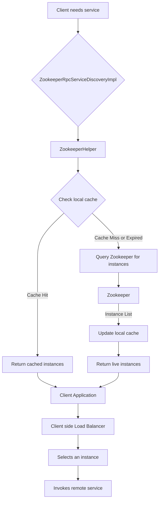
Sources: [rpc-registry/src/main/java/org/example/rpc/registry/zookeeper/ZookeeperHelper.java:47-60](), [rpc-test/src/main/java/org/example/rpc/core/test/TestConfig.java:39-44]()

### `ZookeeperRpcServiceDiscoveryImpl`

`ZookeeperRpcServiceDiscoveryImpl` 类负责从 Zookeeper 中发现服务实例。虽然该类的完整源代码未在上下文中提供，但从 `TestConfig.java` 中可以看出其基本依赖：
```java
// rpc-test/src/main/java/org/example/rpc/core/test/TestConfig.java:39-44
@Bean
public ZookeeperRpcServiceDiscoveryImpl rpcServiceDiscovery(
    ZookeeperHelper zookeeperHelper,
    ServiceHealthManager serviceHealthManager) { // serviceHealthManager might not be used directly by discovery in ZookeeperRpcServiceDiscoveryImpl constructor shown
  return new ZookeeperRpcServiceDiscoveryImpl(zookeeperHelper);
}
```
这表明 `ZookeeperRpcServiceDiscoveryImpl` 主要依赖 `ZookeeperHelper` 来执行实际的 Zookeeper 查询操作以获取服务实例。

Sources: [rpc-test/src/main/java/org/example/rpc/core/test/TestConfig.java:39-44]()

### 服务实例缓存

`ZookeeperHelper` 内部使用 Guava `Cache` (`serviceInstanceCache`) 来缓存从 Zookeeper 获取的服务实例列表。这有助于：
-   减少对 Zookeeper 服务器的直接请求次数，降低其负载。
-   加快服务发现的速度，因为可以从本地缓存快速获取数据。

缓存配置：
-   写入后 30 秒过期 (`expireAfterWrite(30, TimeUnit.SECONDS)`)。
-   最大缓存条目数为 1000 (`maximumSize(1000)`)。
-   记录缓存统计信息 (`recordStats()`)。

当缓存未命中 (`load` 方法) 或需要刷新 (`reload` 方法) 时，会调用 `loadServiceInstanceFromZookeeper` 方法从 Zookeeper 重新加载数据。

```java
// rpc-registry/src/main/java/org/example/rpc/registry/zookeeper/ZookeeperHelper.java:47-60
this.serviceInstanceCache = CacheBuilder.newBuilder()
    .expireAfterWrite(30, TimeUnit.SECONDS)
    .maximumSize(1000)
    .recordStats()
    .build(new CacheLoader<String, List<String>>() {
      @Override
      public List<String> load(String serviceName) throws Exception {
        return loadServiceInstanceFromZookeeper(serviceName);
      }

      @Override
      public ListenableFuture<List<String>> reload(String serviceName, List<String> oldValue) {
        return ListenableFutureTask.create(() -> loadServiceInstanceFromZookeeper(serviceName));
      }
    });
```
Sources: [rpc-registry/src/main/java/org/example/rpc/registry/zookeeper/ZookeeperHelper.java:47-60]()

### 服务变更监听

`ZookeeperHelper` 使用 Apache Curator 框架的 `PathChildrenCache` 来监听 Zookeeper 中服务节点子节点（即服务实例）的变化。
当服务实例上线或下线时，Zookeeper 会通知监听器。`PathChildrenCache` 会接收这些事件 (如 `CHILD_ADDED`, `CHILD_REMOVED`, `CHILD_UPDATED`)。
尽管 `ZookeeperHelper.java` 的提供片段中没有显式展示 `PathChildrenCache` 的监听器回调逻辑如何直接更新 `serviceInstanceCache`，但通常的做法是在这些事件回调中使相应的缓存条目失效或更新缓存，以确保客户端获取到最新的服务列表。

```java
// rpc-registry/src/main/java/org/example/rpc/registry/zookeeper/ZookeeperHelper.java:13-16 (imports)
import org.apache.curator.framework.recipes.cache.PathChildrenCache;
import org.apache.curator.framework.recipes.cache.PathChildrenCacheEvent;
```
`ZookeeperHelper` 中的 `registerWatcherForServiceInstanceChanges` (或类似方法，具体名称未在片段中显示，但 `PathChildrenCache` 的使用暗示了此功能) 会设置这种监听。当服务实例发生变化时，可以触发缓存的刷新机制。

Sources: [rpc-registry/src/main/java/org/example/rpc/registry/zookeeper/ZookeeperHelper.java:13-16]() (推断自 `PathChildrenCache` 的导入和其典型用途)

## `ZookeeperHelper`

`ZookeeperHelper` 是一个核心工具类，封装了与 Zookeeper 交互的所有底层操作。它使用 Apache Curator 客户端库。

Sources: [rpc-registry/src/main/java/org/example/rpc/registry/zookeeper/ZookeeperHelper.java]()

### 主要功能

| 方法 (或功能)                                  | 描述                                                                 |
| ---------------------------------------------- | -------------------------------------------------------------------- |
| `getZookeeperClient()`                         | 获取或初始化 CuratorFramework 客户端实例。                               |
| `createServiceInstanceNode(String serviceName, InetSocketAddress address)` | 在 Zookeeper 中为指定服务创建实例节点 (通常是临时节点)。                 |
| `loadServiceInstanceFromZookeeper(String serviceName)` / `getServiceInstances(String serviceName)` | 从 Zookeeper 获取指定服务的所有实例地址列表。此方法被缓存加载器使用。      |
| `removeServiceInstanceNode(String serviceName, String instanceId)` | 从 Zookeeper 中移除指定的服务实例节点。                                  |
| (隐式) 节点监听                                | 通过 `PathChildrenCache` 监听服务实例的变化。                           |
| `destroy()` (via `DisposableBean`)             | 关闭 Zookeeper 客户端连接。                                            |

```java
// rpc-registry/src/main/java/org/example/rpc/registry/zookeeper/ZookeeperHelper.java:81 (部分示例)
public void createServiceInstanceNode(String serviceName, InetSocketAddress address) {
  // ... logic to create node ...
  // String serviceInstanceNodePath = serviceNodePath + "/" + address.toString();
  // zookeeperClient.create().withMode(CreateMode.EPHEMERAL).forPath(serviceInstanceNodePath);
}

// rpc-registry/src/main/java/org/example/rpc/registry/zookeeper/ZookeeperHelper.java:62 (部分示例)
private List<String> loadServiceInstanceFromZookeeper(String serviceName) {
  String serviceNodePath = zookeeperProperties.getBasePath() + zookeeperProperties.getServicePath() + "/" + serviceName;
  // ... logic to get children ...
  // return zookeeperClient.getChildren().forPath(serviceNodePath);
}
```
Sources: [rpc-registry/src/main/java/org/example/rpc/registry/zookeeper/ZookeeperHelper.java:34-140]() (覆盖该类的主要方法)

### 配置 (`ZookeeperProperties`)

`ZookeeperHelper` 的行为通过 `ZookeeperProperties` 类进行配置。该类通过 `@EnableConfigurationProperties` 在 `TestConfig` 中启用。

| 属性名                | 描述                                     | 示例值 (推断)         |
| --------------------- | ---------------------------------------- | --------------------- |
| `connectString`       | Zookeeper 连接字符串 (例如 "host1:port1,host2:port2") | "localhost:2181"      |
| `sessionTimeoutMs`    | 会话超时时间 (毫秒)                      | 30000                 |
| `connectionTimeoutMs` | 连接超时时间 (毫秒)                      | 5000                  |
| `basePath`            | RPC 在 Zookeeper 中的根路径                | "/rpc"                |
| `servicePath`         | 服务节点在 `basePath` 下的相对路径         | "/services"           |
| `retryPolicy`         | Curator 重试策略 (例如 `ExponentialBackoffRetry`) | (内部配置)          |

这些属性通常在应用的 `application.properties` 或 `application.yml` 文件中设置。
`ZookeeperHelper` 使用 `zookeeperProperties.getBasePath()` 和 `zookeeperProperties.getServicePath()` 来构建 Zookeeper 节点路径。

Sources: [rpc-registry/src/main/java/org/example/rpc/registry/zookeeper/ZookeeperHelper.java:40-41](), [rpc-registry/src/main/java/org/example/rpc/registry/zookeeper/ZookeeperHelper.java:61-62](), [rpc-test/src/main/java/org/example/rpc/core/test/TestConfig.java:25]()

## 健康检查与心跳

为了确保服务注册中心只包含健康和可用的服务实例，框架实现了健康检查和心跳机制。

Sources: [rpc-registry/src/main/java/org/example/rpc/registry/registry/impl/ZookeeperRpcServiceRegistryImpl.java](), [rpc-test/src/main/java/org/example/rpc/core/test/TestConfig.java]()

### `HeartbeatManager`

`HeartbeatManager` 负责代表已注册的服务实例定期向注册中心（或相关协调服务）发送心跳信号。
-   在 `ZookeeperRpcServiceRegistryImpl` 的 `doRegister` 方法中，一旦服务注册成功，就会调用 `heartbeatManager.startHeartbeat()` 来为该服务实例启动心跳。
-   心跳机制有助于维持 Zookeeper 临时节点的活性，如果服务实例崩溃且无法发送心跳，其会话最终会超时，Zookeeper 会自动移除对应的临时节点，从而实现自动的服务下线。
-   `HeartbeatManager` 在 `TestConfig` 中被创建，并注入到 `ZookeeperRpcServiceRegistryImpl`。

Sources: [rpc-registry/src/main/java/org/example/rpc/registry/registry/impl/ZookeeperRpcServiceRegistryImpl.java:62](), [rpc-test/src/main/java/org/example/rpc/core/test/TestConfig.java:30-32]()

### `ServiceHealthManager`

`ServiceHealthManager` 用于管理和跟踪服务的健康状态。
-   它被注入到 `ZookeeperHelper` 和 `HeartbeatManager` 中。
-   在 `ZookeeperHelper` 中，它可能用于在 Zookeeper 连接问题或节点操作失败时更新服务健康状态的内部视图。
-   `HeartbeatManager` 可能使用它来决定是否应为某个服务发送心跳，或根据心跳结果更新健康状态。

Sources: [rpc-registry/src/main/java/org/example/rpc/registry/zookeeper/ZookeeperHelper.java:40-43](), [rpc-test/src/main/java/org/example/rpc/core/test/TestConfig.java:30-32](), [rpc-test/src/main/java/org/example/rpc/core/test/TestConfig.java:50-52]()

### 服务下线处理 (`ServiceShutdownHook`)

`ZookeeperRpcServiceRegistryImpl` 包含一个 `ServiceShutdownHook` 实例。
```java
// rpc-registry/src/main/java/org/example/rpc/registry/registry/impl/ZookeeperRpcServiceRegistryImpl.java:34
private final ServiceShutdownHook serviceShutdownHook = new ServiceShutdownHook(this);
```
在服务注册时 (`doRegister` 方法)，相关的注销参数会通过 `serviceShutdownHook.addRegisteredService()` 添加到钩子中。
```java
// rpc-registry/src/main/java/org/example/rpc/registry/registry/impl/ZookeeperRpcServiceRegistryImpl.java:60
serviceShutdownHook.addRegisteredService(registryParam.getInstanceId(), unregistryParam);
```
这个钩子通常注册为 JVM 的关闭钩子 (Shutdown Hook)。当应用程序关闭时，它会触发，并调用 `ZookeeperRpcServiceRegistryImpl` 的 `doUnregister` 方法来从 Zookeeper 中移除所有已注册的服务实例，确保服务优雅下线。

Sources: [rpc-registry/src/main/java/org/example/rpc/registry/registry/impl/ZookeeperRpcServiceRegistryImpl.java:34](), [rpc-registry/src/main/java/org/example/rpc/registry/registry/impl/ZookeeperRpcServiceRegistryImpl.java:54-61](), [rpc-registry/src/main/java/org/example/rpc/registry/registry/impl/ZookeeperRpcServiceRegistryImpl.java:65-77]() (doUnregister method)

## 总结

该 RPC 框架中的服务注册与发现机制以 Zookeeper 为核心，通过 `@RpcService` 和 `@RpcServiceScan` 注解实现了服务的自动扫描与注册。`ZookeeperRpcServiceRegistryImpl` 负责将服务信息写入 Zookeeper，而 `ZookeeperRpcServiceDiscoveryImpl` (通过 `ZookeeperHelper`) 则使客户端能够发现这些服务。`ZookeeperHelper` 封装了所有 Zookeeper 操作，并提供了服务实例缓存和变更监听功能。心跳机制和关机钩子确保了注册信息的准确性和服务的优雅下线。这套机制为构建弹性和可扩展的分布式应用提供了坚实的基础。

---

<a id='page-loadbalancing'></a>

## 负载均衡

### Related Pages

Related topics: [核心模块详解](#page-core-modules), [服务注册与发现](#page-registry-discovery)

<details>
<summary>相关源文件</summary>

以下文件用作生成此维基页面的上下文：

- [rpc-loadbalancer/src/main/java/org/example/rpc/loadbalancer/api/LoadBalancer.java](rpc-loadbalancer/src/main/java/org/example/rpc/loadbalancer/api/LoadBalancer.java)
- [rpc-loadbalancer/src/main/java/org/example/rpc/loadbalancer/api/LoadBalanceStrategy.java](rpc-loadbalancer/src/main/java/org/example/rpc/loadbalancer/api/LoadBalanceStrategy.java)
- [rpc-loadbalancer/src/main/java/org/example/rpc/loadbalancer/LoadBalancerFactory.java](rpc-loadbalancer/src/main/java/org/example/rpc/loadbalancer/LoadBalancerFactory.java)
- [rpc-loadbalancer/src/main/java/org/example/rpc/loadbalancer/impl/RandomLoadBalancer.java](rpc-loadbalancer/src/main/java/org/example/rpc/loadbalancer/impl/RandomLoadBalancer.java)
- [rpc-loadbalancer/src/main/java/org/example/rpc/loadbalancer/impl/WeightedLoadBalancer.java](rpc-loadbalancer/src/main/java/org/example/rpc/loadbalancer/impl/WeightedLoadBalancer.java)
- [rpc-loadbalancer/src/main/java/org/example/rpc/loadbalancer/impl/LeastActiveLoadBalancer.java](rpc-loadbalancer/src/main/java/org/example/rpc/loadbalancer/impl/LeastActiveLoadBalancer.java)
- [rpc-loadbalancer/src/main/java/org/example/rpc/loadbalancer/impl/ConsistentHashLoadBalancer.java](rpc-loadbalancer/src/main/java/org/example/rpc/loadbalancer/impl/ConsistentHashLoadBalancer.java)
- [rpc-test/src/main/java/org/example/rpc/core/test/TestConfig.java](rpc-test/src/main/java/org/example/rpc/core/test/TestConfig.java)
- [rpc-test/src/main/java/org/example/rpc/core/test/loadbalance/LoadBalancerTest.java](rpc-test/src/main/java/org/example/rpc/core/test/loadbalance/LoadBalancerTest.java)
- [README.md](README.md)
</details>

# 负载均衡

## 引言

负载均衡是 RPC (Remote Procedure Call) 框架中的一个核心组件，负责在多个服务实例之间分配请求流量，以优化资源利用率、最大化吞吐量、减少延迟并确保容错能力。在本项目中，`rpc-loadbalancer` 模块提供了多种负载均衡策略，允许服务消费者根据特定需求选择最合适的服务实例。此功能支持动态服务发现、服务实例选择和流量分配。

该模块设计为可扩展的，允许轻松添加新的自定义负载均衡策略。它与服务注册与发现机制紧密集成，以确保负载均衡器始终拥有最新的可用服务实例列表。
Sources: [README.md:82-86](), [rpc-loadbalancer/src/main/java/org/example/rpc/loadbalancer/api/LoadBalancer.java:8-12]()

## 核心组件

### `LoadBalancer` 接口

`LoadBalancer` 接口是所有负载均衡策略实现的基础。它定义了负载均衡器的核心功能。

```java
package org.example.rpc.loadbalancer.api;

import java.util.List;

public interface LoadBalancer {

  String select(List<String> serviceInstance, String serviceName);

  LoadBalanceStrategy getStrategy();

  default void decrementActive(String instance) {
  }

  default void adjustWeight(String serviceName, String serviceInstance, int newWeight) {
  }
}
```
Sources: [rpc-loadbalancer/src/main/java/org/example/rpc/loadbalancer/api/LoadBalancer.java:1-30]()

主要方法包括：

| 方法名             | 描述                                                                 |
| ------------------ | -------------------------------------------------------------------- |
| `select`           | 从服务实例列表中选择一个实例。                                         |
| `getStrategy`      | 获取当前负载均衡器使用的策略。                                         |
| `decrementActive`  | （默认方法）减少实例的活跃连接数，主要用于最少活跃连接策略。             |
| `adjustWeight`     | （默认方法）调整服务实例的权重，主要用于加权类策略。                   |
Sources: [rpc-loadbalancer/src/main/java/org/example/rpc/loadbalancer/api/LoadBalancer.java:19-29]()

### `LoadBalanceStrategy` 枚举

`LoadBalanceStrategy` 枚举定义了框架支持的各种负载均衡策略。

```java
package org.example.rpc.loadbalancer.api;

public enum LoadBalanceStrategy {
  RANDOM,
  ROUND_ROBIN,
  WEIGHTED, // Weighted Round Robin
  LEAST_ACTIVE,
  CONSISTENT_HASH,
}
```
Sources: [rpc-loadbalancer/src/main/java/org/example/rpc/loadbalancer/api/LoadBalanceStrategy.java:1-12]()

支持的策略包括：

| 策略              | 描述                       |
| ----------------- | -------------------------- |
| `RANDOM`          | 随机选择一个服务实例。     |
| `ROUND_ROBIN`     | 轮询选择服务实例。         |
| `WEIGHTED`        | 根据权重轮询选择服务实例。 |
| `LEAST_ACTIVE`    | 选择活跃连接数最少的实例。 |
| `CONSISTENT_HASH` | 基于一致性哈希算法选择实例。|
Sources: [rpc-loadbalancer/src/main/java/org/example/rpc/loadbalancer/api/LoadBalanceStrategy.java:7-11]()

### `LoadBalancerFactory` 工厂

`LoadBalancerFactory` 用于根据指定的 `LoadBalanceStrategy` 获取相应的 `LoadBalancer` 实例。它将策略枚举映射到具体的负载均衡器实现。

```java
package org.example.rpc.loadbalancer;

// ... imports ...

@Component
public class LoadBalancerFactory {
  private final Map<LoadBalanceStrategy, LoadBalancer> loadBalancers;

  public LoadBalancerFactory(
      RandomLoadBalancer randomLoadBalancer,
      RoundRobinLoadBalancer roundRobinLoadBalancer,
      WeightedLoadBalancer weightedLoadBalancer,
      LeastActiveLoadBalancer leastActiveLoadBalancer,
      ConsistentHashLoadBalancer consistentHashLoadBalancer) {

    loadBalancers = new ConcurrentHashMap<>();
    loadBalancers.put(LoadBalanceStrategy.RANDOM, randomLoadBalancer);
    loadBalancers.put(LoadBalanceStrategy.ROUND_ROBIN, roundRobinLoadBalancer);
    loadBalancers.put(LoadBalanceStrategy.WEIGHTED, weightedLoadBalancer);
    loadBalancers.put(LoadBalanceStrategy.LEAST_ACTIVE, leastActiveLoadBalancer);
    loadBalancers.put(LoadBalanceStrategy.CONSISTENT_HASH, consistentHashLoadBalancer);
  }

  public LoadBalancer getLoadBalancer(LoadBalanceStrategy strategy) {
    LoadBalancer loadBalancer = loadBalancers.get(strategy);
    if (loadBalancer == null) {
      throw new IllegalArgumentException("Unsupported load balance strategy: " + strategy);
    }
    return loadBalancer;
  }
  // ... other methods ...
}
```
Sources: [rpc-loadbalancer/src/main/java/org/example/rpc/loadbalancer/LoadBalancerFactory.java:1-59]()

下图展示了 `LoadBalancerFactory` 如何根据策略提供不同的负载均衡器实例：
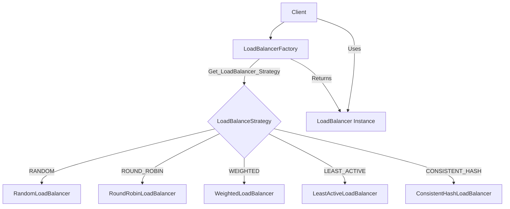
该图描述了客户端请求 `LoadBalancerFactory` 以获取特定策略的负载均衡器。工厂内部维护一个映射，将 `LoadBalanceStrategy` 枚举值映射到相应的具体实现类。
Sources: [rpc-loadbalancer/src/main/java/org/example/rpc/loadbalancer/LoadBalancerFactory.java:26-33]()

## 负载均衡策略详解

### 1. 随机 (Random)

随机负载均衡策略从可用服务实例列表中随机选择一个实例。这种方法简单且在实例处理能力相似时表现良好。

```java
// rpc-loadbalancer/src/main/java/org/example/rpc/loadbalancer/impl/RandomLoadBalancer.java
@Component
public class RandomLoadBalancer implements LoadBalancer {

  @Override
  public String select(List<String> serviceInstance, String serviceName) {
    if (serviceInstance == null || serviceInstance.isEmpty()) {
      return null;
    }
    int size = serviceInstance.size();
    return serviceInstance.get(ThreadLocalRandom.current().nextInt(size));
  }

  @Override
  public LoadBalanceStrategy getStrategy() {
    return LoadBalanceStrategy.RANDOM;
  }
}
```
实现利用 `ThreadLocalRandom.current().nextInt(size)` 来选择一个随机索引。
Sources: [rpc-loadbalancer/src/main/java/org/example/rpc/loadbalancer/impl/RandomLoadBalancer.java:1-23]()

### 2. 轮询 (Round Robin)

轮询策略按顺序将请求分发给每个可用的服务实例。当所有实例都处理完一个请求后，它会从第一个实例重新开始。这种策略假设所有服务实例的处理能力大致相同。
虽然 `RoundRobinLoadBalancer.java` 的完整代码未在此上下文中直接提供，但其行为和集成点可以从 `LoadBalancerFactory` 和测试文件中推断出来。
`LoadBalancerTest.java` 中的测试验证了轮询行为：
```java
// rpc-test/src/main/java/org/example/rpc/core/test/loadbalance/LoadBalancerTest.java
  @Test
  void testRoundRobinLoadBalancer() {
    LoadBalancer loadBalancer = loadBalancerFactory.getLoadBalancer(LoadBalanceStrategy.ROUND_ROBIN);
    List<String> selections = new ArrayList<>();
    int rounds = 3;

    for (int round = 0; round < rounds; round++) {
      for (int i = 0; i < instances.size(); i++) {
        String selected = loadBalancer.select(instances, SERVICE_NAME);
        selections.add(selected);
      }
    }
    // ... assertions to check round-robin distribution ...
  }
```
Sources: [rpc-loadbalancer/src/main/java/org/example/rpc/loadbalancer/LoadBalancerFactory.java:29](), [rpc-test/src/main/java/org/example/rpc/core/test/loadbalance/LoadBalancerTest.java:56-73]()

### 3. 加权轮询 (Weighted Round Robin)

加权轮询策略是轮询策略的扩展，它允许为每个服务实例分配一个权重。权重越高的实例接收到的请求比例就越大。该实现采用平滑加权轮询算法。

`WeightedLoadBalancer` 维护每个服务实例的权重信息，包括初始权重和当前权重。
```java
// rpc-loadbalancer/src/main/java/org/example/rpc/loadbalancer/impl/WeightedLoadBalancer.java
@Component
public class WeightedLoadBalancer implements LoadBalancer {
  private final Map<String, List<ServiceWeight>> serviceWeightMap = new ConcurrentHashMap<>();

  @Override
  public String select(List<String> serviceInstance, String serviceName) {
    // ...
    List<ServiceWeight> weights = serviceWeightMap.computeIfAbsent(serviceName, k -> {
      List<ServiceWeight> list = new ArrayList<>();
      for (String instance : serviceInstance) {
        ServiceWeight serviceWeight = new ServiceWeight();
        serviceWeight.setServiceInstance(instance);
        serviceWeight.setWeight(10); // default weight is 10
        serviceWeight.setCurrentWeight(0);
        list.add(serviceWeight);
      }
      return list;
    });
    return smoothWeightedRoundRobin(weights);
  }

  private String smoothWeightedRoundRobin(List<ServiceWeight> weights) {
    int totalWeight = 0;
    ServiceWeight maxCurrentWeight = null;

    for (ServiceWeight weight : weights) {
      totalWeight += weight.getWeight();
      weight.setCurrentWeight(weight.getCurrentWeight() + weight.getWeight());

      if (maxCurrentWeight == null || weight.getCurrentWeight() > maxCurrentWeight.getCurrentWeight()) {
        maxCurrentWeight = weight;
      }
    }

    if (maxCurrentWeight != null) {
      maxCurrentWeight.setCurrentWeight(maxCurrentWeight.getCurrentWeight() - totalWeight);
      return maxCurrentWeight.getServiceInstance();
    }
    return null;
  }
  // ...
}
```
`ServiceWeight` 类用于存储每个实例的权重信息：
```java
// rpc-loadbalancer/src/main/java/org/example/rpc/loadbalancer/impl/weight/ServiceWeight.java
@Data
public class ServiceWeight {
  private String serviceInstance;
  private int weight;
  private int currentWeight;
}
```
默认权重设置为10。平滑加权轮询算法确保请求根据其权重平滑地分配到各个实例。
Sources: [rpc-loadbalancer/src/main/java/org/example/rpc/loadbalancer/impl/WeightedLoadBalancer.java:1-64](), [rpc-loadbalancer/src/main/java/org/example/rpc/loadbalancer/impl/weight/ServiceWeight.java:1-10]()

### 4. 最少活跃连接 (Least Active)

最少活跃连接策略将请求路由到当前活跃连接数最少的服务实例。这种方法适用于服务实例处理能力不同或请求处理时间差异较大的场景。

```java
// rpc-loadbalancer/src/main/java/org/example/rpc/loadbalancer/impl/LeastActiveLoadBalancer.java
@Component
public class LeastActiveLoadBalancer implements LoadBalancer {
  private final Map<String, AtomicInteger> activeCountMap = new ConcurrentHashMap<>();

  @Override
  public String select(List<String> serviceInstance, String serviceName) {
    // ...
    // 1. 找出当前最小活跃数
    int leastActive = Integer.MAX_VALUE;
    List<String> leastActiveInstances = new ArrayList<>();
    
    for (String instance : serviceInstance) {
      AtomicInteger count = activeCountMap.computeIfAbsent(instance, k -> new AtomicInteger(0));
      int active = count.get();
      // ... logic to find least active instances ...
    }

    // 2. 如果有多个最小活跃数的实例，随机选择一个
    // ...
    
    // 3. 增加选中实例的活跃数
    activeCountMap.get(selectedInstance).incrementAndGet();
    return selectedInstance;
  }

  public void decrementActive(String instance) {
    AtomicInteger count = activeCountMap.get(instance);
    if (count != null && count.get() > 0) {
      count.decrementAndGet();
    }
  }
  // ...
}
```
该实现通过 `activeCountMap` 跟踪每个实例的活跃连接数。选择实例后，其活跃数会增加。`decrementActive` 方法用于在请求处理完成后减少活跃数，这需要与RPC调用生命周期集成。
Sources: [rpc-loadbalancer/src/main/java/org/example/rpc/loadbalancer/impl/LeastActiveLoadBalancer.java:1-56]()

### 5. 一致性哈希 (Consistent Hash)

一致性哈希策略根据请求的某个参数（例如用户ID或请求ID，如果服务名中包含 `#` 分隔的参数）或服务名本身将请求映射到特定的服务实例。这确保了具有相同哈希键的请求始终路由到同一个实例（只要实例列表不发生变化），这对于需要会话保持或缓存本地化的场景非常有用。

```java
// rpc-loadbalancer/src/main/java/org/example/rpc/loadbalancer/impl/ConsistentHashLoadBalancer.java
@Component
public class ConsistentHashLoadBalancer implements LoadBalancer {

  private final int virtualNodes; // 默认为 150
  private final SortedMap<Integer, String> circle = new ConcurrentSkipListMap<>();
  private Set<String> currentInstances;

  // ... constructor ...

  @Override
  public String select(List<String> serviceInstance, String serviceName) {
    // ...
    String param = extractParam(serviceName); // 尝试从 serviceName 提取参数
    String actualServiceName = param != null ? serviceName : serviceName + "#" + System.nanoTime(); // 若无参数，则为每个请求生成唯一key

    // 如果实例列表发生变化，重建哈希环
    Set<String> newInstances = new HashSet<>(serviceInstance);
    if (!newInstances.equals(currentInstances)) {
      buildHashCircle(serviceInstance);
      currentInstances = newInstances;
    }

    int hash = getHash(actualServiceName); // 计算请求的哈希值
    SortedMap<Integer, String> tailMap = circle.tailMap(hash);
    int nodeHash = tailMap.isEmpty() ? circle.firstKey() : tailMap.firstKey(); // 在环上查找顺时针第一个节点

    return circle.get(nodeHash);
  }

  private void buildHashCircle(List<String> serviceInstance) {
    circle.clear();
    for (String instance : serviceInstance) {
      for (int i = 0; i < virtualNodes; i++) { // 为每个真实节点创建多个虚拟节点
        String virtualNodeName = instance + "#" + i;
        circle.put(getHash(virtualNodeName), instance);
      }
    }
  }

  private int getHash(String key) { // 使用 MD5 计算哈希值
    // ...
  }
}
```
该实现使用 `ConcurrentSkipListMap` 来表示哈希环，并通过引入虚拟节点来改善哈希分布的均匀性。默认虚拟节点数为150。
Sources: [rpc-loadbalancer/src/main/java/org/example/rpc/loadbalancer/impl/ConsistentHashLoadBalancer.java:1-60]()

## 配置与集成

负载均衡器通常作为 Spring Bean 进行配置和管理。`TestConfig.java` 文件展示了如何在测试环境中配置这些负载均衡器及其工厂。

```java
// rpc-test/src/main/java/org/example/rpc/core/test/TestConfig.java
@Configuration
// ...
public class TestConfig {

  // ... other beans ...

  @Bean
  public RandomLoadBalancer randomLoadBalancer() {
    return new RandomLoadBalancer();
  }

  @Bean
  public RoundRobinLoadBalancer roundRobinLoadBalancer() {
    return new RoundRobinLoadBalancer();
  }

  @Bean
  public WeightedLoadBalancer weightedLoadBalancer() {
    return new WeightedLoadBalancer();
  }

  @Bean
  public LeastActiveLoadBalancer leastActiveLoadBalancer() {
    return new LeastActiveLoadBalancer();
  }

  @Bean
  public ConsistentHashLoadBalancer consistentHashLoadBalancer() {
    return new ConsistentHashLoadBalancer();
  }

  @Bean
  public LoadBalancerFactory loadBalancerFactory(
      RandomLoadBalancer randomLoadBalancer,
      RoundRobinLoadBalancer roundRobinLoadBalancer,
      WeightedLoadBalancer weightedLoadBalancer,
      LeastActiveLoadBalancer leastActiveLoadBalancer,
      ConsistentHashLoadBalancer consistentHashLoadBalancer) {
    return new LoadBalancerFactory(
        randomLoadBalancer,
        roundRobinLoadBalancer,
        weightedLoadBalancer,
        leastActiveLoadBalancer,
        consistentHashLoadBalancer
    );
  }
}
```
在这个配置中，每种负载均衡策略都被声明为一个Bean，然后注入到 `LoadBalancerFactory` 中。应用程序可以通过 `@Autowired` 注入 `LoadBalancerFactory` 来获取所需的负载均衡器。
Sources: [rpc-test/src/main/java/org/example/rpc/core/test/TestConfig.java:47-80]()

## 测试

项目包含针对负载均衡模块的单元测试和集成测试，以确保各种策略的正确性和性能。

### 单元测试 (`LoadBalancerTest.java`)

`LoadBalancerTest` 类专注于测试单个负载均衡策略的逻辑。例如，它验证随机负载均衡器是否大致均匀地分配请求，以及轮询负载均衡器是否按预期顺序选择实例。

```java
// rpc-test/src/main/java/org/example/rpc/core/test/loadbalance/LoadBalancerTest.java
@SpringBootTest(classes = TestConfig.class)
public class LoadBalancerTest {

  // ... setUp ...

  @Test
  void testRandomLoadBalancer() {
    LoadBalancer loadBalancer = loadBalancerFactory.getLoadBalancer(LoadBalanceStrategy.RANDOM);
    // ... logic to test random distribution ...
  }

  @Test
  void testRoundRobinLoadBalancer() {
    LoadBalancer loadBalancer = loadBalancerFactory.getLoadBalancer(LoadBalanceStrategy.ROUND_ROBIN);
    // ... logic to test round-robin distribution ...
  }
  // ... other tests for different strategies ...
}
```
Sources: [rpc-test/src/main/java/org/example/rpc/core/test/loadbalance/LoadBalancerTest.java:1-100]() (approximate range for overall structure and tests)

### 集成测试 (`LoadBalanceIntegrationTest.java`)

`LoadBalanceIntegrationTest` 类测试负载均衡策略在更接近真实环境的场景下的行为，例如与服务发现集成。它还可能包括性能测试。

```java
// rpc-test/src/main/java/org/example/rpc/core/test/loadbalance/LoadBalanceIntegrationTest.java
@SpringBootTest(classes = TestConfig.class)
public class LoadBalanceIntegrationTest {

  @Autowired
  private LoadBalancerFactory loadBalancerFactory;

  @Autowired
  private RpcServiceDiscovery serviceDiscovery; // 集成服务发现

  @Test
  void testLoadBalancerWithMultipleInstances() throws Exception {
    String serviceName = "test.core.rpc.io.ecstasoy.TestService";
    List<String> instances = serviceDiscovery.getServiceInstaceList(serviceName);

    // Test each strategy
    testStrategy(LoadBalanceStrategy.ROUND_ROBIN, instances, serviceName);
    // ...
  }

  private void testStrategy(LoadBalanceStrategy strategy, List<String> instances, String serviceName) throws InterruptedException {
    LoadBalancer loadBalancer = loadBalancerFactory.getLoadBalancer(strategy);
    // ... simulate multiple requests and analyze distribution ...
  }

  @Test
  void performanceTest() throws ExecutionException {
    // ... logic to test performance of each strategy ...
  }
}
```
这些测试确保了负载均衡模块在各种条件下都能按预期工作。
Sources: [rpc-test/src/main/java/org/example/rpc/core/test/loadbalance/LoadBalanceIntegrationTest.java:1-77]()

## 总结

RPC框架中的负载均衡模块提供了一套灵活且可扩展的机制，用于在分布式环境中有效地分配服务请求。通过支持多种标准负载均衡策略（如随机、轮询、加权、最少活跃和一致性哈希），开发人员可以选择最适合其应用程序需求的策略。该模块与Spring框架良好集成，易于配置和使用，并通过全面的测试套件确保其可靠性。
Sources: [README.md:82-86](), [rpc-loadbalancer/src/main/java/org/example/rpc/loadbalancer/LoadBalancerFactory.java]()

---

<a id='page-monitoring'></a>

## 性能监控

### Related Pages

Related topics: [核心模块详解](#page-core-modules), [拦截器机制与自定义](#page-interceptors)

<details>
<summary>相关源文件</summary>

以下文件用作生成此维基页面的上下文：

- [rpc-monitor/src/main/java/org/example/rpc/monitor/api/MonitoringService.java](rpc-monitor/src/main/java/org/example/rpc/monitor/api/MonitoringService.java)
- [rpc-monitor/src/main/java/org/example/rpc/monitor/impl/DefaultMonitoringServiceImpl.java](rpc-monitor/src/main/java/org/example/rpc/monitor/impl/DefaultMonitoringServiceImpl.java)
- [rpc-monitor/src/main/java/org/example/rpc/monitor/impl/ClientMonitoringServiceImpl.java](rpc-monitor/src/main/java/org/example/rpc/monitor/impl/ClientMonitoringServiceImpl.java)
- [rpc-interceptor/src/main/java/org/example/rpc/interceptor/impl/PerformanceInterceptor.java](rpc-interceptor/src/main/java/org/example/rpc/interceptor/impl/PerformanceInterceptor.java)
- [rpc-monitor/src/main/java/org/example/rpc/monitor/controller/ServerMonitorController.java](rpc-monitor/src/main/java/org/example/rpc/monitor/controller/ServerMonitorController.java)
- [rpc-monitor/src/main/java/org/example/rpc/monitor/controller/ClientMonitorController.java](rpc-monitor/src/main/java/org/example/rpc/monitor/controller/ClientMonitorController.java)
- [rpc-monitor/src/main/java/org/example/rpc/monitor/model/MethodMetrics.java](rpc-monitor/src/main/java/org/example/rpc/monitor/model/MethodMetrics.java)
- [rpc-monitor/src/main/java/org/example/rpc/monitor/model/StatisticalMetrics.java](rpc-monitor/src/main/java/org/example/rpc/monitor/model/StatisticalMetrics.java)
- [README.md](README.md)
</details>

# 性能监控

## 引言

性能监控是 RPC 框架中的一个关键特性，旨在收集、分析和展示服务调用的性能指标和健康状况。`rpc-monitor` 模块负责实现这些功能，它提供了服务性能指标收集、统计分析以及健康监控的能力。通过性能监控，开发和运维人员可以深入了解服务的运行状态，及时发现和定位问题，从而保障系统的稳定性和高可用性。

该系统通过拦截器在服务端和客户端收集数据，并提供 API 接口供外部查询监控数据。监控数据包括方法执行时间、成功/失败状态、错误信息以及请求类型等。

Sources: [README.md:30-33](), [README.md:50-53]()

## 核心组件

性能监控主要由以下几个核心组件构成：监控服务接口、具体实现类（服务端和客户端）、数据模型、性能拦截器以及用于暴露监控数据的控制器。

Sources: [rpc-monitor/src/main/java/org/example/rpc/monitor/api/MonitoringService.java](), [rpc-monitor/src/main/java/org/example/rpc/monitor/impl/DefaultMonitoringServiceImpl.java](), [rpc-monitor/src/main/java/org/example/rpc/monitor/impl/ClientMonitoringServiceImpl.java](), [rpc-interceptor/src/main/java/org/example/rpc/interceptor/impl/PerformanceInterceptor.java]()

### 监控服务接口 (`MonitoringService`)

`MonitoringService` 定义了监控服务的基本操作，包括记录指标、获取方法指标、获取统计数据和清理历史数据。

```java
// rpc-monitor/src/main/java/org/example/rpc/monitor/api/MonitoringService.java
public interface MonitoringService {

  void recordMetrics(String methodName, long executionTime, boolean success, String errorMessage, String metricType);

  List<MethodMetrics> getMethodMetrics(String methodName);

  Map<String, StatisticalMetrics> getStatistics();

  void clearHistoricalData(Duration retention);
}
```
Sources: [rpc-monitor/src/main/java/org/example/rpc/monitor/api/MonitoringService.java:15-39]()

下表总结了 `MonitoringService` 接口中的方法：

| 方法名                | 描述                                   |
| --------------------- | -------------------------------------- |
| `recordMetrics`       | 记录方法调用的性能指标                 |
| `getMethodMetrics`    | 获取指定方法的原始性能指标列表         |
| `getStatistics`       | 获取所有方法的统计性能指标             |
| `clearHistoricalData` | 根据保留期限清理历史监控数据           |
Sources: [rpc-monitor/src/main/java/org/example/rpc/monitor/api/MonitoringService.java:23-39]()

### 服务端监控实现 (`DefaultMonitoringServiceImpl`)

`DefaultMonitoringServiceImpl` 是 `MonitoringService` 的服务端默认实现。它使用 `ConcurrentHashMap` 存储每个方法的指标列表。

关键实现细节：
-   **指标记录**: `recordMetrics` 方法将新的 `MethodMetrics` 对象添加到对应方法名的列表中。如果方法名首次出现，则会创建一个新的同步列表。
-   **统计计算**: `getStatistics` 方法遍历所有方法的指标，计算平均执行时间、最大执行时间、成功次数、总次数、成功率、错误信息列表以及不同指标类型的计数。
-   **数据清理**: `clearHistoricalData` 方法根据传入的 `retention`（保留期限）移除早于截止时间的指标数据。

```java
// rpc-monitor/src/main/java/org/example/rpc/monitor/impl/DefaultMonitoringServiceImpl.java:17-20
@Override
public void recordMetrics(String methodName, long executionTime, boolean success, String errorMessage, String metricType) {
  methodMetricsMap.computeIfAbsent(methodName, k -> Collections.synchronizedList(new ArrayList<>()))
      .add(new MethodMetrics(methodName, executionTime, LocalDateTime.now(), success, errorMessage, metricType));
}
```
Sources: [rpc-monitor/src/main/java/org/example/rpc/monitor/impl/DefaultMonitoringServiceImpl.java:14-60]()

### 客户端监控实现 (`ClientMonitoringServiceImpl`)

`ClientMonitoringServiceImpl` 是 `MonitoringService` 的客户端实现。它除了记录常规指标外，还特别关注熔断器的状态。

关键实现细节：
-   **指标记录与熔断状态**: `recordMetrics` 方法在记录指标时，会根据调用是否成功以及错误信息中是否包含 "circuit breaker" 来更新 `lastCircuitBreakerStates`。
    -   如果调用失败且错误信息指示熔断器打开，则记录失败指标并将状态更新为 `OPEN`。
    -   如果调用成功，则记录成功指标。若 `metricType` 为 `"HALF_OPEN"`，则状态更新为 `HALF_OPEN`，否则为 `CLOSED`。
-   **获取熔断器状态**: 提供了 `getCurrentState` 方法来获取指定服务的当前熔断器状态。
-   **数据清理**: `clearHistoricalData` 方法在清理指标时，如果一个方法的所有指标都被移除，则同时也会从 `methodMetricsMap` 和 `lastCircuitBreakerStates` 中移除该方法的相关条目。

```java
// rpc-monitor/src/main/java/org/example/rpc/monitor/impl/ClientMonitoringServiceImpl.java:18-23
@Override
public void recordMetrics(String methodName, long executionTime, boolean success, String errorMessage, String metricType) {
  if (!success && errorMessage != null && errorMessage.contains("circuit breaker")) {
    methodMetricsMap.computeIfAbsent(methodName, k -> Collections.synchronizedList(new ArrayList<>()))
        .add(new MethodMetrics(methodName, executionTime, LocalDateTime.now(), false, errorMessage, metricType));
      lastCircuitBreakerStates.put(methodName, CircuitBreakerState.OPEN);
  }
  // ... (success case)
}
```
Sources: [rpc-monitor/src/main/java/org/example/rpc/monitor/impl/ClientMonitoringServiceImpl.java:14-77]()

## 数据模型

监控系统使用两个主要的数据模型来存储和表示性能指标。

### 方法指标 (`MethodMetrics`)

`MethodMetrics` 类封装了单次方法调用的详细性能数据。

| 字段名          | 类型            | 描述                                     |
| --------------- | --------------- | ---------------------------------------- |
| `methodName`    | `String`        | 方法名称                                 |
| `executionTime` | `long`          | 执行时间 (毫秒)                          |
| `timestamp`     | `LocalDateTime` | 指标记录的时间戳                         |
| `success`       | `boolean`       | 调用是否成功                             |
| `errorMessage`  | `String`        | 如果调用失败，则为错误信息               |
| `metricType`    | `String`        | 指标类型 (例如, `NORMAL_REQUEST`, `EXCEPTION`) |

Sources: [rpc-monitor/src/main/java/org/example/rpc/monitor/model/MethodMetrics.java:7-15]()

```java
// rpc-monitor/src/main/java/org/example/rpc/monitor/model/MethodMetrics.java
@Data
@AllArgsConstructor
public class MethodMetrics {
  private String methodName;
  private long executionTime;
  private LocalDateTime timestamp;
  private boolean success;
  private String errorMessage;
  private String metricType;
}
```
Sources: [rpc-monitor/src/main/java/org/example/rpc/monitor/model/MethodMetrics.java:6-15]()

### 统计指标 (`StatisticalMetrics`)

`StatisticalMetrics` 类提供了对某个方法在一段时间内多次调用的聚合统计数据。

| 字段名          | 类型                  | 描述                                     |
| --------------- | --------------------- | ---------------------------------------- |
| `averageTime`   | `double`              | 平均执行时间                             |
| `maxTime`       | `long`                | 最大执行时间                             |
| `successCount`  | `long`                | 成功调用次数                             |
| `totalCount`    | `long`                | 总调用次数                               |
| `successRate`   | `double`              | 成功率                                   |
| `errorMessages` | `List<String>`        | 收集到的错误信息列表 (去重，仅客户端)    |
| `metricTypes`   | `Map<String, Integer>`| 不同指标类型的计数                       |
Sources: [rpc-monitor/src/main/java/org/example/rpc/monitor/model/StatisticalMetrics.java:14-22]()

```java
// rpc-monitor/src/main/java/org/example/rpc/monitor/model/StatisticalMetrics.java
@Data
@AllArgsConstructor
public class StatisticalMetrics {
  private double averageTime;
  private long maxTime;
  private long successCount;
  private long totalCount;
  private double successRate;
  private List<String> errorMessages;
  private Map<String, Integer> metricTypes;
}
```
Sources: [rpc-monitor/src/main/java/org/example/rpc/monitor/model/StatisticalMetrics.java:13-22]()

下图展示了核心监控服务及其数据模型之间的关系：
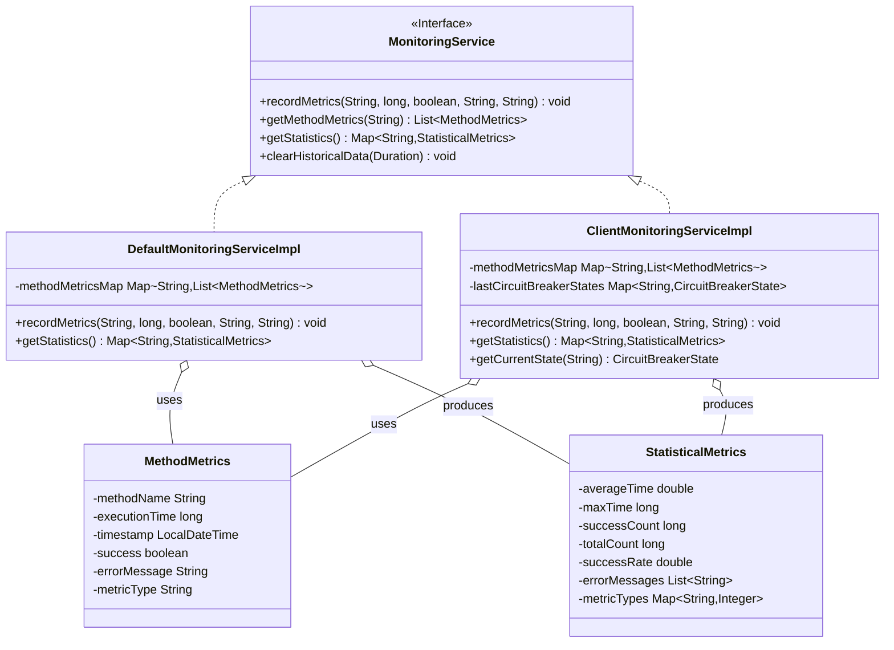
Sources: [rpc-monitor/src/main/java/org/example/rpc/monitor/api/MonitoringService.java](), [rpc-monitor/src/main/java/org/example/rpc/monitor/impl/DefaultMonitoringServiceImpl.java](), [rpc-monitor/src/main/java/org/example/rpc/monitor/impl/ClientMonitoringServiceImpl.java](), [rpc-monitor/src/main/java/org/example/rpc/monitor/model/MethodMetrics.java](), [rpc-monitor/src/main/java/org/example/rpc/monitor/model/StatisticalMetrics.java]()

## 指标收集 (`PerformanceInterceptor`)

`PerformanceInterceptor` 是一个 RPC 拦截器，用于在服务端记录方法调用的性能指标。它实现了 `RpcInterceptor` 接口。

-   **`preHandle`**: 在方法调用之前，记录当前时间戳到 `ThreadLocal` 变量 `startTime` 中。
-   **`postHandle`**: 在方法调用之后，计算执行时长。根据 `RpcResponse` 中的异常信息判断调用是否成功，并确定错误信息和指标类型 (`MetricType.NORMAL_REQUEST` 或 `MetricType.EXCEPTION`)。然后调用 `MonitoringService.recordMetrics` 方法记录这些指标。如果调用失败，会记录错误日志；如果调用成功，会记录调试日志，并在执行时间超过1000ms时发出警告。

```java
// rpc-interceptor/src/main/java/org/example/rpc/interceptor/impl/PerformanceInterceptor.java
@Override
public void postHandle(RpcRequest request, RpcResponse response, CircuitBreakerState state) {
  long duration = System.currentTimeMillis() - startTime.get();
  boolean success = response.getThrowable() == null;
  String errorMessage = success ? null : response.getThrowable().getMessage();
  MetricType metricType = success ? MetricType.NORMAL_REQUEST : MetricType.EXCEPTION;

  monitoringService.recordMetrics(
      request.getClassName() + "#" + request.getMethodName(),
      duration,
      success,
      errorMessage,
      metricType.toString()
  );

  // ... logging logic ...
}
```
Sources: [rpc-interceptor/src/main/java/org/example/rpc/interceptor/impl/PerformanceInterceptor.java:39-60]()

以下序列图展示了 `PerformanceInterceptor` 记录指标的流程：
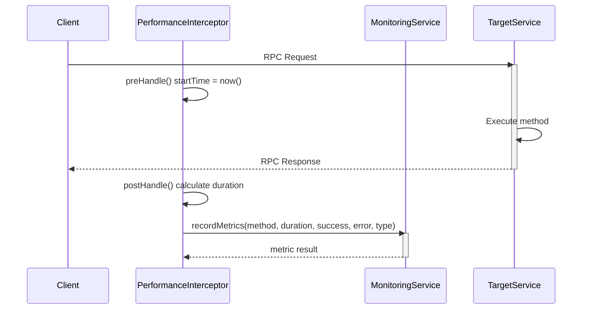
Sources: [rpc-interceptor/src/main/java/org/example/rpc/interceptor/impl/PerformanceInterceptor.java:35-60]()

## API 接口

监控数据通过 RESTful API 接口暴露，分为服务端监控接口和客户端监控接口。

### 服务端监控 (`ServerMonitorController`)

`ServerMonitorController` 提供用于查询服务端收集的性能指标的 API。

| HTTP 方法 | 路径                      | 描述                                     |
| --------- | ------------------------- | ---------------------------------------- |
| GET       | `/monitor/server/metrics/{methodName}` | 获取指定服务端方法的原始性能指标列表     |
| GET       | `/monitor/server/statistics`  | 获取所有服务端方法的统计性能指标         |
| DELETE    | `/monitor/server/clear`     | 清理服务端历史监控数据 (默认保留7天)   |

Sources: [rpc-monitor/src/main/java/org/example/rpc/monitor/controller/ServerMonitorController.java:20-36]()

```java
// rpc-monitor/src/main/java/org/example/rpc/monitor/controller/ServerMonitorController.java:24-27
@GetMapping("/metrics/{methodName}")
public String getMethodMetrics(@PathVariable String methodName) {
  return gson.toJson(monitoringService.getMethodMetrics(methodName));
}
```
Sources: [rpc-monitor/src/main/java/org/example/rpc/monitor/controller/ServerMonitorController.java:24-27]()

### 客户端监控 (`ClientMonitorController`)

`ClientMonitorController` 提供用于查询客户端收集的性能指标和熔断器状态的 API。

| HTTP 方法 | 路径                               | 描述                                       |
| --------- | ---------------------------------- | ------------------------------------------ |
| GET       | `/monitor/client/metrics/{serviceName}` | 获取指定客户端服务的统计性能指标           |
| GET       | `/monitor/client/statistics`       | 获取所有客户端服务的统计性能指标           |
| GET       | `/monitor/client/circuit-breaker/state/{serviceName}` | 获取指定客户端服务的当前熔断器状态     |
| DELETE    | `/monitor/client/metrics/clear`    | 清理客户端历史监控数据 (默认保留7天)     |

Sources: [rpc-monitor/src/main/java/org/example/rpc/monitor/controller/ClientMonitorController.java:23-40]()

```java
// rpc-monitor/src/main/java/org/example/rpc/monitor/controller/ClientMonitorController.java:33-36
@GetMapping("/circuit-breaker/state/{serviceName}")
public CircuitBreakerState getCircuitBreakerState(@PathVariable String serviceName) {
  return ((ClientMonitoringServiceImpl) clientMonitoringService).getCurrentState(serviceName);
}
```
Sources: [rpc-monitor/src/main/java/org/example/rpc/monitor/controller/ClientMonitorController.java:33-36]()

下图展示了监控数据从收集到API暴露的整体流程：
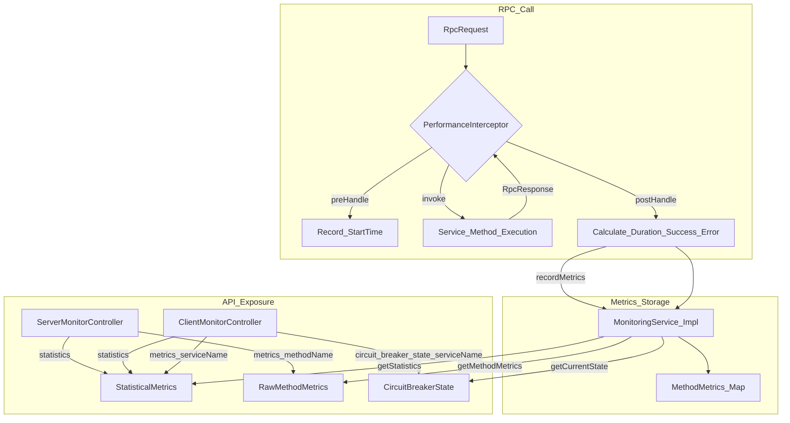
Sources: [rpc-interceptor/src/main/java/org/example/rpc/interceptor/impl/PerformanceInterceptor.java](), [rpc-monitor/src/main/java/org/example/rpc/monitor/impl/DefaultMonitoringServiceImpl.java](), [rpc-monitor/src/main/java/org/example/rpc/monitor/impl/ClientMonitoringServiceImpl.java](), [rpc-monitor/src/main/java/org/example/rpc/monitor/controller/ServerMonitorController.java](), [rpc-monitor/src/main/java/org/example/rpc/monitor/controller/ClientMonitorController.java]()

## 命令行工具

项目提供了一个脚本 `get-stats.sh` 用于从命令行监控服务性能和健康状况。
```bash
./get-stats.sh
```
这个脚本可能通过调用上述 API 端点来获取和展示数据。
Sources: [README.md:80-83]()

## 总结

RPC 框架的性能监控功能通过 `rpc-monitor` 模块实现，它结合了拦截器、服务实现、数据模型和 API 控制器，为服务端和客户端提供了全面的性能指标收集、统计和查询能力。特别是客户端监控还集成了对熔断器状态的跟踪。这些功能有助于开发者和运维人员及时了解服务运行状况，保障系统稳定。

Sources: [README.md:30-33](), [rpc-monitor/src/main/java/org/example/rpc/monitor/api/MonitoringService.java](), [rpc-interceptor/src/main/java/org/example/rpc/interceptor/impl/PerformanceInterceptor.java]()
Error: Invalid operation: The `response.text` quick accessor requires the response to contain a valid `Part`, but none were returned. The candidate's [finish_reason](https://ai.google.dev/api/generate-content#finishreason) is 1.

---

<a id='page-rpc-dataflow-serialization'></a>

## RPC 数据流与序列化

### Related Pages

Related topics: [核心模块详解](#page-core-modules), [整体架构](#page-overall-arch)

<details>
<summary>Relevant source files</summary>

The following files were used as context for generating this wiki page:

- [rpc-protocol/src/main/java/org/example/rpc/protocol/model/RpcRequest.java](rpc-protocol/src/main/java/org/example/rpc/protocol/model/RpcRequest.java)
- [rpc-protocol/src/main/java/org/example/rpc/protocol/model/RpcResponse.java](rpc-protocol/src/main/java/org/example/rpc/protocol/model/RpcResponse.java)
- [rpc-protocol/src/main/java/org/example/rpc/protocol/serialize/impl/ProtobufSerializerImpl.java](rpc-protocol/src/main/java/org/example/rpc/protocol/serialize/impl/ProtobufSerializerImpl.java)
- [rpc-protocol/src/main/java/org/example/rpc/protocol/serialize/impl/SimpleJsonSerializerImpl.java](rpc-protocol/src/main/java/org/example/rpc/protocol/serialize/impl/SimpleJsonSerializerImpl.java)
- [rpc-network/src/main/java/org/example/rpc/network/NettyRpcRequestSenderImpl.java](rpc-network/src/main/java/org/example/rpc/network/NettyRpcRequestSenderImpl.java)
- [rpc-network/src/main/java/org/example/rpc/transport/server/RpcServerSimpleChannelInboundHandlerImpl.java](rpc-network/src/main/java/org/example/rpc/transport/server/RpcServerSimpleChannelInboundHandlerImpl.java)
- [rpc-proxy/src/main/java/org/example/rpc/proxy/RpcClientProxy.java](rpc-proxy/src/main/java/org/example/rpc/proxy/RpcClientProxy.java)
- [rpc-common/src/main/java/org/example/rpc/common/exception/BaseRpcException.java](rpc-common/src/main/java/org/example/rpc/common/exception/BaseRpcException.java)
- [README.md](README.md)
- [rpc-test/src/main/java/org/example/rpc/core/test/serialize/SerializerPerformanceTest.java](rpc-test/src/main/java/org/example/rpc/core/test/serialize/SerializerPerformanceTest.java)
- [rpc-example/rpc-user-service/src/main/java/org/example/rpc/user/UserServiceApplication.java](rpc-example/rpc-user-service/src/main/java/org/example/rpc/user/UserServiceApplication.java)
</details>

# RPC 数据流与序列化

## 简介

RPC (Remote Procedure Call) 框架的核心在于实现高效、可靠的跨进程通信。本文档将详细阐述该 RPC 框架中的数据流和序列化机制。数据流描述了 RPC 调用从客户端发起，到服务端处理，再到结果返回客户端的完整路径。序列化机制则关注如何将内存中的对象转换为字节流以便网络传输，以及如何从字节流反序列化回对象。

该框架基于 Spring Boot，采用 Protocol Buffers 作为主要的序列化方案，同时支持 JSON 序列化作为备选。理解数据流与序列化对于开发者进行问题排查、性能优化以及框架扩展至关重要。

Sources: [README.md]()

## RPC 核心数据结构

### RPC 请求 (RpcRequest)

`RpcRequest` 对象封装了客户端发起一次远程调用所需的所有信息。它继承自 `Packet` 类，并实现了 `Serializable` 接口。

Sources: [rpc-protocol/src/main/java/org/example/rpc/protocol/model/RpcRequest.java]()

**关键字段:**

| 字段名         | 类型                  | 描述                                     |
| -------------- | --------------------- | ---------------------------------------- |
| `sequence`     | `String`              | 请求的唯一标识符，用于关联请求和响应。     |
| `className`    | `String`              | 目标服务接口的完整类名。                 |
| `methodName`   | `String`              | 目标调用的方法名。                       |
| `parameterTypes`| `Class<?>[]`          | 方法参数类型数组，用于方法重载时的精确匹配。 |
| `parameters`   | `Map<String, Object>` | 方法参数，键为参数名或占位符，值为参数值。   |
| `httpMethod`   | `String`              | 模拟 HTTP 请求时使用的 HTTP 方法 (如 GET, POST)。 |
| `path`         | `String`              | 模拟 HTTP 请求时使用的请求路径。           |
| `queryParams`  | `Map<String, String>` | 模拟 HTTP 请求时使用的查询参数。           |
| `serializerType`| `byte`                | 序列化类型 (继承自 `Packet`)。             |

**代码示例:**
```java
// File: rpc-protocol/src/main/java/org/example/rpc/protocol/model/RpcRequest.java
package org.example.rpc.protocol.model;

import lombok.*;
import enums.common.rpc.io.ecstasoy.PacketType;
import packet.model.protocol.rpc.io.ecstasoy.Packet;

import java.io.Serializable;
import java.util.Map;

@Getter
@Setter
@Builder
@NoArgsConstructor
@AllArgsConstructor
@EqualsAndHashCode(callSuper = true)
@ToString
public class RpcRequest extends Packet implements Serializable {

  private static final long serialVersionUID = 6096668930426886407L;
  private String sequence;
  private String className;
  private String methodName;
  private Class<?>[] parameterTypes;
  private Map<String, Object> parameters;
  private String httpMethod;
  private String path;
  private Map<String, String> queryParams;

  @Override
  public PacketType getPacketType() {
    return PacketType.RPC_REQUEST;
  }
}
```
Sources: [rpc-protocol/src/main/java/org/example/rpc/protocol/model/RpcRequest.java:1-49]()

**Mermaid 类图:**
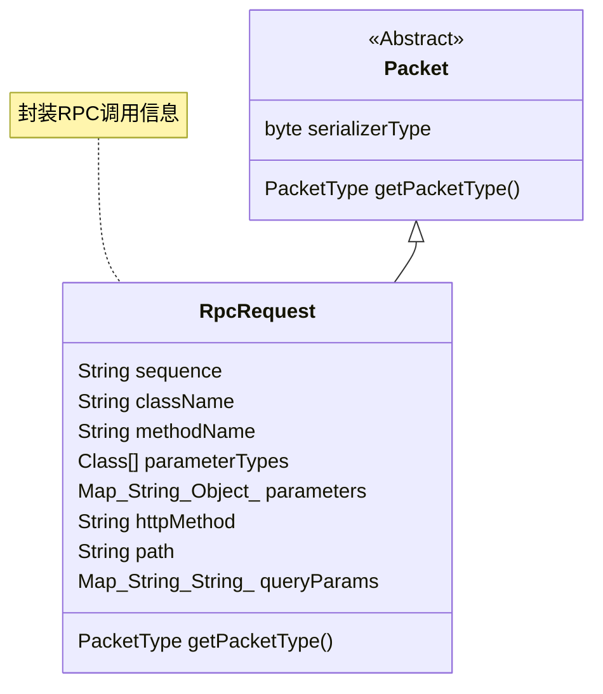
Sources: [rpc-protocol/src/main/java/org/example/rpc/protocol/model/RpcRequest.java]()

### RPC 响应 (RpcResponse)

`RpcResponse` 对象封装了服务端处理完 RPC 请求后的结果或发生的异常。它同样继承自 `Packet` 类并实现了 `Serializable` 接口。

Sources: [rpc-protocol/src/main/java/org/example/rpc/protocol/model/RpcResponse.java]()

**关键字段:**

| 字段名          | 类型             | 描述                                     |
| --------------- | ---------------- | ---------------------------------------- |
| `sequence`      | `String`         | 对应请求的唯一标识符，用于客户端匹配响应。   |
| `throwable`     | `Throwable`      | 如果服务端处理发生异常，则此字段包含异常对象。 |
| `result`        | `Object`         | 服务端方法成功执行的返回结果。             |
| `rpcException`  | `BaseRpcException`| 如果是框架定义的RPC异常，则此字段包含该异常。 |
| `exceptionType` | `String`         | 原始异常的类型名称。                       |
| `serializerType`| `byte`           | 序列化类型 (继承自 `Packet`)。             |

**异常处理:**
`RpcResponse` 中的 `throwable` 字段用于传递服务端发生的异常。如果异常是 `BaseRpcException` 的子类，`rpcException` 字段也会被填充。在序列化（特别是JSON序列化）时，`Throwable` 对象会通过自定义的 `ThrowableSerializer` 和 `ThrowableDeserializer` 进行特殊处理，以保留异常类型和消息。

Sources: [rpc-protocol/src/main/java/org/example/rpc/protocol/model/RpcResponse.java:30-34](), [rpc-protocol/src/main/java/org/example/rpc/protocol/serialize/impl/SimpleJsonSerializerImpl.java:42-63]()

**代码示例:**
```java
// File: rpc-protocol/src/main/java/org/example/rpc/protocol/model/RpcResponse.java
package org.example.rpc.protocol.model;

import com.alibaba.fastjson.annotation.JSONField;
import enums.common.rpc.io.ecstasoy.PacketType;
import exception.common.rpc.io.ecstasoy.BaseRpcException;
import packet.model.protocol.rpc.io.ecstasoy.Packet;
import impl.serialize.protocol.rpc.io.ecstasoy.SimpleJsonSerializerImpl;
// ... other imports

public class RpcResponse extends Packet implements Serializable {
  // ...
  private String sequence;
  @JSONField(serializeUsing = SimpleJsonSerializerImpl.ThrowableSerializer.class,
      deserializeUsing = SimpleJsonSerializerImpl.ThrowableDeserializer.class)
  private Throwable throwable;
  private Object result;
  private BaseRpcException rpcException;
  private String exceptionType;
  // ... constructors and methods
  @Override
  public PacketType getPacketType() {
    return PacketType.RPC_RESPONSE;
  }
}
```
Sources: [rpc-protocol/src/main/java/org/example/rpc/protocol/model/RpcResponse.java:1-71]()

**Mermaid 类图:**
```mermaid

 classDiagram
  Packet <|-- RpcResponse
  BaseRpcException --|> Throwable
  class Packet {
      <<Abstract>>
      byte serializerType
      PacketType getPacketType()
  }
  class RpcResponse {
      String sequence
      Throwable throwable
      Object result
      BaseRpcException rpcException
      String exceptionType
      PacketType getPacketType()
  }
  class BaseRpcException {
      <<Abstract>>
      String errorCode
      int httpStatus
  }
  note for RpcResponse "封装RPC调用结果或异常"
```
Sources: [rpc-protocol/src/main/java/org/example/rpc/protocol/model/RpcResponse.java](), [rpc-common/src/main/java/org/example/rpc/common/exception/BaseRpcException.java]()

## 序列化机制 (Serialization)

序列化是将对象状态转换为可存储或传输的格式的过程。此 RPC 框架支持多种序列化协议，主要通过 `Serializer` 接口及其实现来完成。

Sources: [README.md: Technical Stack](), [rpc-protocol/src/main/java/org/example/rpc/protocol/serialize/impl/ProtobufSerializerImpl.java](), [rpc-protocol/src/main/java/org/example/rpc/protocol/serialize/impl/SimpleJsonSerializerImpl.java]()

### `Serializer` 接口
定义了序列化和反序列化的基本操作，以及获取序列化器类型的方法。

### 主要实现

#### 1. Protocol Buffers (`ProtobufSerializerImpl`)
这是框架默认的序列化方式，因其高效的编解码性能和紧凑的数据格式而被选用。
- **核心逻辑**: `serialize` 方法根据对象类型（`RpcRequest` 或 `RpcResponse`）调用相应的 Protobuf 生成类的 `toByteArray()` 方法。反序列化则使用 `parseFrom()` 方法。
- **特殊处理**: `HeartBeatPacket` 对象会回退到 JSON 进行序列化。
- **类缓存**: 使用 `FastThreadLocal<Map<String, Class<?>>> CLASS_CACHE` 缓存类定义，以提高反射获取类的性能，特别是在反序列化参数和结果时。

```java
// File: rpc-protocol/src/main/java/org/example/rpc/protocol/serialize/impl/ProtobufSerializerImpl.java
public class ProtobufSerializerImpl implements Serializer {
  // ... CLASS_CACHE definition ...

  @Override
  public <T> byte[] serialize(T obj) throws Exception {
    if (obj instanceof HeartBeatPacket) {
      return JSON.toJSONBytes(obj); // Fallback to JSON for HeartBeatPacket
    }
    if (obj instanceof RpcRequest) {
      return serializeRequest((RpcRequest) obj);
    } else if (obj instanceof RpcResponse) {
      return serializeResponse((RpcResponse) obj);
    }
    // ... (omitted for brevity)
    return RpcRequestProto.newBuilder().build().toByteArray(); // Example, actual logic is more complex
  }
  // ... deserialize methods ...
}
```
Sources: [rpc-protocol/src/main/java/org/example/rpc/protocol/serialize/impl/ProtobufSerializerImpl.java:27-61]()

#### 2. JSON (`SimpleJsonSerializerImpl`)
使用 FastJSON 库实现 JSON 序列化。
- **核心逻辑**: 调用 `JSON.toJSONBytes(obj, SerializerFeature.WriteClassName)`进行序列化，`JSON.parseObject(jsonString, clazz)` 进行反序列化。`WriteClassName` 特性用于在序列化时写入类名，以便反序列化时能正确恢复对象类型。
- **自定义异常处理**:
    - `ThrowableSerializer`: 将 `Throwable` 对象序列化为包含 `className` 和 `message` 的 `ThrowableWrapper` 对象。
    - `ThrowableDeserializer`: 从 `ThrowableWrapper` 对象反序列化回原始的 `Throwable` 对象，如果原始类找不到，则使用 `RuntimeException`。
- **全局配置**: `ParserConfig.getGlobalInstance().addAccept("org.example.rpc")` 允许反序列化指定包下的类。`ParserConfig.getGlobalInstance().setAutoTypeSupport(true)` 开启了自动类型识别。

```java
// File: rpc-protocol/src/main/java/org/example/rpc/protocol/serialize/impl/SimpleJsonSerializerImpl.java
public class SimpleJsonSerializerImpl implements Serializer {
  static {
    ParserConfig.getGlobalInstance().addAccept("org.example.rpc");
    SerializeConfig.getGlobalInstance().put(Throwable.class, new ThrowableSerializer());
    ParserConfig.getGlobalInstance().putDeserializer(Throwable.class, new ThrowableDeserializer());
    ParserConfig.getGlobalInstance().setAutoTypeSupport(true);
  }

  @Override
  public <T> byte[] serialize(T obj) throws Exception {
    return JSON.toJSONBytes(obj, SerializerFeature.WriteClassName);
  }

  @Override
  public <T> T deSerialize(byte[] bytes, Class<T> clazz) {
    String jsonString = new String(bytes);
    return JSON.parseObject(jsonString, clazz);
  }
  // ... ThrowableSerializer and ThrowableDeserializer inner classes ...
}
```
Sources: [rpc-protocol/src/main/java/org/example/rpc/protocol/serialize/impl/SimpleJsonSerializerImpl.java:23-79]()

### 序列化性能对比
根据 `SerializerPerformanceTest` 的测试结果，Protocol Buffers 在序列化/反序列化速度和产物大小方面通常优于 JSON。

| 特性                     | Protobuf                                  | JSON                                      |
| ------------------------ | ----------------------------------------- | ----------------------------------------- |
| 序列化+反序列化平均耗时  | 较低 (例如 ~126 ns)                       | 较高 (例如 ~375 ns)                       |
| 序列化后大小             | 较小 (例如 198 bytes)                     | 较大 (例如 367 bytes)                     |
| 速度提升 (Protobuf vs JSON) | 显著 (例如 ~66% 更快)                   | -                                         |

*注：具体数值来源于 `SerializerPerformanceTest` 中的示例日志输出，实际性能可能因数据结构和测试环境而异。*
Sources: [rpc-test/src/main/java/org/example/rpc/core/test/serialize/SerializerPerformanceTest.java:35-54]()

**Mermaid 类图:**
```mermaid

  classDiagram
  Serializer <|.. ProtobufSerializerImpl
  Serializer <|.. SimpleJsonSerializerImpl
  class Serializer {
      <<Interface>>
      getSerializerType() SerializerType
      serialize(T obj) byte[]
      deSerialize(byte[] bytes, Class T) T
  }
  class ProtobufSerializerImpl {
      serializeRequest(RpcRequest request)
      serializeResponse(RpcResponse response)
      deserializeRequest(byte[] data)
      deserializeResponse(byte[] data)
  }
  class SimpleJsonSerializerImpl {
      ThrowableSerializer
      ThrowableDeserializer
  }
  note for ProtobufSerializerImpl "默认序列化器，性能高"
  note for SimpleJsonSerializerImpl "基于FastJSON，支持自动类型"
```
Sources: [rpc-protocol/src/main/java/org/example/rpc/protocol/serialize/impl/ProtobufSerializerImpl.java](), [rpc-protocol/src/main/java/org/example/rpc/protocol/serialize/impl/SimpleJsonSerializerImpl.java]()

## RPC 数据流 (Data Flow)

### 整体流程
```mermaid
graph TD
    ClientApp[客户端应用] --> RpcClientProxy_Node{RpcClientProxy}
    RpcClientProxy_Node --> BuildRequest[构建 RpcRequest]
    BuildRequest --> SerializeRequest[序列化请求]
    SerializeRequest --> NettyRpcRequestSender_Node{NettyRpcRequestSender}
    NettyRpcRequestSender_Node --> SendOverNetwork[通过Netty发送]
    SendOverNetwork --> Network[(网络传输)]
    Network --> NettyServer_Node{NettyServer}
    NettyServer_Node --> DeserializeRequest[反序列化请求]
    DeserializeRequest --> RpcServerHandler_Node{RpcServerSimpleChannelInboundHandler}
    RpcServerHandler_Node --> RpcRequestProcessor_Node{RpcRequestProcessor}
    RpcRequestProcessor_Node --> InvokeService[调用目标服务方法]
    InvokeService --> BuildResponse[构建 RpcResponse]
    BuildResponse --> SerializeResponse[序列化响应]
    SerializeResponse --> SendResponseOverNetwork[通过Netty发送响应]
    SendResponseOverNetwork --> Network
    Network --> ClientApp_Receive[客户端接收]
    ClientApp_Receive --> DeserializeResponse[反序列化响应]
    DeserializeResponse --> RpcClientProxy_Return[RpcClientProxy返回结果]
    RpcClientProxy_Return --> ClientApp
```
Sources: [rpc-proxy/src/main/java/org/example/rpc/proxy/RpcClientProxy.java](), [rpc-network/src/main/java/org/example/rpc/network/NettyRpcRequestSenderImpl.java](), [rpc-network/src/main/java/org/example/rpc/transport/server/RpcServerSimpleChannelInboundHandlerImpl.java]()

### 客户端数据流

1.  **代理调用 (`RpcClientProxy`)**:
    当客户端代码调用 RPC 接口方法时，实际上是调用了由 `RpcClientProxy` (通过 `java.lang.reflect.Proxy`) 生成的动态代理对象。
    `RpcClientProxy.invoke()` 方法被触发。

2.  **构建 `RpcRequest` (`RpcClientProxy.buildRequest`)**:
    -   提取方法名、参数、参数类型。
    -   处理接口及方法上的注解（如 `@GET`, `@POST`, `@Path`, `@Query`, `@Body`），填充 `RpcRequest` 的 `httpMethod`, `path`, `queryParams`, `parameters` (body) 字段。
    -   生成唯一的 `sequence` ID。

    ```java
    // File: rpc-proxy/src/main/java/org/example/rpc/proxy/RpcClientProxy.java
    private RpcRequest buildRequest(Method method, Object[] args, String httpMethod, String path) {
        // ...
        return RpcRequest.builder()
            .className(method.getDeclaringClass().getName())
            .methodName(methodName)
            .parameters(paramMap)
            .parameterTypes(method.getParameterTypes())
            .sequence(UUID.randomUUID().toString())
            .httpMethod(httpMethod)
            .path(path)
            .queryParams(queryParams)
            .build();
    }
    ```
    Sources: [rpc-proxy/src/main/java/org/example/rpc/proxy/RpcClientProxy.java:62-83]()

3.  **发送请求 (`NettyRpcRequestSenderImpl.sendRpcRequest`)**:
    -   `RpcClientProxy` 将构建好的 `RpcRequest` 交给 `RpcRequestSender` (通常是 `NettyRpcRequestSenderImpl`)。
    -   设置请求的序列化类型 (`rpcRequest.setSerializerType()`)，通常基于 `SerializerFactory.getDefaultType()`。
    -   应用客户端拦截器链 (`clientInterceptorChainManager.applyPreHandle(rpcRequest)`)。
    -   检查服务对应的断路器 (`CircuitBreaker`) 状态。如果断路器打开，则直接返回错误。
    -   从服务发现 (`RpcServiceDiscovery`) 获取服务实例地址。
    -   从 `ChannelPool` 获取或创建到目标服务实例的 Netty `Channel`。
    -   将 `RpcRequest` 写入 `Channel`，并通过 `RequestFutureManager` 注册一个 `CompletableFuture` 来异步等待响应。

    ```java
    // File: rpc-network/src/main/java/org/example/rpc/network/NettyRpcRequestSenderImpl.java
    @Override
    public CompletableFuture<RpcResponse> sendRpcRequest(RpcRequest rpcRequest) {
        rpcRequest.setSerializerType(SerializerType.fromType(serializerFactory.getDefaultType().getType()));
        clientInterceptorChainManager.applyPreHandle(rpcRequest);
        CompletableFuture<RpcResponse> resultFuture = new CompletableFuture<>();
        String serviceName = rpcRequest.getClassName();
        // ... CircuitBreaker logic ...
        // ... Service Discovery and ChannelPool logic ...
        RequestFutureManager.addRequest(rpcRequest.getSequence(), resultFuture, timeout);
        channel.writeAndFlush(rpcRequest).addListener((ChannelFutureListener) future -> {
            // ... handle write success/failure ...
        });
        return resultFuture;
    }
    ```
    Sources: [rpc-network/src/main/java/org/example/rpc/network/NettyRpcRequestSenderImpl.java:65-99]() (逻辑简化和合并)

4.  **序列化与网络传输**:
    Netty 的 `ChannelPipeline` 中配置了编码器 (`MessageEncoder`)，它会使用 `SerializerFactory` 获取相应的序列化器（如 `ProtobufSerializerImpl`）将 `RpcRequest` 对象序列化为字节数组，然后通过网络发送出去。

### 服务端数据流

1.  **接收与反序列化**:
    -   Netty 服务端 (`NettyServer`) 接收到网络数据。
    -   Netty `ChannelPipeline` 中的解码器 (`MessageDecoder`) 使用 `SerializerFactory` 获取序列化器，将字节流反序列化为 `RpcRequest` 对象。

2.  **请求处理 (`RpcServerSimpleChannelInboundHandlerImpl.channelRead0`)**:
    -   `RpcServerSimpleChannelInboundHandlerImpl` 的 `channelRead0` 方法接收到反序列化后的 `RpcRequest`。
    -   心跳请求 (`HeartBeatPacket`) 会被特殊处理。
    -   对于普通 RPC 请求：
        -   将请求提交给 `RpcRequestProcessor` 进行异步处理。
        -   `RpcRequestProcessor` 负责查找并调用本地注册的实际服务实现方法。

    ```java
    // File: rpc-network/src/main/java/org/example/rpc/transport/server/RpcServerSimpleChannelInboundHandlerImpl.java
    @Override
    protected void channelRead0(ChannelHandlerContext ctx, Packet packet) {
        if (packet instanceof HeartBeatPacket) {
            // ... handle heartbeat ...
            return;
        }
        RpcRequest rpcRequest = (RpcRequest) packet;
        // ...
        CompletableFuture.supplyAsync(() -> requestProcessor.processRequest(rpcRequest), requestProcessor.getExecutor())
            .thenAccept(rpcResponse -> {
                // ... write response ...
            })
            .exceptionally(throwable -> {
                // ... handle error and write error response ...
                return null;
            });
    }
    ```
    Sources: [rpc-network/src/main/java/org/example/rpc/transport/server/RpcServerSimpleChannelInboundHandlerImpl.java:39-70]()

3.  **服务调用与响应构建 (`RpcRequestProcessor`)**:
    `RpcRequestProcessor` (未在提供文件中直接显示其 `processRequest` 内部逻辑，但可从 `UserServiceApplication` 推断其存在和作用) 会：
    -   根据 `RpcRequest` 中的 `className`, `methodName`, `parameterTypes` 定位到具体的服务实例和方法。
    -   通过反射调用目标方法，并传入参数。
    -   将方法执行结果或捕获到的异常封装到 `RpcResponse` 对象中，并设置相同的 `sequence` ID。

    *示例 `UserServiceApplication` 中注入了 `RpcRequestProcessor`*:
    ```java
    // File: rpc-example/rpc-user-service/src/main/java/org/example/rpc/user/UserServiceApplication.java
    public class UserServiceApplication implements CommandLineRunner {
      // ...
      private final RpcRequestProcessor requestProcessor;
    
      @Autowired
      public UserServiceApplication(/*..._/, RpcRequestProcessor requestProcessor) {
        // ...
        this.requestProcessor = requestProcessor;
      }
    
      @Override
      public void run(String... args) throws Exception {
        CompletableFuture.runAsync(() -> {
          try {
            NettyServer nettyServer = new NettyServer(
                requestProcessor, // RpcRequestProcessor is used here
                nettyServerProperties,
                serializerFactory
            );
            // ...
    ```
    Sources: [rpc-example/rpc-user-service/src/main/java/org/example/rpc/user/UserServiceApplication.java:19-42]()

4.  **序列化与响应发送**:
    -   `RpcServerSimpleChannelInboundHandlerImpl` 将 `RpcResponse` 写回 `Channel`。
    -   Netty `ChannelPipeline` 中的编码器 (`MessageEncoder`) 将 `RpcResponse` 序列化为字节数组，通过网络发送回客户端。

### 客户端接收响应

1.  **反序列化**: 客户端 Netty `ChannelPipeline` 中的解码器 (`MessageDecoder`) 将收到的字节流反序列化为 `RpcResponse` 对象。
2.  **匹配与完成 Future**:
    -   客户端的 `ChannelInboundHandler` (例如 `NettyClientHandler`) 收到 `RpcResponse`。
    -   通过 `RpcResponse` 中的 `sequence` ID，从 `RequestFutureManager` 中找到对应的 `CompletableFuture`。
    -   调用 `future.complete(rpcResponse)` 或 `future.completeExceptionally(throwable)` 来通知等待的客户端线程。
3.  **结果返回**: `RpcClientProxy` 从 `CompletableFuture` 获取 `RpcResponse`，提取 `result` 或抛出 `throwable`，最终返回给调用方。

### 时序图示例

**客户端发起请求到服务端处理**
```mermaid
sequenceDiagram
    participant ClientApp as 客户端应用
    participant Proxy as RpcClientProxy
    participant Sender as NettyRpcRequestSender
    participant Encoder as MessageEncoder_Client
    participant Net_CS as 网络
    participant Decoder as MessageDecoder_Server
    participant Handler as RpcServerHandler
    participant Processor as RpcRequestProcessor
    participant ServiceImpl as 服务实现

    ClientApp->>+Proxy: 调用接口方法(args)
    Proxy->>+Sender: invoke(method, args)
    Sender->>Proxy: 构建 RpcRequest
    Proxy-->>-Sender: RpcRequest
    Sender->>+Encoder: RpcRequest
    Encoder-->>-Sender: byte[] (序列化后)
    Sender->>Net_CS: 发送字节流
    Net_CS->>+Decoder: 接收字节流
    Decoder-->>-Net_CS: RpcRequest (反序列化后)
    Net_CS->>+Handler: RpcRequest
    Handler->>+Processor: processRequest(RpcRequest)
    Processor->>+ServiceImpl: 调用目标方法(params)
    ServiceImpl-->>-Processor: 返回结果/异常
    Processor-->>-Handler: RpcResponse
    Note right of Handler: 后续响应流程省略
```
Sources: [rpc-proxy/src/main/java/org/example/rpc/proxy/RpcClientProxy.java](), [rpc-network/src/main/java/org/example/rpc/network/NettyRpcRequestSenderImpl.java](), [rpc-network/src/main/java/org/example/rpc/transport/server/RpcServerSimpleChannelInboundHandlerImpl.java]()

## HTTP 风格的 RPC 调用

该框架通过在 `RpcRequest` 中包含 `httpMethod`、`path` 和 `queryParams` 字段，支持了类似 HTTP RESTful 风格的 RPC 调用。
`RpcClientProxy` 在构建请求时，会检查接口方法上的 HTTP 方法注解 (如 `@GET`, `@POST`，虽然这些注解本身未在提供的 `rpc-common` 注解中显示，但 `RpcClientProxy` 的逻辑暗示了它们的存在或类似机制) 以及参数上的 `@Path`, `@Query`, `@Body` 注解，从而填充这些 HTTP 相关字段。

```java
// File: rpc-proxy/src/main/java/org/example/rpc/proxy/RpcClientProxy.java
// Snippet from invoke method, showing HTTP method and path extraction logic
// (Actual HTTP method annotation like @GET, @POST are assumed based on logic)

// String httpMethod = determineHttpMethod(method); // Simplified
// String path = determinePath(method); // Simplified

// Snippet from buildRequest method
// ...
for (int i = 0; i < parameters.length; i++) {
  Parameter param = parameters[i];
  if (param.isAnnotationPresent(Path.class)) { // @Path is a hypothetical annotation for this example
    String pathParamName = param.getAnnotation(Path.class).value();
    path = path.replace("{" + pathParamName + "}", args[i].toString());
  } else if (param.isAnnotationPresent(Query.class)) { // @Query is hypothetical
    String queryParamName = param.getAnnotation(Query.class).value();
    queryParams.put(queryParamName, args[i].toString());
  } else if (param.isAnnotationPresent(Body.class)) { // @Body is hypothetical
    paramMap.put("body", args[i]);
  } else {
    paramMap.put("param" + i, args[i]);
  }
}

return RpcRequest.builder()
    // ...
    .httpMethod(httpMethod) // httpMethod is set
    .path(path)             // path is set
    .queryParams(queryParams) // queryParams are set
    .build();
```
*注：`@Path`, `@Query`, `@Body` 注解的实际定义未在提供的文件中找到，此处基于 `RpcClientProxy` 的使用逻辑进行推断。框架可能依赖特定HTTP客户端库的注解或自定义注解。*
Sources: [rpc-proxy/src/main/java/org/example/rpc/proxy/RpcClientProxy.java:42-83](), [rpc-protocol/src/main/java/org/example/rpc/protocol/model/RpcRequest.java]()

这种设计使得 RPC 调用可以携带更丰富的语义信息，便于与现有的 HTTP 基础设施（如 API 网关、负载均衡器）进行集成，尽管底层的传输仍然是基于 TCP 的 Netty 通信。

## 总结

RPC 框架的数据流与序列化是其核心功能。通过 `RpcRequest` 和 `RpcResponse` 定义了清晰的通信数据结构，利用 `Serializer` 接口及其 Protobuf 和 JSON 实现提供了灵活高效的数据转换能力。整个数据流从客户端代理发起，经过序列化、网络传输、服务端反序列化、业务处理、响应序列化、网络回传，最终由客户端代理接收并返回结果。对这些机制的理解有助于开发者更好地使用和扩展该 RPC 框架。

---

<a id='page-provider-consumer'></a>

## 服务提供者与消费者实现

### Related Pages

Related topics: [快速入门](#page-getting-started), [核心模块详解](#page-core-modules)

<details>
<summary>Relevant source files</summary>

The following files were used as context for generating this wiki page:

- [rpc-common/src/main/java/org/example/rpc/common/annotations/RpcService.java](rpc-common/src/main/java/org/example/rpc/common/annotations/RpcService.java)
- [rpc-example/rpc-blog-service/src/main/java/org/example/rpc/blog/impl/BlogServiceImpl.java](rpc-example/rpc-blog-service/src/main/java/org/example/rpc/blog/impl/BlogServiceImpl.java)
- [rpc-example/rpc-user-service/src/main/java/org/example/rpc/user/UserServiceApplication.java](rpc-example/rpc-user-service/src/main/java/org/example/rpc/user/UserServiceApplication.java)
- [rpc-example/rpc-bff-service/src/main/java/org/example/rpc/bff/BffService.java](rpc-example/rpc-bff-service/src/main/java/org/example/rpc/bff/BffService.java)
- [rpc-spring/src/main/java/org/example/rpc/spring/RpcBeanRegistrar.java](rpc-spring/src/main/java/org/example/rpc/spring/RpcBeanRegistrar.java)
- [rpc-processor/src/main/java/org/example/rpc/processor/RpcRequestProcessor.java](rpc-processor/src/main/java/org/example/rpc/processor/RpcRequestProcessor.java)
- [rpc-example/rpc-api/src/main/java/org/example/rpc/api/service/UserService.java](rpc-example/rpc-api/src/main/java/org/example/rpc/api/service/UserService.java)
- [README.md](README.md)
</details>

# 服务提供者与消费者实现

## 简介

本文档详细介绍了在 `rpc-framework` 项目中如何实现和配置 RPC 服务提供者 (Service Provider) 和服务消费者 (Service Consumer)。该框架是一个基于 Spring Boot 的轻量级 RPC 实现，支持服务注册与发现、负载均衡、序列化等核心功能。服务提供者负责实现具体的业务逻辑并通过框架暴露为远程服务，而服务消费者则通过注入代理对象来透明地调用这些远程服务。

核心机制依赖于自定义注解（如 `@RpcService` 和 `@Reference`）、Spring Boot 的自动配置能力以及诸如 Netty（网络传输）、Zookeeper（服务注册与发现）和 Protocol Buffers（序列化）等技术栈。

Sources: [README.md]()

## 服务提供者 (Service Provider)

服务提供者是 RPC 框架中负责提供具体服务实现的单元。它通常包含服务接口的定义、接口的实现类以及将这些实现类暴露为 RPC 服务的配置。

### 服务接口定义 (Service Interface Definition)

服务接口定义了服务契约，即消费者可以调用的方法。这些接口通常位于 API模块 (如 `rpc-api`)，以便提供者和消费者共享。

例如，`UserService` 接口定义了用户相关的操作：

```java
// rpc-example/rpc-api/src/main/java/org/example/rpc/api/service/UserService.java
package org.example.rpc.api.service;

import request.dto.api.rpc.io.ecstasoy.CreateUserDTO;
import request.dto.api.rpc.io.ecstasoy.UpdateUserDTO;
import response.dto.api.rpc.io.ecstasoy.UserDTO;
// ... other imports
import java.util.concurrent.CompletableFuture;
import java.util.List;

@Api("/users") // 标记为API类，可能用于HTTP网关等
public interface UserService {

  @GET("/{id}")
  CompletableFuture<UserDTO> selectById(@Path("id") String id);

  @POST
  CompletableFuture<UserDTO> createUser(@Body CreateUserDTO createUserDTO);

  // ... other methods
}
```
Sources: [rpc-example/rpc-api/src/main/java/org/example/rpc/api/service/UserService.java:13-30]()

### 服务实现与注解 (Service Implementation and Annotation)

#### `@RpcService` 注解

服务实现类需要使用 `@RpcService` 注解进行标记，以表明该类是一个 RPC 服务，并应由框架进行管理和暴露。

```java
// rpc-common/src/main/java/org/example/rpc/common/annotations/RpcService.java
package org.example.rpc.common.annotations;

import java.lang.annotation.*;

@Documented
@Retention(RetentionPolicy.RUNTIME)
@Target({ElementType.TYPE})
public @interface RpcService {

}
```
此注解用于标记服务实现类，使其能够被 `RpcBeanRegistrar` 扫描到。
Sources: [rpc-common/src/main/java/org/example/rpc/common/annotations/RpcService.java:1-17]()

#### 示例：`BlogServiceImpl`

下面是 `BlogServiceImpl` 如何实现 `BlogService` 接口并使用 `@RpcService` 注解的示例：

```java
// rpc-example/rpc-blog-service/src/main/java/org/example/rpc/blog/impl/BlogServiceImpl.java
package org.example.rpc.blog.impl;

// ... imports
import service.api.rpc.io.ecstasoy.BlogService;
import annotations.common.rpc.io.ecstasoy.RpcService;
import org.springframework.stereotype.Service; // Spring @Service, 也可与@RpcService共存

@Slf4j
@RpcService // 标记为RPC服务
public class BlogServiceImpl implements BlogService {

  private final BlogRepository blogRepository;
  private final BlogConverter blogConverter;

  public BlogServiceImpl(BlogRepository blogRepository, BlogConverter blogConverter) {
    this.blogRepository = blogRepository;
    this.blogConverter = blogConverter;
  }

  @Override
  public CompletableFuture<BlogDTO> selectById(@Path("id") String id) {
    // ... implementation
  }

  // ... other implemented methods
}
```
`BlogServiceImpl` 实现了 `BlogService` 接口中定义的方法，并通过 `@RpcService` 注解声明自己是一个 RPC 服务。
Sources: [rpc-example/rpc-blog-service/src/main/java/org/example/rpc/blog/impl/BlogServiceImpl.java:18-38]()

### 服务暴露与启动 (Service Exposure and Startup)

#### `@RpcServiceScan` 与 Spring Boot 应用

服务提供者通常是一个 Spring Boot 应用。通过在启动类上使用 `@RpcServiceScan` 注解，可以指定扫描包含 `@RpcService` 注解的类的包路径。

```java
// rpc-example/rpc-user-service/src/main/java/org/example/rpc/user/UserServiceApplication.java
package org.example.rpc.user;

import lombok.extern.slf4j.Slf4j;
import annotation.spring.rpc.io.ecstasoy.RpcServiceScan; // 假设的注解路径，实际应为项目内定义
import org.springframework.boot.SpringApplication;
import org.springframework.boot.autoconfigure.SpringBootApplication;
// ... other imports

@Slf4j
@RpcServiceScan(basePackages = "org.example.rpc.**") // 扫描指定包下的RpcService
@SpringBootApplication(scanBasePackages = {"org.example.rpc"})
public class UserServiceApplication implements CommandLineRunner {
  // ... fields and constructor

  public static void main(String[] args) {
    SpringApplication.run(UserServiceApplication.class, args);
  }

  @Override
  public void run(String... args) throws Exception {
    // 启动Netty服务器
    CompletableFuture.runAsync(() -> {
      try {
        NettyServer nettyServer = new NettyServer(
            requestProcessor,
            nettyServerProperties,
            serializerFactory
        );
        nettyServer.start();
        log.info("Netty server started successfully on port: {}", nettyServerProperties.getServerPort());
      } catch (Exception e) {
        log.error("Failed to start netty server", e);
        System.exit(1);
      }
    });
  }
}
```
`UserServiceApplication` 使用 `@RpcServiceScan` 来发现并注册 RPC 服务。同时，它在 `run` 方法中启动了 `NettyServer` 来监听和处理 RPC 请求。
Sources: [rpc-example/rpc-user-service/src/main/java/org/example/rpc/user/UserServiceApplication.java:10-45]()

#### `RpcBeanRegistrar`：扫描与注册服务

`RpcBeanRegistrar` 类实现了 Spring 的 `ImportBeanDefinitionRegistrar` 接口，负责在 Spring 容器初始化时扫描指定包路径下带有 `@RpcService` 注解的类，并将它们注册为 Spring Bean。

```java
// rpc-spring/src/main/java/org/example/rpc/spring/RpcBeanRegistrar.java
package org.example.rpc.spring;

import annotation.spring.rpc.io.ecstasoy.RpcServiceScan;
import annotations.common.rpc.io.ecstasoy.RpcService;
// ... other imports
import org.springframework.beans.factory.support.BeanDefinitionRegistry;
import org.springframework.context.annotation.ImportBeanDefinitionRegistrar;
import org.springframework.core.type.AnnotationMetadata;

@Slf4j
public class RpcBeanRegistrar implements ImportBeanDefinitionRegistrar, ResourceLoaderAware {

  public static final String CORE_MODULE_PACKAGE = "org.example.rpc.core";

  @Override
  public void registerBeanDefinitions(AnnotationMetadata importingClassMetadata,
                                      BeanDefinitionRegistry registry) {
    AnnotationAttributes annotationAttributes = AnnotationAttributes.fromMap(importingClassMetadata
        .getAnnotationAttributes(RpcServiceScan.class.getName())); // 获取 @RpcServiceScan 的属性
    String[] rpcPakages = new String[0];

    if (annotationAttributes != null) {
      rpcPakages = annotationAttributes.getStringArray("basePackages");
    }
    // ... 省略部分路径处理逻辑

    RpcBeanDefinitionScanner serviceScanner = new RpcBeanDefinitionScanner(registry,
        RpcService.class); // 创建扫描器，指定扫描 @RpcService 注解

    serviceScanner.scan(CORE_MODULE_PACKAGE); // 扫描核心包
    int rpcServiceNum = serviceScanner.scan(rpcPakages); // 扫描用户指定的包
    log.info("Rpc Service registered number: [{}]", rpcServiceNum);
  }
  // ... RpcBeanDefinitionScanner 内部类定义
}
```
`RpcBeanRegistrar` 确保了所有标记了 `@RpcService` 的服务实现类都被 Spring IoC 容器管理。
Sources: [rpc-spring/src/main/java/org/example/rpc/spring/RpcBeanRegistrar.java:12-46]()

#### `RpcRequestProcessor`：处理入站请求

当服务提供者启动并接收到来自消费者的 RPC 请求时，`RpcRequestProcessor` 负责处理这些请求。它会根据请求中的服务名和方法名，找到对应的服务实例和方法，并执行调用。

```java
// rpc-processor/src/main/java/org/example/rpc/processor/RpcRequestProcessor.java
package org.example.rpc.processor;

// ... imports
import model.protocol.rpc.io.ecstasoy.RpcRequest;
import model.protocol.rpc.io.ecstasoy.RpcResponse;

@Slf4j
@Component
public class RpcRequestProcessor {

  // ... fields and constructor
  private static final Map<String, Object> SERVICE_MAP = new ConcurrentHashMap<>();

  public static void addService(String serviceName, Object service) {
    SERVICE_MAP.put(serviceName, service); // 服务注册时添加到本地缓存
  }

  public CompletableFuture<RpcResponse> processRequest(RpcRequest request) {
    return CompletableFuture.supplyAsync(() -> {
      RpcResponse response = new RpcResponse();
      response.setSequence(request.getSequence());
      try {
        // ... 拦截器处理
        Object result = doProcess(request); // 核心处理逻辑
        response.setResult(result);
        // ... 拦截器后处理
      } catch (Exception e) {
        // ... 异常处理
      } finally {
        // ... 完成处理
      }
      return response;
    });
  }

  private Object doProcess(RpcRequest request) throws Exception {
    Object service = SERVICE_MAP.get(request.getClassName()); // 从缓存获取服务实例
    if (service == null) {
      throw new IllegalStateException("Service not found: " + request.getClassName());
    }
    Method method = service.getClass().getMethod(request.getMethodName(), request.getParameterTypes());
    return method.invoke(service, request.getArguments()); // 反射调用
  }
}
```
`RpcRequestProcessor` 通过一个内部的 `SERVICE_MAP` 来存储已注册的服务实例。当服务启动时（例如通过 `RpcBeanRegistrar`），服务实例会被添加到这个映射中。收到请求后，它查找服务实例并使用反射调用相应的方法。
Sources: [rpc-processor/src/main/java/org/example/rpc/processor/RpcRequestProcessor.java:11-61]()

## 服务消费者 (Service Consumer)

服务消费者通过 RPC 框架调用远程服务提供者所暴露的服务。

### 引用远程服务 (Referencing Remote Services)

#### `@Reference` 注解

服务消费者使用 `@Reference` 注解来声明对远程服务的依赖。框架会自动为标记了 `@Reference` 的字段注入一个代理对象，该代理对象负责处理远程方法调用的细节（如服务发现、网络通信、序列化/反序列化）。

虽然 `@Reference` 注解的定义文件未在当前上下文中提供，但我们可以从其使用方式推断其功能。`README.md` 中提到 `rpc-proxy` 模块负责 "Dynamic proxy generation" 和 "Remote service invocation"。

Sources: [README.md: System Architecture > Core Components > Proxy (rpc-proxy)]()

#### 示例：`BffService`

`BffService` (Backend For Frontend) 是一个典型的服务消费者，它调用 `UserService` 和 `BlogService`。

```java
// rpc-example/rpc-bff-service/src/main/java/org/example/rpc/bff/BffService.java
package org.example.rpc.bff;

import lombok.extern.slf4j.Slf4j;
import service.api.rpc.io.ecstasoy.BlogService;
import service.api.rpc.io.ecstasoy.UserService;
import annotations.common.rpc.io.ecstasoy.Reference; // 假设的注解路径
import org.springframework.stereotype.Service;
// ... other imports

@Service
@Slf4j
public class BffService {

  @Reference // 注入远程UserService的代理
  private UserService userService;

  @Reference // 注入远程BlogService的代理
  private BlogService blogService;

  public CompletableFuture<UserDTO> getUserInfo(String id) {
    log.info("Fetching user info for ID: {}", id);
    return userService.selectById(id) // 透明调用远程服务
        .thenApply(userDTO -> {
          log.info("Fetched user info: {}", userDTO);
          return userDTO;
        })
        .exceptionally(this::handleException);
  }

  // ... other methods calling userService and blogService
}
```
在 `BffService` 中，`userService` 和 `blogService` 字段被 `@Reference` 注解标记。在运行时，RPC 框架会为这些字段注入代理实例。当 `BffService` 调用 `userService.selectById(id)` 时，实际上是调用了代理对象的方法，该代理对象会处理实际的远程过程调用。
Sources: [rpc-example/rpc-bff-service/src/main/java/org/example/rpc/bff/BffService.java:12-37]()

### 远程方法调用 (Remote Method Invocation)

当消费者调用 `@Reference` 注入的代理对象的方法时，会发生以下大致流程（具体实现依赖 `rpc-proxy` 模块）：
1.  **代理拦截**: 调用被代理对象拦截。
2.  **服务发现**: 代理查询服务注册中心 (如 Zookeeper) 以获取目标服务 (`UserService`, `BlogService`) 的可用实例地址。
3.  **负载均衡**: 如果有多个可用实例，根据配置的负载均衡策略选择一个实例。
4.  **请求构建**: 构建 RPC 请求对象，包含服务名、方法名、参数等信息。
5.  **序列化**: 将请求对象序列化为字节流 (如使用 Protocol Buffers)。
6.  **网络传输**: 通过网络层 (如 Netty) 将序列化后的请求发送到选定的服务提供者实例。
7.  **等待响应**: 异步等待服务提供者的响应。
8.  **反序列化**: 收到响应后，将其反序列化为结果对象或异常。
9.  **返回结果**: 将结果返回给调用方。

此过程对消费者是透明的，使其感觉像在调用本地方法。

Sources: [README.md: Overview, Key Features, System Architecture]() (inferred from general RPC principles and module descriptions)

## 核心流程与交互 (Core Flows and Interactions)

### 服务提供者启动与请求处理流程

```mermaid
graph TD
    A[Spring Boot Application Start] --> B{RpcServiceScan Present_}
    B -- Yes --> C[RpcBeanRegistrar]
    C -- Scans for @RpcService --> D[Finds RpcService Beans]
    D -- Registers with Spring & RpcRequestProcessor --> E[Service Instances in RpcRequestProcessor_SERVICE_MAP]
    A --> F[NettyServer Start]
    F -- Listens for connections --> G{Incoming RPC Request}
    G -- Forwarded to --> H[RpcRequestProcessor]
    H -- Uses SERVICE_MAP --> I[Locates Service Impl]
    I -- Invokes method via reflection --> J[Executes Business Logic]
    J -- Returns result --> H
    H -- Builds RpcResponse --> G
    G -- Sends response to Consumer --> K[Consumer Receives Response]

    subgraph Service Provider Application
        direction TB
        B
        C
        D
        E
        F
    end

    subgraph Request Processing
        direction TB
        G
        H
        I
        J
        K
    end
```
上图展示了服务提供者应用的启动过程：Spring Boot 应用启动，`RpcBeanRegistrar` 扫描并注册 `@RpcService` 注解的 Bean。这些服务实例被添加到 `RpcRequestProcessor` 的内部缓存中。同时，`NettyServer` 启动并监听端口。当 RPC 请求到达时，`NettyServer` 将其交由 `RpcRequestProcessor` 处理，后者查找并调用相应的服务实现。
Sources: [rpc-spring/src/main/java/org/example/rpc/spring/RpcBeanRegistrar.java](), [rpc-processor/src/main/java/org/example/rpc/processor/RpcRequestProcessor.java](), [rpc-example/rpc-user-service/src/main/java/org/example/rpc/user/UserServiceApplication.java]()

### RPC 调用时序图 (RPC Call Sequence Diagram)

```mermaid
sequenceDiagram
    participant Consumer_App as Consumer Application
    participant Rpc_Proxy as RPC Proxy (@Reference)
    participant Service_Registry as Service Registry (e_g_ Zookeeper)
    participant Load_Balancer as Load Balancer
    participant Network_Client as Network Client (e_g_ Netty)
    participant Network_Server as Network Server (Provider)
    participant Request_Processor as RpcRequestProcessor (Provider)
    participant Service_Impl as Service Implementation (Provider)

    Consumer_App->>+Rpc_Proxy: invokeMethod(args)
    Rpc_Proxy->>+Service_Registry: discoverService(serviceName)
    Service_Registry-->>-Rpc_Proxy: serviceInstancesList
    Rpc_Proxy->>+Load_Balancer: selectInstance(serviceInstancesList)
    Load_Balancer-->>-Rpc_Proxy: chosenInstanceAddress
    Rpc_Proxy->>+Network_Client: sendRequest(chosenInstanceAddress, rpcRequest)
    Network_Client->>+Network_Server: serializedRpcRequest
    Network_Server->>+Request_Processor: rpcRequest
    Request_Processor->>+Service_Impl: invokeActualMethod(args)
    activate Service_Impl
    Service_Impl-->>-Request_Processor: result
    deactivate Service_Impl
    Request_Processor-->>Network_Server: rpcResponse
    Network_Server-->>-Network_Client: serializedRpcResponse
    Network_Client-->>-Rpc_Proxy: rpcResponse
    Rpc_Proxy-->>-Consumer_App: resultOrException
```
此序列图描绘了一次完整的 RPC 调用过程：消费者应用通过注入的 `@Reference` 代理发起调用。代理负责服务发现、负载均衡，然后通过网络客户端将请求发送到服务提供者。提供者端的网络服务器接收请求，交由 `RpcRequestProcessor` 处理，最终调用到实际的服务实现。结果循原路返回给消费者。
Sources: [README.md: System Architecture](), [rpc-example/rpc-bff-service/src/main/java/org/example/rpc/bff/BffService.java](), [rpc-processor/src/main/java/org/example/rpc/processor/RpcRequestProcessor.java]() (conceptual flow based on components)

## 关键注解与组件 (Key Annotations and Components)

| 注解/组件                | 作用                                                                 | 相关文件                                                                                                                               |
| ------------------------ | -------------------------------------------------------------------- | ------------------------------------------------------------------------------------------------------------------------------------ |
| `@RpcService`            | 标记一个类为 RPC 服务实现，以便框架扫描和管理。                        | `rpc-common/src/main/java/org/example/rpc/common/annotations/RpcService.java`                                                        |
| `@Reference`             | 在消费者端标记一个字段，用于注入远程服务的代理对象。                   | (定义未提供) 使用于 `rpc-example/rpc-bff-service/src/main/java/org/example/rpc/bff/BffService.java`                                  |
| `@RpcServiceScan`        | 在 Spring Boot 启动类上使用，指定扫描 `@RpcService` 的包路径。         | (定义未提供) 使用于 `rpc-example/rpc-user-service/src/main/java/org/example/rpc/user/UserServiceApplication.java`                      |
| `RpcBeanRegistrar`       | 负责扫描 `@RpcService` 注解的类并将其注册为 Spring Bean。              | `rpc-spring/src/main/java/org/example/rpc/spring/RpcBeanRegistrar.java`                                                              |
| `RpcRequestProcessor`    | 在服务提供者端处理入站 RPC 请求，分发到具体的服务实现。                | `rpc-processor/src/main/java/org/example/rpc/processor/RpcRequestProcessor.java`                                                     |
| `NettyServer`            | 服务提供者端的网络服务器，基于 Netty 实现，负责接收和发送 RPC 消息。     | 提及于 `rpc-example/rpc-user-service/src/main/java/org/example/rpc/user/UserServiceApplication.java`                               |
| `rpc-proxy` 模块         | 负责为消费者生成动态代理，处理远程调用逻辑。                           | `README.md`                                                                                                                          |

Sources: As listed in the table.

## 结论

`rpc-framework` 通过注解和 Spring Boot 集成，简化了服务提供者和消费者的开发。提供者使用 `@RpcService` 暴露服务，并通过 `RpcBeanRegistrar` 和 `@RpcServiceScan` 自动注册。消费者使用 `@Reference` 透明地调用远程服务，其背后的代理机制（由 `rpc-proxy` 模块提供）处理了服务发现、网络通信等复杂性。`RpcRequestProcessor` 是提供者端的核心，负责请求的接收和分发。这种设计使得开发者可以专注于业务逻辑，而不必过多关注 RPC 的底层细节。

---

<a id='page-deployment-running'></a>

## 服务部署与运行

### Related Pages

Related topics: [快速入门](#page-getting-started)

<details>
<summary>Relevant source files</summary>

The following files were used as context for generating this wiki page:

- `README.md`
- `rpc-example/rpc-blog-service/src/main/java/org/example/rpc/blog/BlogServiceApplication.java`
- `rpc-example/rpc-user-service/src/main/java/org/example/rpc/user/UserServiceApplication.java`
- `rpc-registry/src/main/java/org/example/rpc/registry/zookeeper/ZookeeperHelper.java`
- `rpc-monitor/src/main/java/org/example/rpc/monitor/impl/DefaultMonitoringServiceImpl.java`
- `rpc-monitor/src/main/java/org/example/rpc/monitor/model/StatisticalMetrics.java`
- `rpc-test/src/main/java/org/example/rpc/core/test/TestConfig.java`
- `rpc-monitor/src/main/java/org/example/rpc/monitor/api/MonitoringService.java`
- (Implicitly, via `README.md`) `start-test-instances.sh`
- (Implicitly, via `README.md`) `start-blog-instances.sh`
- (Implicitly, via `README.md`) `start-user-instances.sh`
- (Implicitly, via `README.md`) `stop-test-instances.sh`
- (Implicitly, via `README.md`) `stop-blog-instances.sh`
- (Implicitly, via `README.md`) `stop-user-instances.sh`
- (Implicitly, via `README.md`) `get-stats.sh`
</details>

# 服务部署与运行

## 引言

本文档旨在详细说明 `rpc-framework` 项目中各项服务的部署与运行流程。`rpc-framework` 是一个基于 Spring Boot 的轻量级 RPC 框架，提供服务注册与发现、负载均衡、网络传输等核心功能。服务的正确部署和稳定运行是保障整个 RPC 系统高效运作的基础。本指南将覆盖从项目构建、服务启动停止到性能监控等关键环节，帮助开发和运维人员理解和管理这些服务。

`rpc-framework` 采用模块化设计，核心组件包括注册中心 (`rpc-registry`)、网络传输 (`rpc-network`)、服务代理 (`rpc-proxy`) 和监控 (`rpc-monitor`) 等。这些组件协同工作，为分布式应用提供远程过程调用能力。

Sources: [README.md]()

## 先决条件

在部署和运行 `rpc-framework` 服务之前，请确保您的环境中已安装并配置好以下软件：

*   **JDK**: 1.8 或更高版本
*   **Maven**: 3.0 或更高版本
*   **Git**: 用于克隆项目代码库

Sources: [README.md:Getting Started > Prerequisites]()

## 项目构建

首先，需要从代码仓库克隆项目并进行构建。

1.  **克隆代码库**:
    ```bash
    git clone [repository-url]
    cd rpc-framework
    ```

2.  **构建项目**:
    使用 Maven 执行 `clean install` 命令来编译代码、运行测试并打包所有模块。
    ```bash
    mvn clean install
    ```
    此命令会生成所有必要的 JAR 文件，以便后续部署。

Sources: [README.md:Getting Started > Building the Project]()

## 服务启动与停止

`rpc-framework` 包含多种服务，如注册中心服务、服务提供者（例如 BlogService, UserService）和服务消费者。通常建议按照特定顺序启动这些服务。

### 服务启动脚本

项目提供了一系列 shell 脚本来简化服务的启动和停止过程。

| 脚本文件                  | 描述                                   |
| ------------------------- | -------------------------------------- |
| `start-test-instances.sh` | 启动注册中心服务 (Registry Server)         |
| `start-blog-instances.sh` | 启动 Blog 服务提供者实例                |
| `start-user-instances.sh` | 启动 User 服务提供者实例 (或消费者实例) |
| `stop-test-instances.sh`  | 停止注册中心服务                         |
| `stop-blog-instances.sh`  | 停止 Blog 服务实例                      |
| `stop-user-instances.sh`  | 停止 User 服务实例 (或消费者实例)       |

Sources: [README.md:Running the Services]()

### 启动顺序

推荐的服务启动顺序如下：

1.  **启动注册中心服务**:
    ```bash
    ./start-test-instances.sh
    ```
2.  **启动服务提供者**:
    例如，启动 Blog 服务：
    ```bash
    ./start-blog-instances.sh
    ```
    例如，启动 User 服务：
    ```bash
    ./start-user-instances.sh
    ```
3.  **启动服务消费者** (如果适用，可能与 User 服务脚本相同或类似):
    ```bash
    ./start-user-instances.sh
    ```

Sources: [README.md:Running the Services > Starting Services]()

### 服务启动流程图

下图展示了典型的服务启动和注册流程：

```mermaid
graph TD
    A[用户 执行 start_test_instances_sh] --> B(Registry_Server_启动)
    B --> C{Zookeeper_运行中}
    D[用户 执行 start_blog_instances_sh] --> E(BlogService_启动)
    E -- 调用 NettyServer start --> F[Netty_服务器_监听端口]
    E -- 服务注册 --> B
    G[用户 执行 start_user_instances_sh] --> H(UserService_启动)
    H -- 调用 NettyServer start --> I[Netty_服务器_监听端口]
    H -- 服务注册 --> B
    J[服务消费者_启动] --> K{查找服务}
    K -- 从 Registry_Server 查询 --> B
    B -- 返回服务地址 --> K
    K -- 连接服务提供者 --> E
    K -- 连接服务提供者 --> H
```
此图描述了首先启动注册中心，然后启动各个服务提供者，服务提供者会向注册中心注册自身。服务消费者启动后从注册中心发现服务并建立连接。
Sources: [README.md:Running the Services > Starting Services](), [rpc-example/rpc-blog-service/src/main/java/org/example/rpc/blog/BlogServiceApplication.java:50-56](), [rpc-example/rpc-user-service/src/main/java/org/example/rpc/user/UserServiceApplication.java:41-53]()

### 服务应用启动实现

各个 RPC 服务（如 `BlogServiceApplication` 和 `UserServiceApplication`）通常是 Spring Boot 应用，它们通过 `CommandLineRunner` 接口在应用启动后启动内置的 `NettyServer`。

以 `BlogServiceApplication` 为例：
```java
// rpc-example/rpc-blog-service/src/main/java/org/example/rpc/blog/BlogServiceApplication.java
@Override
public void run(String... args) throws Exception {
  CountDownLatch latch = new CountDownLatch(1);
  NettyServer nettyServer = new NettyServer(
      requestProcessor,
      nettyServerProperties,
      serializerFactory);
  new Thread(() -> {
    nettyServer.start();
    latch.countDown();
  }).start();
  latch.await();
}
```
`UserServiceApplication` 也有类似的启动逻辑，使用 `CompletableFuture.runAsync` 异步启动 `NettyServer`。

Sources: [rpc-example/rpc-blog-service/src/main/java/org/example/rpc/blog/BlogServiceApplication.java:50-59](), [rpc-example/rpc-user-service/src/main/java/org/example/rpc/user/UserServiceApplication.java:41-53]()

### 服务停止

使用对应的 `stop-*.sh` 脚本来停止正在运行的服务：
```bash
./stop-test-instances.sh
./stop-blog-instances.sh
./stop-user-instances.sh
```
Sources: [README.md:Running the Services > Stopping Services]()

## 服务配置

服务的行为受到多种配置参数的影响，这些参数通常通过 Spring Boot 的 `application.properties` 或 `application.yml` 文件以及特定的配置类进行管理。

### 网络配置

`NettyServer` 的配置由 `NettyServerProperties` 类定义，关键参数包括：
*   `serverPort`: Netty 服务器监听的端口。
    *   例如，在 `UserServiceApplication` 的日志中可以看到端口信息：`log.info("Netty server started successfully on port: {}", nettyServerProperties.getServerPort());`
*   其他可能的参数如 `bossThreads`, `workerThreads` 等控制 Netty 的线程模型。

Sources: [rpc-example/rpc-user-service/src/main/java/org/example/rpc/user/UserServiceApplication.java:48](), [rpc-example/rpc-blog-service/src/main/java/org/example/rpc/blog/BlogServiceApplication.java:36-41]()

### 注册中心配置

服务注册与发现依赖于 Zookeeper。相关配置由 `ZookeeperProperties` 类定义：
*   `connectString`: Zookeeper 服务器的连接地址。
*   `sessionTimeoutMs`:会话超时时间。
*   `connectionTimeoutMs`: 连接超时时间。
*   `basePath`: Zookeeper 中 RPC 服务节点的根路径。
*   `servicePath`: Zookeeper 中具体服务节点的路径。

`ZookeeperHelper` 类使用这些配置来初始化 CuratorFramework客户端并与 Zookeeper 进行交互。
```java
// rpc-registry/src/main/java/org/example/rpc/registry/zookeeper/ZookeeperHelper.java
public ZookeeperHelper(ZookeeperProperties zookeeperProperties, ServiceHealthManager serviceHealthManager) {
  this.zookeeperProperties = zookeeperProperties;
  // ...
}

// ...
// String serviceNodePath = zookeeperProperties.getBasePath() + zookeeperProperties.getServicePath() + "/" + serviceName;
```
Sources: [rpc-registry/src/main/java/org/example/rpc/registry/zookeeper/ZookeeperHelper.java:43-47, 64](), [rpc-test/src/main/java/org/example/rpc/core/test/TestConfig.java:24]()

### 服务扫描

`@RpcServiceScan` 注解用于指定需要扫描并注册为 RPC 服务的包路径。
例如，在 `BlogServiceApplication` 中：
```java
// rpc-example/rpc-blog-service/src/main/java/org/example/rpc/blog/BlogServiceApplication.java
@RpcServiceScan(basePackages = "org.example.rpc.blog")
```
这会扫描 `org.example.rpc.blog` 包下带有 `@RpcService` 注解的类，并将它们注册为 RPC 服务。

Sources: [rpc-example/rpc-blog-service/src/main/java/org/example/rpc/blog/BlogServiceApplication.java:20](), [rpc-example/rpc-user-service/src/main/java/org/example/rpc/user/UserServiceApplication.java:19]()

## 服务注册与发现

服务注册与发现是 RPC 框架的核心功能之一，由 `rpc-registry` 模块实现，默认使用 Zookeeper 作为注册中心。

### Zookeeper 交互

`ZookeeperHelper` 类封装了与 Zookeeper 的所有交互逻辑：
*   **连接 Zookeeper**: 使用 `CuratorFrameworkFactory` 创建客户端。
*   **创建服务节点**: 服务启动时，会在 Zookeeper 指定路径下创建临时节点来注册服务实例。路径通常格式为：`zookeeperProperties.getBasePath() + zookeeperProperties.getServicePath() + "/" + serviceName + "/" + address`。
*   **获取服务实例**: 服务消费者通过查询 Zookeeper 获取可用的服务实例列表。
*   **监听节点变化**: 使用 `PathChildrenCache` 监听服务节点的变化，以便动态更新服务实例列表。
*   **服务实例缓存**: `serviceInstanceCache` (Guava Cache) 用于缓存从 Zookeeper 获取的服务实例列表，减少对 Zookeeper 的直接访问。

Sources: [rpc-registry/src/main/java/org/example/rpc/registry/zookeeper/ZookeeperHelper.java]()

### 服务注册流程

```mermaid
sequenceDiagram
    participant ServiceProvider as 服务提供者 (如 BlogService)
    participant ZookeeperHelper as ZookeeperHelper
    participant ZookeeperServer as Zookeeper 服务器

    ServiceProvider->>+ZookeeperHelper: registerService(serviceName, address)
    ZookeeperHelper->>+ZookeeperServer: createEphemeralNode(path, data)
    Note right of ZookeeperHelper: 节点路径包含服务名和地址
    ZookeeperServer-->>-ZookeeperHelper: NodeCreated
    ZookeeperHelper-->>-ServiceProvider: RegistrationSuccess
```
此图展示了服务提供者如何通过 `ZookeeperHelper` 将自身注册到 Zookeeper。

Sources: [rpc-registry/src/main/java/org/example/rpc/registry/zookeeper/ZookeeperHelper.java:110-130]() (conceptual, based on `createNode` and typical registration logic), [rpc-test/src/main/java/org/example/rpc/core/test/TestConfig.java:44-46]() (RpcServiceRegistry bean)

## 性能监控

`rpc-framework` 提供了性能监控功能，允许收集和分析服务调用的各项指标。

### 监控数据收集

`rpc-monitor` 模块中的 `DefaultMonitoringServiceImpl` 负责记录服务调用的度量数据。
`MonitoringService` 接口定义了核心的监控操作：
```java
// rpc-monitor/src/main/java/org/example/rpc/monitor/api/MonitoringService.java
public interface MonitoringService {
  void recordMetrics(String methodName, long executionTime, boolean success, String errorMessage, String metricType);
  List<MethodMetrics> getMethodMetrics(String methodName);
  Map<String, StatisticalMetrics> getStatistics();
  void clearHistoricalData(Duration retention);
}
```
每次 RPC 调用完成后，相关信息（方法名、执行时间、成功与否、错误信息、指标类型）会被记录下来。

Sources: [rpc-monitor/src/main/java/org/example/rpc/monitor/api/MonitoringService.java:19-39](), [rpc-monitor/src/main/java/org/example/rpc/monitor/impl/DefaultMonitoringServiceImpl.java:19-22]()

### 查看统计信息

`README.md` 中提到了 `get-stats.sh` 脚本，推测该脚本用于获取和展示服务的性能统计数据。
```bash
./get-stats.sh
```
这些统计数据可能来源于 `DefaultMonitoringServiceImpl` 的 `getStatistics()` 方法，该方法会计算并返回 `StatisticalMetrics` 对象。

Sources: [README.md:Performance Monitoring](), [rpc-monitor/src/main/java/org/example/rpc/monitor/impl/DefaultMonitoringServiceImpl.java:29-56]()

### 统计指标

`StatisticalMetrics` 类包含了以下关键的统计信息：

| 字段            | 类型                         | 描述                                     |
| --------------- | ---------------------------- | ---------------------------------------- |
| `averageTime`   | `double`                     | 平均执行时间 (毫秒)                        |
| `maxTime`       | `long`                       | 最大执行时间 (毫秒)                        |
| `successCount`  | `long`                       | 成功调用次数                             |
| `totalCount`    | `long`                       | 总调用次数                               |
| `successRate`   | `double`                     | 调用成功率                               |
| `errorMessages` | `List<String>`               | 错误信息列表                             |
| `metricTypes`   | `Map<String, Integer>`       | 不同指标类型的调用次数 (例如，正常请求、异常) |

Sources: [rpc-monitor/src/main/java/org/example/rpc/monitor/model/StatisticalMetrics.java:16-22](), [rpc-monitor/src/main/java/org/example/rpc/monitor/impl/DefaultMonitoringServiceImpl.java:31-55]()

### 清理历史数据

`DefaultMonitoringServiceImpl` 还提供了 `clearHistoricalData(Duration retention)` 方法，用于清理超过指定保留期限的历史监控数据，防止内存无限增长。

Sources: [rpc-monitor/src/main/java/org/example/rpc/monitor/impl/DefaultMonitoringServiceImpl.java:59-64](), [rpc-monitor/src/main/java/org/example/rpc/monitor/api/MonitoringService.java:37-39]()

## 总结

`rpc-framework` 的服务部署与运行涉及项目构建、配置管理、服务启动与停止、服务注册与发现以及性能监控等多个方面。通过遵循本文档中描述的步骤和理解关键组件的工作原理，开发和运维人员可以有效地部署和管理基于此框架的分布式应用。标准化的脚本和模块化的设计简化了操作复杂性，而完善的监控机制则为保障服务质量提供了支持。
Sources: [README.md]()
Error: Invalid operation: The `response.text` quick accessor requires the response to contain a valid `Part`, but none were returned. The candidate's [finish_reason](https://ai.google.dev/api/generate-content#finishreason) is 1.

---

<a id='page-interceptors'></a>

## 拦截器机制与自定义

### Related Pages

Related topics: [核心模块详解](#page-core-modules), [性能监控](#page-monitoring)

<details>
<summary>Relevant source files</summary>

The following files were used as context for generating this wiki page:

- [rpc-interceptor/src/main/java/org/example/rpc/interceptor/ClientInterceptorChainManager.java](rpc-interceptor/src/main/java/org/example/rpc/interceptor/ClientInterceptorChainManager.java)
- [rpc-interceptor/src/main/java/org/example/rpc/interceptor/impl/LoggingInterceptor.java](rpc-interceptor/src/main/java/org/example/rpc/interceptor/impl/LoggingInterceptor.java)
- [rpc-interceptor/src/main/java/org/example/rpc/interceptor/impl/PerformanceInterceptor.java](rpc-interceptor/src/main/java/org/example/rpc/interceptor/impl/PerformanceInterceptor.java)
- [rpc-interceptor/src/main/java/org/example/rpc/interceptor/impl/ClientCircuitBreakerInterceptor.java](rpc-interceptor/src/main/java/org/example/rpc/interceptor/impl/ClientCircuitBreakerInterceptor.java)
- [rpc-interceptor/src/main/java/org/example/rpc/interceptor/InterceptorChainManager.java](rpc-interceptor/src/main/java/org/example/rpc/interceptor/InterceptorChainManager.java)
- [README.md](README.md)
</details>

# 拦截器机制与自定义

## 引言

RPC 框架中的拦截器机制提供了一种强大的方式来处理横切关注点 (cross-cutting concerns)，例如日志记录、性能监控、熔断、权限校验等，而无需修改核心业务逻辑。拦截器允许在 RPC 调用的生命周期的特定点（如请求处理前、响应处理后、异常发生时）注入自定义逻辑。

该 RPC 框架在客户端和服务端均设计了拦截器链，通过 `RpcInterceptor` 接口定义拦截器行为，并由各自的拦截器链管理器 (`ClientInterceptorChainManager` 和 `InterceptorChainManager`) 负责调度执行。这种设计增强了框架的可扩展性和可维护性，允许开发者方便地添加自定义拦截器以满足特定需求。
Sources: [README.md:82-84](), [rpc-interceptor/src/main/java/org/example/rpc/interceptor/ClientInterceptorChainManager.java](), [rpc-interceptor/src/main/java/org/example/rpc/interceptor/InterceptorChainManager.java]()

## RpcInterceptor 核心接口

所有自定义拦截器都需要实现 `RpcInterceptor` 接口。该接口定义了拦截器在 RPC 调用不同阶段执行的方法。其结构（根据实现类推断）如下：

```java
public interface RpcInterceptor {
    /**
     * 在实际的 RPC 方法调用之前执行。
     * @param request RPC 请求对象
     * @return 如果返回 true，则中断后续的拦截器执行以及目标方法的调用。通常应返回 false 以继续执行。
     */
    boolean preHandle(RpcRequest request);

    /**
     * 在目标方法成功执行之后，但在结果返回给调用方之前执行。
     * @param request RPC 请求对象
     * @param response RPC 响应对象
     * @param state （可选）熔断器状态，主要用于客户端拦截器
     */
    void postHandle(RpcRequest request, RpcResponse response, CircuitBreakerState state);

    /**
     * 在整个请求处理完成之后执行，无论成功还是失败（包括发生异常）。
     * 主要用于资源清理等工作。
     * @param request RPC 请求对象
     * @param response RPC 响应对象 (可能为 null)
     * @param ex 如果在处理过程中发生异常，则为该异常对象，否则为 null
     */
    void afterCompletion(RpcRequest request, RpcResponse response, Throwable ex);
}
```
Sources: [rpc-interceptor/src/main/java/org/example/rpc/interceptor/impl/LoggingInterceptor.java:16-45](), [rpc-interceptor/src/main/java/org/example/rpc/interceptor/impl/PerformanceInterceptor.java:45-79](), [rpc-interceptor/src/main/java/org/example/rpc/interceptor/impl/ClientCircuitBreakerInterceptor.java:32-65]()

下表总结了 `RpcInterceptor` 接口的主要方法：

| 方法名             | 描述                                                                 | 返回值类型 | 主要参数                                       |
| ------------------ | -------------------------------------------------------------------- | ---------- | ---------------------------------------------- |
| `preHandle`        | 目标方法执行前调用。可用于请求校验、日志记录等。                       | `boolean`  | `RpcRequest`                                   |
| `postHandle`       | 目标方法成功执行后调用。可用于响应修改、日志记录等。                   | `void`     | `RpcRequest`, `RpcResponse`, `CircuitBreakerState` |
| `afterCompletion`  | 整个请求处理完毕后调用（无论成功或异常）。可用于资源清理、统一异常处理等。 | `void`     | `RpcRequest`, `RpcResponse`, `Throwable ex`      |

Sources: [rpc-interceptor/src/main/java/org/example/rpc/interceptor/impl/LoggingInterceptor.java](), [rpc-interceptor/src/main/java/org/example/rpc/interceptor/impl/PerformanceInterceptor.java](), [rpc-interceptor/src/main/java/org/example/rpc/interceptor/impl/ClientCircuitBreakerInterceptor.java]()

## 拦截器链管理器

框架为客户端和服务端分别提供了拦截器链管理器，负责维护和执行拦截器列表。

### 客户端拦截器链 (`ClientInterceptorChainManager`)

`ClientInterceptorChainManager` 管理客户端 RPC 请求的拦截器链。

**初始化与默认拦截器**

通过 `@PostConstruct` 注解的 `init` 方法，在 Bean 初始化后自动加载预定义的拦截器。默认情况下，它会按顺序添加以下拦截器：
1.  `LoggingInterceptor`：用于记录请求和响应日志。
2.  `ClientCircuitBreakerInterceptor`：用于客户端熔断逻辑和指标记录。

```java
// rpc-interceptor/src/main/java/org/example/rpc/interceptor/ClientInterceptorChainManager.java:36-41
  @PostConstruct
  public void init() {
    // Add interceptors to the chain, in the order of execution.
    interceptors.add(loggingInterceptor);
    interceptors.add(circuitBreakerInterceptor);
  }
```
Sources: [rpc-interceptor/src/main/java/org/example/rpc/interceptor/ClientInterceptorChainManager.java:20-41]()

**执行流程**

`ClientInterceptorChainManager` 提供了三个核心方法来应用拦截器链：
-   `applyPreHandle(RpcRequest request)`: 依次调用链中所有拦截器的 `preHandle` 方法。
-   `applyPostHandle(RpcRequest request, RpcResponse response, CircuitBreakerState state)`: **逆序**调用链中所有拦截器的 `postHandle` 方法。
-   `applyAfterCompletion(RpcRequest request, RpcResponse response, Throwable ex)`: **逆序**调用链中所有拦截器的 `afterCompletion` 方法。

下图展示了客户端拦截器的基本执行流程：
```mermaid
graph TD
    Client_Start[客户端发起 RPC 调用] --> Client_ApplyPreHandle{applyPreHandle}
    Client_ApplyPreHandle --> Client_LogPre[LoggingInterceptor preHandle]
    Client_LogPre --> Client_CBPre[ClientCircuitBreakerInterceptor preHandle]
    Client_CBPre --> Client_NetworkReq[网络请求发送]

    Client_NetworkReq -- RpcResponse_State --> Client_ApplyPostHandle{applyPostHandle}
    Client_ApplyPostHandle --> Client_CBPost[ClientCircuitBreakerInterceptor postHandle]
    Client_CBPost --> Client_LogPost[LoggingInterceptor postHandle]
    Client_LogPost --> Client_End[结果返回给调用方]

    Client_NetworkReq -- ExceptionInfo --> Client_ApplyAfterCompletion{applyAfterCompletion}
    Client_ApplyAfterCompletion --> Client_CBAfter[ClientCircuitBreakerInterceptor afterCompletion]
    Client_CBAfter --> Client_LogAfter[LoggingInterceptor afterCompletion]
    Client_LogAfter --> Client_EndError[异常传递给调用方]
```
Sources: [rpc-interceptor/src/main/java/org/example/rpc/interceptor/ClientInterceptorChainManager.java:43-70]()

### 服务端拦截器链 (`InterceptorChainManager`)

`InterceptorChainManager` 管理服务端接收到的 RPC 请求的拦截器链。

**初始化与默认拦截器**

与客户端类似，服务端拦截器链也在 `@PostConstruct` 注解的 `init` 方法中初始化。默认情况下，它会按顺序添加以下拦截器：
1.  `PerformanceInterceptor`：用于记录服务端方法执行性能指标。
2.  `LoggingInterceptor`：用于记录请求和响应日志。

```java
// rpc-interceptor/src/main/java/org/example/rpc/interceptor/InterceptorChainManager.java:36-40
  @PostConstruct
  public void init() {
    // Add interceptors in order
    interceptors.add(performanceInterceptor);
    interceptors.add(loggingInterceptor);
  }
```
Sources: [rpc-interceptor/src/main/java/org/example/rpc/interceptor/InterceptorChainManager.java:20-40]()

**执行流程**

服务端拦截器链的执行流程与客户端相似：
-   `applyPreHandle(RpcRequest request)`: 依次调用链中所有拦截器的 `preHandle` 方法。如果任何一个 `preHandle` 方法返回 `true`，则会中断后续拦截器和目标业务方法的执行。
-   `applyPostHandle(RpcRequest request, RpcResponse response)`: **逆序**调用链中所有拦截器的 `postHandle` 方法。 (注意：此处的 `response` 参数用于传递给拦截器，而 `CircuitBreakerState` 参数则由拦截器自身实现决定是否需要，可能为 `null`)
-   `applyAfterCompletion(RpcRequest request, RpcResponse response, Throwable ex)`: **逆序**调用链中所有拦截器的 `afterCompletion` 方法。

下图展示了服务端拦截器的基本执行流程：
```mermaid
graph TD
    Server_Start[服务端接收 RPC 请求] --> Server_ApplyPreHandle{applyPreHandle}
    Server_ApplyPreHandle --> Server_PerfPre[PerformanceInterceptor preHandle]
    Server_PerfPre --> Server_LogPre[LoggingInterceptor preHandle]
    Server_LogPre -- 若所有 preHandle 返回 false --> Server_ServiceCall[执行业务服务逻辑]

    Server_ServiceCall -- RpcResponse_Info --> Server_ApplyPostHandle{applyPostHandle}
    Server_ApplyPostHandle --> Server_LogPost[LoggingInterceptor postHandle]
    Server_LogPost --> Server_PerfPost[PerformanceInterceptor postHandle]
    Server_PerfPost --> Server_NetworkResp[网络响应发送]

    Server_ServiceCall -- ExceptionInfo --> Server_ApplyAfterCompletion{applyAfterCompletion}
    Server_ApplyAfterCompletion --> Server_LogAfter[LoggingInterceptor afterCompletion]
    Server_LogAfter --> Server_PerfAfter[PerformanceInterceptor afterCompletion]
    Server_PerfAfter --> Server_NetworkRespError[错误响应发送]
```
Sources: [rpc-interceptor/src/main/java/org/example/rpc/interceptor/InterceptorChainManager.java:42-69]()

## 内置拦截器详解

框架提供了一些内置的拦截器实现，用于处理常见的 RPC 场景。

### 日志拦截器 (`LoggingInterceptor`)

`LoggingInterceptor` 负责在 RPC 调用的不同阶段记录日志信息。

-   **`preHandle(RpcRequest request)`**: 记录正在处理的请求序列号、方法名和参数。
    ```java
    // rpc-interceptor/src/main/java/org/example/rpc/interceptor/impl/LoggingInterceptor.java:18-23
    log.debug("Processing request: [{}], method: [{}], parameters: [{}]",
        request.getSequence(),
        request.getMethodName(),
        request.getParameters());
    return false; // 通常返回 false 以继续执行
    ```
-   **`postHandle(RpcRequest request, RpcResponse response, CircuitBreakerState state)`**: 如果响应中包含异常，记录错误信息；否则记录请求完成和结果。
    ```java
    // rpc-interceptor/src/main/java/org/example/rpc/interceptor/impl/LoggingInterceptor.java:27-35
    if (response.getThrowable() != null) {
      log.error("Request processing error: [{}], error message: [{}]",
          request.getSequence(),
          response.getThrowable().getMessage());
    } else {
      log.debug("Request completed: [{}], result: [{}]",
          request.getSequence(),
          response.getResult());
    }
    ```
-   **`afterCompletion(RpcRequest request, RpcResponse response, Throwable ex)`**: 如果在整个处理过程中（包括其他拦截器或业务逻辑）捕获到未处理的异常 `ex`，则记录最终的错误信息。
    ```java
    // rpc-interceptor/src/main/java/org/example/rpc/interceptor/impl/LoggingInterceptor.java:39-44
    if (ex != null) {
      log.error("Request final error: [{}], error message: [{}]",
          request.getSequence(),
          ex.getMessage());
    }
    ```
    Sources: [rpc-interceptor/src/main/java/org/example/rpc/interceptor/impl/LoggingInterceptor.java]()

### 性能监控拦截器 (`PerformanceInterceptor`)

`PerformanceInterceptor` 主要用于服务端，记录方法调用的性能指标。

-   **`preHandle(RpcRequest request)`**: 记录方法开始执行的时间戳。
    ```java
    // rpc-interceptor/src/main/java/org/example/rpc/interceptor/impl/PerformanceInterceptor.java:46-48
    startTime.set(System.currentTimeMillis());
    return false;
    ```
-   **`postHandle(RpcRequest request, RpcResponse response, CircuitBreakerState state)`**: 计算方法执行耗时，并调用 `MonitoringService` 记录方法名、耗时、是否成功、错误信息（如果失败）以及指标类型。如果方法执行失败，会记录错误日志。同时也会记录方法执行的耗时日志。
    ```java
    // rpc-interceptor/src/main/java/org/example/rpc/interceptor/impl/PerformanceInterceptor.java:52-69
    long duration = System.currentTimeMillis() - startTime.get();
    boolean success = response.getThrowable() == null;
    String errorMessage = success ? null : response.getThrowable().getMessage();
    MetricType metricType = success ? MetricType.NORMAL_REQUEST : MetricType.EXCEPTION;
    
    monitoringService.recordMetrics(
        request.getClassName() + "#" + request.getMethodName(),
        duration,
        success,
        errorMessage,
        metricType.toString()
    );
    // ... logging ...
    ```
-   **`afterCompletion(RpcRequest request, RpcResponse response, Throwable ex)`**: 如果有异常，记录最终错误。 (此拦截器中的 `afterCompletion` 方法体在提供的代码片段中未完整显示，但通常用于资源清理或最终状态记录)。
Sources: [rpc-interceptor/src/main/java/org/example/rpc/interceptor/impl/PerformanceInterceptor.java]()

### 客户端熔断拦截器 (`ClientCircuitBreakerInterceptor`)

`ClientCircuitBreakerInterceptor` 用于客户端，记录与熔断器相关的指标。

-   **`preHandle(RpcRequest request)`**: 记录请求开始的时间戳，与请求序列号关联。
    ```java
    // rpc-interceptor/src/main/java/org/example/rpc/interceptor/impl/ClientCircuitBreakerInterceptor.java:33-35
    requestStartTimes.put(request.getSequence(), System.currentTimeMillis());
    return false;
    ```
-   **`postHandle(RpcRequest request, RpcResponse response, CircuitBreakerState state)`**: 计算请求耗时，并调用 `MonitoringService` (特指 `clientMonitoringService`) 记录方法名、耗时、是否成功、错误信息（如果失败）以及熔断器状态。如果请求失败，记录错误日志。同时也会记录方法执行的耗时日志，并在处理完毕后移除请求开始时间。
    ```java
    // rpc-interceptor/src/main/java/org/example/rpc/interceptor/impl/ClientCircuitBreakerInterceptor.java:39-60
    Long startTime = requestStartTimes.get(request.getSequence());
    if (startTime != null) {
      long duration = System.currentTimeMillis() - startTime;
      boolean success = response.getThrowable() == null;
      String errorMessage = success ? null : response.getThrowable().getMessage();
      String stateMessage = state == null ? null : state.toString();
    
      clientMonitoringService.recordMetrics(
          request.getClassName() + "#" + request.getMethodName(),
          duration,
          success,
          errorMessage,
          stateMessage
      );
      // ... logging and cleanup ...
      requestStartTimes.remove(request.getSequence()); // Example of cleanup
    }
    ```
-   **`afterCompletion(RpcRequest request, RpcResponse response, Throwable ex)`**: 清理与请求序列号关联的开始时间戳。 (此拦截器中的 `afterCompletion` 方法体在提供的代码片段中未完整显示，但主要用于确保 `requestStartTimes` 中的条目被移除)。
Sources: [rpc-interceptor/src/main/java/org/example/rpc/interceptor/impl/ClientCircuitBreakerInterceptor.java]()

## 类图关系

下图展示了核心拦截器接口、部分实现以及拦截器链管理器的关系：

```mermaid
classDiagram
    direction TB
    class RpcInterceptor_Interface {
        <<Interface>>
        +preHandle_RpcRequest_boolean preHandle(RpcRequest request)
        +postHandle_RpcRequest_RpcResponse_CircuitBreakerState_void postHandle(RpcRequest request, RpcResponse response, CircuitBreakerState state)
        +afterCompletion_RpcRequest_RpcResponse_Throwable_void afterCompletion(RpcRequest request, RpcResponse response, Throwable ex)
    }
    class LoggingInterceptor_Impl {
        +preHandle_RpcRequest_boolean preHandle(RpcRequest request)
        +postHandle_RpcRequest_RpcResponse_CircuitBreakerState_void postHandle(RpcRequest request, RpcResponse response, CircuitBreakerState state)
        +afterCompletion_RpcRequest_RpcResponse_Throwable_void afterCompletion(RpcRequest request, RpcResponse response, Throwable ex)
    }
    class PerformanceInterceptor_Impl {
        +preHandle_RpcRequest_boolean preHandle(RpcRequest request)
        +postHandle_RpcRequest_RpcResponse_CircuitBreakerState_void postHandle(RpcRequest request, RpcResponse response, CircuitBreakerState state)
        +afterCompletion_RpcRequest_RpcResponse_Throwable_void afterCompletion(RpcRequest request, RpcResponse response, Throwable ex)
    }
    class ClientCircuitBreakerInterceptor_Impl {
        +preHandle_RpcRequest_boolean preHandle(RpcRequest request)
        +postHandle_RpcRequest_RpcResponse_CircuitBreakerState_void postHandle(RpcRequest request, RpcResponse response, CircuitBreakerState state)
        +afterCompletion_RpcRequest_RpcResponse_Throwable_void afterCompletion(RpcRequest request, RpcResponse response, Throwable ex)
    }
    class ClientInterceptorChainManager_Class {
        -interceptors List_RpcInterceptor_
        +init_void init()
        +applyPreHandle_RpcRequest_void applyPreHandle(RpcRequest request)
        +applyPostHandle_RpcRequest_RpcResponse_CircuitBreakerState_void applyPostHandle(RpcRequest request, RpcResponse response, CircuitBreakerState state)
        +applyAfterCompletion_RpcRequest_RpcResponse_Throwable_void applyAfterCompletion(RpcRequest request, RpcResponse response, Throwable ex)
    }
    class InterceptorChainManager_Class {
        -interceptors List_RpcInterceptor_
        +init_void init()
        +applyPreHandle_RpcRequest_boolean applyPreHandle(RpcRequest request)
        +applyPostHandle_RpcRequest_RpcResponse_void applyPostHandle(RpcRequest request, RpcResponse response)
        +applyAfterCompletion_RpcRequest_RpcResponse_Throwable_void applyAfterCompletion(RpcRequest request, RpcResponse response, Throwable ex)
    }

    RpcInterceptor_Interface <|.. LoggingInterceptor_Impl
    RpcInterceptor_Interface <|.. PerformanceInterceptor_Impl
    RpcInterceptor_Interface <|.. ClientCircuitBreakerInterceptor_Impl

    ClientInterceptorChainManager_Class o-- "0..*" RpcInterceptor_Interface : uses
    InterceptorChainManager_Class o-- "0..*" RpcInterceptor_Interface : uses
```
Sources: [rpc-interceptor/src/main/java/org/example/rpc/interceptor/ClientInterceptorChainManager.java](), [rpc-interceptor/src/main/java/org/example/rpc/interceptor/InterceptorChainManager.java](), [rpc-interceptor/src/main/java/org/example/rpc/interceptor/impl/LoggingInterceptor.java](), [rpc-interceptor/src/main/java/org/example/rpc/interceptor/impl/PerformanceInterceptor.java](), [rpc-interceptor/src/main/java/org/example/rpc/interceptor/impl/ClientCircuitBreakerInterceptor.java]()

## 自定义与扩展

开发者可以通过以下步骤来自定义和扩展拦截器功能：

1.  **创建自定义拦截器**:
    实现 `RpcInterceptor` 接口，并根据需求在 `preHandle`、`postHandle` 和 `afterCompletion` 方法中编写自定义逻辑。

    ```java
    // 示例：一个简单的自定义拦截器
    // import circuit.common.rpc.io.ecstasoy.CircuitBreakerState;
    // import interceptor.rpc.io.ecstasoy.RpcInterceptor;
    // import model.protocol.rpc.io.ecstasoy.RpcRequest;
    // import model.protocol.rpc.io.ecstasoy.RpcResponse;
    // import org.springframework.stereotype.Component;
    
    // @Component // 如果需要Spring管理
    // public class MyCustomInterceptor implements RpcInterceptor {
    //     @Override
    //     public boolean preHandle(RpcRequest request) {
    //         System.out.println("MyCustomInterceptor: preHandle for " + request.getMethodName());
    //         return false; // 返回 false 继续执行
    //     }
    
    //     @Override
    //     public void postHandle(RpcRequest request, RpcResponse response, CircuitBreakerState state) {
    //         System.out.println("MyCustomInterceptor: postHandle for " + request.getMethodName());
    //     }
    
    //     @Override
    //     public void afterCompletion(RpcRequest request, RpcResponse response, Throwable ex) {
    //         System.out.println("MyCustomInterceptor: afterCompletion for " + request.getMethodName());
    //         if (ex != null) {
    //             System.err.println("MyCustomInterceptor: Exception caught: " + ex.getMessage());
    //         }
    //     }
    // }
    ```

2.  **注册自定义拦截器**:
    将自定义拦截器添加到相应的拦截器链管理器中。目前，这通常需要修改 `ClientInterceptorChainManager` 或 `InterceptorChainManager` 的 `init` 方法，将自定义拦截器的实例注入并添加到 `interceptors` 列表中。

    例如，在 `ClientInterceptorChainManager` 中添加自定义拦截器：
    ```java
    // rpc-interceptor/src/main/java/org/example/rpc/interceptor/ClientInterceptorChainManager.java
    // ... (注入 MyCustomInterceptor myCustomInterceptor) ...
    // @PostConstruct
    // public void init() {
    //   interceptors.add(myCustomInterceptor); // 添加自定义拦截器
    //   interceptors.add(loggingInterceptor);
    //   interceptors.add(circuitBreakerInterceptor);
    // }
    ```
    确保自定义拦截器被 Spring 正确管理（例如使用 `@Component` 注解）并注入到相应的管理器中。拦截器的顺序很重要，会影响其执行。
    Sources: [rpc-interceptor/src/main/java/org/example/rpc/interceptor/ClientInterceptorChainManager.java:36-41](), [rpc-interceptor/src/main/java/org/example/rpc/interceptor/InterceptorChainManager.java:36-40]()

## 总结

RPC 框架的拦截器机制通过 `RpcInterceptor` 接口和链式调用模式，为开发者提供了一个灵活且强大的工具，用于在 RPC 调用的各个生命周期阶段注入自定义逻辑。无论是日志记录、性能监控还是客户端熔断等，都可以通过拦截器以非侵入的方式实现。通过客户端的 `ClientInterceptorChainManager` 和服务端的 `InterceptorChainManager`，可以方便地管理和编排这些拦截器的执行顺序，从而实现各种横切关注点，增强了系统的可维护性和扩展性。
Sources: [README.md:82-84]()

---

